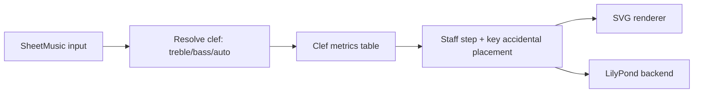

Additional clef rendering support plan for sheet music.

## Status
Done

## Goal
Add support for additional clefs in sheet-music rendering, starting with bass clef, while keeping current treble-clef behavior stable and backward compatible.

## Why this comes first
1. Current rendering hardcodes treble assumptions, which prevents correct notation for low-register content.
2. Clef-aware staff positioning is a foundational prerequisite before adding more advanced engraving features.
3. A canonical clef model now reduces future rework for alto/tenor support.

## Scope
1. Introduce a canonical clef model for sheet rendering (`treble`, `bass` in v1 of this plan).
2. Make staff-step mapping, key-signature accidental placement, and default clef glyph rendering clef-aware.
3. Add API support to select clef explicitly when constructing `SheetMusic`.
4. Add optional automatic clef selection mode based on score pitch distribution.
5. Update LilyPond backend output to honor selected clef.
6. Add tests and docs for new clef behavior.

## Out of scope
1. Grand staff (paired treble+bass) layout in this phase (follow-up: `.plans/grand_staff_rendering_plan.md`).
2. Mid-staff clef changes within one rendered output in this phase.
3. Alto, tenor, percussion, and tablature clefs (planned later after bass is complete).
4. Polyphonic stem-voice engraving beyond existing logic.

## Technical design details
1. Canonical types/data models and invariants
   1. Add a clef type in `src/chordelia/sheet_music.py`:
      1. `SheetClef` enum or equivalent literal set (`treble`, `bass`).
   2. Add `clef` to `SheetMusic.__init__(...)`:
      1. accepted values: `"treble"`, `"bass"`, `"auto"`, and enum variants.
      2. default becomes `"auto"`.
   3. Invariants:
      1. Rendering must be deterministic for a given score and clef.
      2. Existing outputs remain unchanged when `clef="treble"`.
      3. Invalid clef values raise `ValueError` with accepted values.

2. API signatures for new/changed public methods
   1. `SheetMusic.__init__(..., clef: str | SheetClef = "auto", ...)`
   2. `SheetMusic.score_to_file(..., clef: str | SheetClef = "auto", ...)`
   3. Optional helper:
      1. `_resolve_clef(score, requested_clef) -> SheetClef`
      2. Auto mode contract: choose bass only when all pitched notes are below middle C (MIDI 60), else treble.

3. Module/file touchpoints
   1. `src/chordelia/sheet_music.py`
   2. `src/chordelia/sheetmusic_backends/lilypond.py`
   3. `src/chordelia/__init__.py` (exports if clef enum is public)
   4. `tests/unit/chordelia/test_sheet_music.py`
   5. `tests/unit/chordelia/test_sheet_music.py` (LilyPond backend assertions live here)
   6. `docs/api-overview.md`
   7. `docs/tutorials/sheet-music-rendering.md`

4. Error and validation semantics
   1. Unknown clef input raises `ValueError`.
   2. `auto` mode falls back to treble for empty scores.
   3. Clef selection must not mutate score/events.

5. Clef-aware rendering strategy
   1. Replace treble-specific constants/methods with clef tables:
      1. bottom-line diatonic anchor per clef.
      2. key-signature accidental staff steps per clef.
      3. glyph metadata for SVG/LilyPond output.
   2. Drive all staff-step calculations through clef-aware helpers:
      1. notehead y position.
      2. ledger lines.
      3. accidental placement.
      4. key-signature accidental placement.

6. Compatibility and migration notes
   1. Existing call sites now default to `auto`; when uncertain, auto resolves to treble.
   2. New clef parameter is additive.
   3. No required migration for current users.

7. Implementation pseudocode

```text
resolve_clef(requested_clef, score):
    if requested_clef in {treble, bass}: return requested_clef
    if requested_clef == auto:
        if score has no events: return treble
      return bass if max(event pitches) < MIDDLE_C_MIDI_60 else treble
    raise ValueError

staff_step_for_pitch(pitch, spelling, clef):
    anchor = CLEF_BOTTOM_LINE_INDEX[clef]
    letter_index, octave = parse_spelling_or_pitchclass(...)
    return (octave * 7 + letter_index) - anchor
```

8. Usage pseudocode

```text
sheet = SheetMusic(sequence_or_score, clef="bass")
sheet.to_file("bass_line.svg")

sheet_auto = SheetMusic(sequence_or_score, clef="auto")
sheet_auto.to_file("auto_clef.svg")
```

9. Diagram


## Testing approach
Expected test delta classification: both new tests and updated tests.

1. Unit tests in `test_sheet_music.py`
   1. Treble explicit mode matches current baseline output.
   2. Bass explicit mode places low notes on expected staff positions with reduced ledger lines.
   3. Auto mode selects bass only when all pitched notes are below middle C; otherwise treble.
   4. Invalid clef input raises `ValueError`.
   5. Empty score with auto mode defaults to treble.

2. Backend tests in `test_sheetmusic_backends_lilypond.py`
   1. LilyPond source contains `\\clef bass` when bass clef selected.
   2. Existing treble path remains unchanged.

3. Regression tests
   1. Existing sheet music rendering snapshots or assertions remain valid for explicit `clef="treble"` mode.

4. Validation commands
   1. Focused: `pytest tests/unit/chordelia/test_sheet_music.py tests/unit/chordelia/test_sheetmusic_backends_lilypond.py`
   2. Full: `pytest`

## Documentation approach
Expected docs delta classification: both README updates and docs updates.

1. Update `docs/api-overview.md` with clef parameter and supported values.
2. Update `docs/tutorials/sheet-music-rendering.md` with bass clef examples and auto mode guidance.
3. Add a short README mention under sheet-music features after implementation is complete.
4. Validate examples consistently use canonical "bass clef" terminology.

## Progress checklist
- [x] Phase 0: Clef API and compatibility contract locked
- [x] Phase 1: Core clef model and validation added
- [x] Phase 2: SVG renderer made clef-aware
- [x] Phase 3: LilyPond backend clef support added
- [x] Phase 4: Tests updated and passing
- [x] Phase 5: Documentation and examples updated
- [x] Additional clef rendering support accepted

## Phases
### Phase 0: Contract lock
1. Finalize public `clef` parameter shape and accepted values.
2. Lock auto-clef heuristic threshold and fallback behavior.

### Phase 1: Core clef model
1. Add clef type/enum and input coercion/validation.
2. Introduce clef metric tables for line anchors and accidental placement.

### Phase 2: SVG rendering integration
1. Replace treble-only helper methods with clef-aware helpers.
2. Render clef symbol and key signature in selected clef context.
3. Ensure notehead, accidental, and ledger placement are clef-aware.

### Phase 3: LilyPond backend integration
1. Emit selected clef (`\\clef treble` or `\\clef bass`) in generated LilyPond source.
2. Keep existing key/time/tempo behavior unchanged.

### Phase 4: Verification
1. Add and update focused tests for clef selection and staff mapping.
2. Run focused tests, then full suite.

### Phase 5: Documentation
1. Update API overview and tutorial.
2. Add usage examples for bass and auto clef modes.

## Execution order recommendation
1. Lock clef API and auto behavior before refactoring render helpers.
2. Implement SVG clef-awareness first because it is the canonical in-house renderer.
3. Update LilyPond backend after core model stabilizes.
4. Complete tests before docs final polish.

## Implementation notes
### 2026-06-05 - Phase 0-5
- Scope completed: Implemented SheetMusic clef support (`treble`, `bass`, `auto`) with auto selection based on all pitches below MIDI 60, integrated clef-aware SVG/LilyPond rendering, and exported `SheetClef` publicly.
- Code touchpoints: `src/chordelia/sheet_music.py`, `src/chordelia/sheetmusic_backends/lilypond.py`, `src/chordelia/__init__.py`, `tests/unit/chordelia/test_sheet_music.py`.
- Tests: Focused suite passed (`pytest tests/unit/chordelia/test_sheet_music.py` equivalent, 57 passed) and full suite passed (`pytest`, 963 passed).
- Docs: Updated `docs/api-overview.md`, `docs/tutorials/sheet-music-rendering.md`, and README sheet-music usage snippet.
- Commit/PR: Not committed in this step.
- Follow-ups: Grand staff plan can now treat additional clef support as satisfied prerequisite.

### 2026-06-18 - Correction note
- Auto-clef behavior was later updated after archival: selection now uses the median of unique pitches, with bass for median below MIDI 60 and treble for MIDI 60 or above.

## Risks and mitigations
1. Risk: treble baseline regressions from shared helper refactor.
   1. Mitigation: preserve explicit treble mode and add strict regression tests.
2. Risk: accidental/key-signature positioning drift in bass clef.
   1. Mitigation: explicit per-clef step maps with targeted placement tests.
3. Risk: auto-clef heuristic surprises users in mixed-register passages.
   1. Mitigation: keep explicit clef override and document the all-notes-below-middle-C rule clearly.

## Acceptance criteria
1. `SheetMusic(..., clef="bass")` renders valid sheet output with bass-clef positioning.
2. Default `SheetMusic(...)` behavior uses `clef="auto"` and falls back to treble unless all notes are below middle C.
3. `clef="auto"` produces deterministic, documented clef selection.
4. LilyPond backend honors selected clef.
5. Focused and full test suites pass.
6. API/tutorial docs include clef usage examples.
