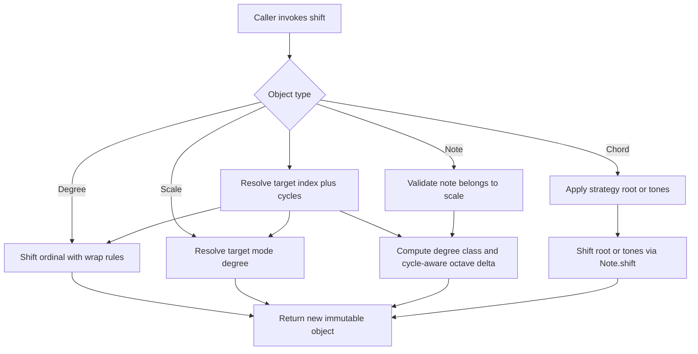

Diatonic shifting and chromatic transposing plan for chordelia.

## Status
Done

## Completion note
Completed on 2026-05-30.
1. Shift APIs are implemented for Degree, Scale, Note, and Chord.
2. Note/Chord shift keeps explicit `scale=...` support and retains global scale-context fallback.
3. Docs and examples were migrated to clearly distinguish diatonic shift from chromatic transpose.
4. Validation: focused movement tests passed (418), full test suite passed (819), and coverage run passed (819).

## Goal
Support two distinct movement models across the library with clear naming and consistent behavior:
1. Shifting = diatonic movement within a key/scale context.
2. Transposing = chromatic semitone movement where `+1` always means one semitone up (for example `C -> C#`).

## Why this comes first
1. Current APIs use transpose for all movement semantics, which mixes in-key movement and key-changing movement.
2. Degree support now exists across Scale, Chord, and Interval, which enables a strong diatonic shift API.
3. Resolving naming and semantics early avoids inconsistent additions to Note and Chord APIs.

## Scope
1. Define canonical terminology and API naming policy: shift or shifting for diatonic movement, transpose or transposing for chromatic movement.
2. Audit existing movement and degree APIs and classify each under the new system.
3. Implement first-class shift support for Scale and Degree.
4. Implement context-aware shift support for Note and Chord with explicit `scale=...` semantics plus global fallback support.
5. Support compound diatonic intervals (greater than 7, for example 9, 13) with consistent semantics across shift-capable APIs.
6. Apply a breaking transpose contract where numeric transpose inputs are semitone steps (`1` means `+1` semitone).
7. Update tests, examples, and docs to demonstrate both movement types.

## Out of scope
1. Automatic key inference from arbitrary note streams or chord progressions.
2. Full harmonic analysis engine to infer borrowed chords or temporary tonicization.
3. Microtonal or non-12TET transposition systems.
4. Retaining ambiguous legacy transpose shorthand where `"1"` means unison.

## Technical design details
### Terminology and canonical naming
1. Canonical transform names:
   1. shift(...): diatonic movement using scale-degree steps and a scale context.
   2. transpose(...): chromatic movement using semitone-step behavior.
2. Compatibility policy:
   1. Keep `transpose` as the canonical chromatic API name, but change its numeric-input semantics as a breaking change.
   2. Numeric transpose inputs (`int`, numeric `str`) are interpreted as semitone steps.
   3. Quality-bearing interval strings (for example `"m2"`, `"P5"`) and explicit `Interval` values are converted to semitone displacement before applying transpose.
   4. New docs and examples must use shift for in-key movement and transpose for chromatic movement.

### Breaking transpose contract
1. Canonical behavior:
   1. `transpose(1)` and `transpose("1")` mean transpose up by one semitone.
   2. `transpose(-1)` and `transpose("-1")` mean transpose down by one semitone.
2. Migration semantics:
   1. Legacy numeric interval-degree intent must use explicit interval notation (for example `"P5"`) or explicit `Interval(...)` values.
   2. Example migration: old `transpose("5")` (perfect fifth expectation) becomes `transpose("P5")`.
3. Cross-type consistency requirement:
   1. The same transpose contract applies to `Note`, `Chord`, `Scale`, and `Sequence` payload transposition.

### Initial-state audit and classification
1. Current movement APIs in src:
   1. src/chordelia/notes.py: Note.transpose(interval)
      1. Classification: transposing (chromatic), already aligned with new naming.
      2. Gap: string coercion currently routes through Interval semantics, so `"1"` yields unison instead of `+1` semitone.
   2. src/chordelia/chords.py: Chord.transpose(interval)
      1. Classification: transposing (chromatic), already aligned.
      2. Gap: no shift API and no external scale context for diatonic movement.
   3. src/chordelia/scales.py: Scale.transpose(interval)
      1. Classification: transposing (chromatic), already aligned.
      2. Gap: no explicit shift API despite mode and degree capabilities.
   4. src/chordelia/scales.py: Scale.mode_from_degree(degree)
      1. Classification: shifting primitive (diatonic mode rotation within existing pitch collection).
      2. Gap: naming and signature do not directly express relative shift steps.
   5. src/chordelia/scales.py: Scale.degree(...), chord_for_degree(...), chords_for_degrees(...), degree_for_chord_root(...)
      1. Classification: diatonic lookup or derivation primitives.
      2. Gap: missing direct degree-shift transforms.
   6. src/chordelia/chords.py: Chord.tone_at(...), degree_for_tone(...)
      1. Classification: diatonic lookup primitives within chord structure.
      2. Gap: no shift operation across tones constrained by a scale.
   7. src/chordelia/intervals.py: interval.degree and interval.simple_degree
      1. Classification: degree metadata support.
      2. Gap: no dedicated diatonic step object for shift operations.
2. Current test and docs audit:
   1. tests/unit/chordelia/test_notes.py, test_chords.py, test_scales.py validate transpose behavior only.
   2. Existing tests currently encode numeric string inputs as interval-degree shorthand (for example `"3"`, `"5"`) and must be migrated.
   3. docs/guides/notes-and-intervals.md and docs/guides/scales-and-chords.md use transpose examples only.
   4. examples/ uses transpose for note, chord, and progression movement.
   5. Classification result: chromatic transposing is covered but needs breaking-contract migration; diatonic shifting lacks first-class API coverage.

### Proposed API additions and signatures
1. Degree-level shifting:
   1. Degree.shift(steps: int, *, span: int = 7, wrap: bool = True) -> Degree
   2. Behavior:
      1. Shifts numeric degree by diatonic steps, including compound movement (for example +8 for a 9th).
      2. Preserves accidental offset by default.
      3. Preserves Roman case metadata when source is Roman.
      4. wrap controls normalization of the returned degree class, not whether compound steps are accepted.
2. Scale-level shifting:
   1. Scale.shift(steps: int) -> Scale
   2. Behavior:
      1. Interprets steps as relative diatonic movement from current tonic.
      2. Returns the corresponding mode rooted at shifted degree (same pitch collection).
      3. Negative, positive, and compound steps are supported.
3. Note-level shifting with context:
   1. Note.shift(steps: int, *, scale: Scale | str | None = None) -> Note
   2. Behavior:
      1. Uses explicit scale input when provided, otherwise resolves scale from global context helpers.
      2. Finds note degree in scale by pitch class.
      3. Raises ValueError when no scale context is available.
      4. Raises ValueError when note is outside scale unless policy override is added in later phase.
      5. Returns scale degree moved by steps, preserving octave with cycle-aware diatonic crossing rules.
4. Chord-level shifting with context:
   1. Chord.shift(steps: int, *, scale: Scale | str | None = None) -> Chord
   2. Behavior:
      1. Uses explicit scale input when provided, otherwise resolves scale from global context helpers.
      2. Applies root-first shifting and preserves quality, extensions, and slash-bass intent.
      3. Shifts custom-note chords tone-by-tone through the same resolved scale context.
      4. Raises ValueError when no scale context is available or when required tones are out of scale.

### Compound diatonic interval model (>7)
1. Canonical model: selector versus distance semantics
   1. Selector APIs return in-span degree classes (for example Scale.degree(...), Chord.tone_at(...)).
   2. Shift APIs accept unbounded diatonic distance (including compound intervals).
2. Canonical internal resolver output
   1. target_index: normalized in-span index for lookup.
   2. cycles: number of full scale spans traversed (used for octave-aware models).
   3. span: active scale cardinality (not hard-coded to 7).
3. Semantics
   1. For Note and octave-bearing chord tones, cycles adjust octave height.
   2. For Degree/Scale class-like outputs, cycles may collapse to class-only output unless explicitly surfaced by a helper API.
   3. Compound movement is never rejected only because it is greater than the span.
4. API boundary rule
   1. Shift methods are unbounded in steps.
   2. Range validation remains for selector APIs that intentionally require in-span inputs.

### Scale context options for Note and Chord shifting
1. Option A: explicit scale parameter on shift methods (recommended first implementation)
   1. Example: note.shift(2, scale=c_major), chord.shift(-1, scale=c_major)
   2. Pros: explicit, deterministic, easy to test, no hidden global state.
   3. Cons: slightly more verbose call sites.
2. Option B: context manager using contextvars
   1. Example: with scale_context(c_major): chord.shift(2)
   2. Pros: ergonomic in composition pipelines.
   3. Cons: implicit dependency, harder debugging, requires strict thread/task safety guarantees.
3. Option C: optional scale reference stored on model instances
   1. Example: chord.with_scale_context(c_major).shift(2)
   2. Pros: reusable context for chained transforms.
   3. Cons: model complexity, stale context risk, equality/hash and serialization implications.
4. Option D: dedicated service object
   1. Example: shifter = ScaleShifter(c_major); shifter.shift_note(note, 2)
   2. Pros: no model mutation concerns, easy strategy injection.
   3. Cons: less discoverable than instance methods.
5. Option E: progression or key object as aggregate context
   1. Example: KeyContext(c_major).shift(chord, 2)
   2. Pros: good for sequence-level workflows and future harmonic analysis extensions.
   3. Cons: larger design surface and potentially out of scope for first rollout.
6. Recommendation path:
   1. Phase 1 through 3 use Option A (explicit scale parameter).
   2. Evaluate Option B and Option D as additive ergonomics after core semantics stabilize.
   3. Defer Option C unless a strong immutable-safe design is proven.
7. Final resolution:
   1. Keep explicit scale parameters as the preferred, deterministic API shape.
   2. Keep the existing global context fallback (`with_global_scale_context`, `set_global_scale_context`) for ergonomic workflows.
   3. Do not add a new public context service object in this rollout.

### Implementation pseudocode
1. Shared diatonic resolver

```text
function resolve_diatonic_shift(start_index, steps, span):
   if span < 1:
      raise ValueError("span must be >= 1")

   raw_index = start_index + steps
   target_index = ((raw_index % span) + span) % span
   cycles = floor_div(raw_index, span)

   return target_index, cycles
```

2. Degree.shift

```text
function degree_shift(degree, steps, span=7, wrap=true):
   start_ordinal = degree.number + steps
   start_index = degree.number - 1
   target_index, cycles = resolve_diatonic_shift(start_index, steps, span)

   if wrap:
      # Class-oriented output in 1..span
      shifted = target_index + 1
   else:
      # Absolute ordinal output; supports compound values > span
      if start_ordinal < 1:
         raise ValueError("Degree.shift without wrap requires resulting ordinal >= 1")
      shifted = start_ordinal

   return Degree(
      number=shifted,
      accidental=degree.accidental,
      parsed_case=degree.roman_case,
      is_roman=degree.is_roman,
      had_diminished_symbol=degree.had_diminished_symbol,
      source_roman=degree.source_roman,
   )
```

3. Scale.shift

```text
function scale_shift(scale, steps):
   span = len(scale.notes)
   start_index = 0
   target_index, cycles = resolve_diatonic_shift(start_index, steps, span)
   target_degree = target_index + 1

   # Reuse existing mode rotation semantics
   return scale.mode_from_degree(target_degree)
```

4. Note.shift

```text
function note_shift(note, steps, scale):
   origin_degree = scale.degree_for_chord_root(note)
   if origin_degree is None:
      raise ValueError("Note.shift requires note to be in scale; use transpose for chromatic movement")

   span = len(scale.notes)
   origin_index = origin_degree.to_int() - 1
   target_index, cycles = resolve_diatonic_shift(origin_index, steps, span)
   target_degree = Degree(target_index + 1)
   target_pc_note = scale.degree(target_degree)

   # Octave handling for notes that carry octave information
   if note.octave is None:
      return target_pc_note.with_octave(None)

   octave_delta = cycles
   return target_pc_note.with_octave(note.octave + octave_delta)
```

5. Chord.shift (root strategy first)

```text
function chord_shift(chord, steps, scale, strategy="root"):
   if strategy == "root":
      new_root = chord.root.shift(steps, scale=scale)
      new_bass = chord.bass_note.shift(steps, scale=scale) if chord.bass_note else None
      return chord.with_(root=new_root, bass_note=new_bass)

   if strategy == "tones":
      shifted_notes = []
      for tone in chord.notes:
         shifted_notes.append(tone.shift(steps, scale=scale))
      return Chord.from_notes(shifted_notes, bass_note=shifted_notes[0])

   raise ValueError("Unsupported shift strategy")
```

### Usage pseudocode
1. Basic diatonic shifting versus chromatic transposing

```text
scale = Scale("C", ScaleType.MAJOR)
note = Note("E4")

shifted = note.shift(2, scale=scale)               # E -> G (diatonic)
transposed = note.transpose(2)                     # E -> F# (chromatic)
semitone_up = Note("C4").transpose("1")           # C4 -> C#4
perfect_fifth = note.transpose("P5")              # explicit interval-degree intent
```

2. Compound diatonic interval usage

```text
scale = Scale("C", ScaleType.MAJOR)
note = Note("E4")

second = note.shift(1, scale=scale)   # F4
ninth = note.shift(8, scale=scale)    # F5 (same degree class, +1 cycle)
```

3. Progression-level usage with explicit context

```text
scale = Scale("C", ScaleType.MAJOR)
progression = scale.chords_for_degrees("ii", "V", "I")

shifted_progression = [
   chord.shift(1, scale=scale, strategy="root")
   for chord in progression
]
```

4. Degree and scale workflows

```text
d = Degree.from_string("bIII")
next_degree = d.shift(2, span=7, wrap=true)

c_major = Scale("C", ScaleType.MAJOR)
d_dorian = c_major.shift(1)
```

### Design diagrams
1. Shift call flow



2. Relationship snapshot

```text
[Degree.shift] ----> [Scale.shift]
     |                  |
     |                  +--> reuses mode_from_degree
     |
     +--> used by [Note.shift] ----> used by [Chord.shift]

[resolve_diatonic_shift] provides: target_index + cycles
cycles are applied for octave-bearing outputs

transpose (chromatic) remains parallel and independent of scale context
```

### Module and file touchpoints
1. src/chordelia/degrees.py: add Degree.shift and related validation helpers.
2. src/chordelia/scales.py: add Scale.shift and reuse mode_from_degree logic.
3. src/chordelia/notes.py: add Note.shift with scale context semantics.
4. src/chordelia/chords.py: add Chord.shift with root-first behavior and context resolution semantics.
5. src/chordelia/__init__.py: export any new public helper types if introduced.
6. tests/unit/chordelia/test_degrees.py: add degree shifting tests.
7. tests/unit/chordelia/test_scales.py: add scale shifting tests.
8. tests/unit/chordelia/test_notes.py: add note shifting tests with in-scale and out-of-scale coverage.
9. tests/unit/chordelia/test_chords.py: add chord shifting tests for root behavior, slash chords, custom-note chords, and fallback context handling.
10. docs/quickstart.md, docs/guides/notes-and-intervals.md, docs/guides/scales-and-chords.md, examples/: update terminology and examples.

### Error and validation semantics
1. shift methods on Note and Chord accept explicit `scale=...` and otherwise use global scale context; they raise ValueError if neither is available.
2. Out-of-scale shift input raises ValueError with guidance to transpose if chromatic behavior is intended.
3. Negative and large-step (compound) shifts are supported without upper bound.
4. Selector APIs (for example degree lookups) keep explicit in-span range validation.
5. transpose remains scale-context free and semitone-driven.

### Compatibility and migration notes
1. This plan includes a breaking transpose semantic change for numeric inputs: `transpose("1")` now means `+1` semitone.
2. Migrate legacy numeric interval-degree usage to explicit interval notation (`"P5"`, `"m3"`) or explicit `Interval(...)` values.
3. Existing transpose tests become migration targets: numeric-string interval tests should be rewritten to either semitone assertions or explicit interval notation assertions.
4. Cross-plan alignment: `Note` and `Chord` shift outputs must remain compatible with the canonical `Sequenceable -> Score` conversion boundary used by `MidiFile` and `SheetMusic` plans.

## Testing approach
Expected test delta classification: both new tests and updated tests.

1. New unit tests:
   1. Degree.shift wrapping, negative movement, accidental preservation, Roman metadata preservation.
   2. Scale.shift for major and minor, including compound movement (for example step 8 and step 15) class equivalence.
   3. Note.shift with explicit scale context for in-scale movement, compound movement (for example 9th), and out-of-scale failure.
   4. Chord.shift root strategy behavior and extension or bass preservation expectations under both simple and compound steps.
2. Updated unit tests:
   1. Add terminology assertions in docstring-based tests where applicable.
   2. Rewrite transpose tests that currently use numeric interval strings so they validate semitone semantics.
   3. Add explicit interval-notation regression tests (for example `"P5"`) to preserve interval-degree workflows.
3. Regression and edge cases:
   1. Shift by 0 returns equivalent object.
   2. Shift by values larger than scale length preserves cycle semantics for octave-aware types.
   3. Non-heptatonic scale behavior is explicit and tested with span-aware calculations.
   4. Chromatic guarantee: `Note("C4").transpose("1") == Note("C#4")` and equivalent behavior across Chord/Scale/Sequence transposition paths.
4. Validation commands:
   1. Focused: pytest tests/unit/chordelia/test_degrees.py tests/unit/chordelia/test_scales.py tests/unit/chordelia/test_notes.py tests/unit/chordelia/test_chords.py
   2. Full: pytest and python -m pytest --cov=src

## Documentation approach
Expected docs delta classification: both README updates and docs updates.

1. Terminology update:
   1. Define shift versus transpose in README and docs/api-overview.md.
   2. Update existing guides to use shift in diatonic examples and transpose in chromatic examples.
   3. Document the breaking transpose contract for numeric inputs and provide migration examples.
2. Examples update:
   1. Add side-by-side examples demonstrating shift versus transpose outcomes.
   2. Add note and chord shift examples that show explicit scale context and global fallback usage.
3. Documentation validation:
   1. API names and signatures match implementation exactly.
   2. Terminology usage is consistent: no diatonic examples described as transposing.
   3. Example snippets execute against current behavior.

## Progress checklist
- [x] Phase 0: Audit and naming contract finalized
- [x] Phase 1: Degree and Scale shift APIs implemented
- [x] Phase 2: Note shift with explicit scale context implemented
- [x] Phase 3: Chord shift with explicit scale context implemented
- [x] Phase 4: Context ergonomics option evaluated (context manager or service)
- [x] Phase 5: Docs and examples migrated to shift or transpose terminology
- [x] Phase 6: Full regression and coverage validation completed
- [x] Milestone A complete
- [x] Milestone B complete
- [x] Milestone C complete

## Phases
### Phase 0: Finalize contract and audit baseline
1. Lock terminology and naming in docs and planning artifacts.
2. Confirm audit matrix against current src, tests, docs, and examples.
3. Define acceptance-level semantics for selector versus distance APIs.
4. Define compound-interval and cycle semantics (for example second versus ninth behavior).
5. Lock breaking transpose contract and migration examples before implementation.

### Phase 1: Implement core diatonic shift foundations
1. Add Degree.shift in src/chordelia/degrees.py.
2. Add Scale.shift in src/chordelia/scales.py using mode rotation semantics.
3. Add shared diatonic resolver logic that returns target index and cycles.
4. Add focused tests for Degree and Scale shifting, including compound intervals.
5. Milestone A: Degree and Scale shifting are stable and tested.

### Phase 2: Implement Note.shift with explicit scale context and fallback
1. Add Note.shift(steps, scale=...) with deterministic degree lookup and octave handling.
2. Support global scale context fallback when explicit scale is not supplied.
3. Add clear ValueError messaging for out-of-scale notes.
4. Add note-shift tests for positive, negative, compound, and error paths.
5. Milestone B: Notes can shift diatonically with explicit scale context or global fallback.

### Phase 3: Implement Chord.shift with explicit scale context and fallback
1. Add Chord.shift root strategy first and preserve existing quality or extension metadata.
2. Add optional tones strategy only if semantics are unambiguous and testable.
3. Add tests for slash chords, extensions, and edge cases.
4. Ensure global scale context fallback behavior is covered by tests.
5. Milestone C: Chords support practical diatonic shifting for progression workflows.

### Phase 4: Evaluate context ergonomics
1. Evaluate explicit-only versus global-fallback ergonomics against current usage.
2. Retain current API: explicit scale argument preferred, global fallback supported.
3. No additional public context service API is introduced in this rollout.

### Phase 5: Documentation and examples migration
1. Update README and docs guides with canonical terminology.
2. Update examples to demonstrate both shift and transpose.
3. Verify that beginner and advanced docs both show context-aware note or chord shifting.

### Phase 6: Validation and rollout guardrails
1. Run focused and full tests.
2. Run coverage and review affected modules.
3. Confirm transpose behavioral migration is complete and explicitly validated for numeric semitone inputs.
4. Confirm compound diatonic behavior is consistent across Degree, Scale, Note, and Chord.

## Execution order recommendation
1. Complete Phase 0 before adding APIs.
2. Implement Degree and Scale shifting first because they are least context-ambiguous.
3. Add Note and Chord shifting only after selector versus distance semantics are fixed.
4. Defer ergonomic context abstractions until explicit parameter APIs are stable.
5. Migrate docs and examples after API behavior is validated.

## Risks and mitigations
1. Risk: confusion between shift and transpose remains in docs and examples.
   1. Mitigation: enforce terminology checks during documentation updates and review.
2. Risk: Note or Chord shift semantics are ambiguous for out-of-scale tones.
   1. Mitigation: require explicit or global scale context and raise actionable ValueError.
3. Risk: Compound diatonic behavior is inconsistent between class-oriented and octave-oriented outputs.
   1. Mitigation: define and test a shared target-index plus cycles resolver used by all shift paths.
4. Risk: Chord shifting may produce musically unexpected quality outcomes.
   1. Mitigation: start with root strategy and clearly document reconstruction rules.
5. Risk: context-manager approach introduces hidden state bugs.
   1. Mitigation: treat context manager as optional phase with explicit decision gate.

## Acceptance criteria
1. The library has explicit, documented terminology where shift means diatonic and transpose means chromatic.
2. Degree and Scale expose shift APIs with deterministic behavior and passing tests.
3. Note and Chord support diatonic shifting through explicit scale context or global fallback context.
4. Compound diatonic intervals greater than 7 are supported consistently (for example 9th and 13th).
5. Compound behavior preserves cycle semantics for octave-aware outputs and class semantics for selector-style outputs.
6. Breaking transpose contract is fully implemented and tested, including `Note("C4").transpose("1") -> Note("C#4")` and equivalent cross-type behavior.
7. Tests include new and updated coverage across degree, scale, note, and chord movement.
8. Docs and examples consistently classify and demonstrate shifting versus transposing.
9. Focused and full test runs pass, or any exception is explicitly documented with rationale.
