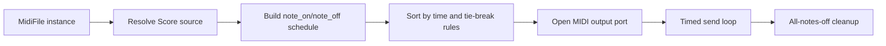

Midi interface playback plan for MidiFile in chordelia.

## Status
Done

## Goal
Add canonical MidiFile playback to MIDI output interfaces so score-backed and file-backed MidiFile instances can be auditioned directly on external MIDI ports.

## Why this comes first
1. Export-only MIDI workflows force users to round-trip through external tools for quick audition.
2. MidiFile already normalizes data through Score, which is a stable foundation for deterministic playback scheduling.
3. Direct interface playback aligns with the wrapper-first architecture and reduces drift between export and playback behavior.

## Scope
1. Add a MidiFile instance playback API for MIDI interfaces.
2. Support output-port selection by name with sane default-port fallback.
3. Convert normalized Score events into timed note_on/note_off interface messages.
4. Guarantee cleanup of active notes on normal completion and error/interrupt paths.
5. Keep dependency optionality: core package works without interface playback dependency at runtime.
6. Replace `MIDIChordPlayer` with canonical `MidiPlayback` API (breaking change approved for pre-1.0).
7. Remove `MIDIPlaybackNote` from public API and use `ScoreEvent`/`Score` as canonical scheduled playback input.

## Out of scope
1. DAW-grade transport controls (scrub, locate, punch-in, automation lanes).
2. Full real-time MIDI clock sync and external clock following.
3. Sysex, aftertouch, pitch bend, and controller-lane editing for v1.
4. Multi-tempo map playback from parsed files in this phase.
5. Maintaining pre-1.0 compatibility aliases.

## Role responsibilities: MidiFile vs midi_playback
1. MidiFile responsibilities (canonical score wrapper)
   1. Own normalized Score-centric read/write/playback workflows.
   2. Provide deterministic playback of finite arrangements from Score events.
   3. Keep constructor and file APIs stable for export/read compatibility.
   4. Prioritize deterministic conversion behavior and wrapper ergonomics.
2. midi_playback responsibilities (interactive live player)
   1. Provide low-latency interactive note/chord control APIs.
   2. Support stateful live updates (for example update_chord semantics).
   3. Manage active-note state during interactive performance sessions.
   4. Optimize for realtime playability over score-wrapper normalization concerns.
3. Boundary rule for v1
   1. MidiFile gains deterministic interface playback for score-backed content.
   2. `midi_playback` remains the live-performance API surface via canonical `MidiPlayback`.
   3. Overlap should be implemented through shared internal helpers, not by collapsing public responsibilities.

## What MidiFile would need to change to fully support midi_playback behaviors
1. Add stateful realtime session model
   1. Introduce a long-lived transport/session object that keeps port and active notes alive across calls.
   2. Expose explicit start/stop lifecycle rather than one-shot playback only.
2. Add incremental live-update APIs
   1. Support operations like update_chord, play_note, stop_note, and replace-current-voicing.
   2. Diff desired notes vs active notes and emit only required on/off events.
3. Add non-blocking transport controls
   1. Provide pause/resume/seek/cancel semantics and optional background scheduling.
   2. Use monotonic scheduler loops with interrupt-safe cancellation points.
4. Add realtime-safe concurrency model
   1. Protect active-note/port state with synchronization suitable for threaded callbacks.
   2. Ensure cleanup and all-notes-off across concurrent failure paths.
5. Add richer live-expression controls
   1. Per-call velocity/channel/program overrides.
   2. Optional runtime control changes (program change, controller sends).
6. Add latency/jitter instrumentation and policy
   1. Track scheduling drift.
   2. Define acceptable jitter thresholds and fallback behavior.
7. Add additional tests for live semantics
   1. Deterministic active-note diffs.
   2. Concurrency and cancellation robustness.
   3. Stuck-note prevention under abrupt interruption.

## Convergence strategy
1. Preferred strategy for v1-v2
   1. Keep MidiFile and midi_playback as distinct public roles.
   2. Extract shared private helpers for port resolution, message sending, and note-state cleanup.
2. Optional future strategy
   1. Introduce an internal MidiTransport engine used by both modules.
   2. Keep public APIs separate while consolidating implementation internals.

## Technical design details
1. Canonical API surface
   1. Add instance method:
      1. MidiFile.play_to_interface(output_name=None, *, blocking=True, velocity_scale=1.0, channel_override=None) -> None
   2. Replace live playback class API:
      1. class MidiPlayback(...)
      2. support context manager usage (`with MidiPlayback(...) as playback:`).
      3. add `play_score(score, *, blocking=True, velocity_scale=1.0, channel_override=None)`.
      4. retain live methods: `update_chord`, `play_note`, `stop`, `set_channel`, `set_velocity`.
   3. Breaking public API changes approved:
      1. remove `MIDIChordPlayer` symbol.
      2. remove `MIDIPlaybackNote` symbol.
      3. update convenience functions to consume `Note` and/or `ScoreEvent` forms without legacy note wrapper type.

2. Playback source model
   1. Always play from Score events:
      1. If self.score exists, use it directly.
      2. If self.score is missing, derive score via MidiFile.score_from_file(...) before playback.
   2. This keeps interface playback semantics consistent across score-backed and file-backed instances.

3. Scheduling model and invariants
   1. Build a flattened message schedule from Score events:
      1. For each pitch in each ScoreEvent:
         1. schedule note_on at event beat.
         2. schedule note_off at event beat + event duration.
   2. Convert beat/time durations to seconds:
      1. beat-mode: seconds = beats * 60 / tempo
      2. seconds-mode: use duration directly
   3. Sort messages by (time, order, channel, pitch):
      1. order: note_off before note_on at the same timestamp to avoid stuck/overlap artifacts.
   4. Track active notes and guarantee all-off cleanup in finally blocks.

4. Port and dependency behavior
   1. If mido is unavailable, raise ImportError with install guidance.
   2. If output_name is provided but missing, raise ValueError with available output names.
   3. If output_name is None:
      1. use first available output port.
      2. if no ports exist, raise RuntimeError with actionable guidance.

5. File/module touchpoints
   1. src/chordelia/midifile.py
      1. add play_to_interface and private schedule-building helpers.
      2. add dependency/port resolution and cleanup logic.
   2. src/chordelia/__init__.py
      1. export `MidiPlayback` and remove old midi_playback class/type exports.
   3. src/chordelia/midi_playback.py
      1. replace `MIDIChordPlayer` with canonical `MidiPlayback` class.
      2. remove `MIDIPlaybackNote` type and migrate function inputs.
   4. tests/unit/chordelia/test_midifile.py
      1. add playback scheduling and cleanup tests with mocked mido/time.
   5. tests/unit/chordelia/test_midi_playback.py
      1. migrate tests to `MidiPlayback` surface and context manager behavior.
   6. docs/api-overview.md and docs/quickstart.md
      1. add canonical MidiFile interface playback usage.

6. Error and validation semantics
   1. velocity_scale must be > 0.
   2. channel_override must be in range 0-15 when provided.
   3. ScoreEvent pitch/velocity/channel validity remains enforced by ScoreEvent model.
   4. Playback methods raise clear errors for unavailable ports/dependencies.

7. Compatibility and migration notes
   1. Breaking changes are intentional in pre-1.0.
   2. MidiFile.play_to_interface is the canonical path for playing normalized score-backed content.
   3. MidiPlayback is the canonical live interface player surface.

8. Core algorithm pseudocode

```text
function play_to_interface(output_name, blocking, velocity_scale, channel_override):
    score = self.score or MidiFile.score_from_file(self.filepath)
    schedule = []

    for event in score.events:
        start_s = duration_to_seconds(event.beat, score.metadata.tempo)
        end_s = start_s + duration_to_seconds(event.duration, score.metadata.tempo)
        channel = channel_override if provided else event.channel

        for pitch in event.pitches:
            velocity = clamp(round(event.velocity * velocity_scale), 0, 127)
            schedule.add((start_s, OFF_ORDER, channel, pitch, note_off_message))
            schedule.add((start_s, ON_ORDER, channel, pitch, note_on_message))
            schedule.add((end_s, OFF_ORDER, channel, pitch, note_off_message))

    sort schedule by (time, order, channel, pitch)

    open output port
    active = set()
    t0 = monotonic_time()

    try:
        for item in schedule:
            wait_until(t0 + item.time)
            send(item.message)
            update active-note set
    finally:
        send note_off for all active notes
        close output port
```

9. Playback flow diagram



## Cross-plan and decision links
1. .plans/sequence_to_midi_export_plan.md
2. .plans/common_musical_interfaces_plan.md
3. .plans/shared_score_ir_implementation_plan.md
4. decisions/sequence_midi_export_api_decision.md

## Testing approach
Expected test delta classification: both new tests and updated tests.

1. Unit tests
   1. score-backed playback sends expected note_on/note_off sequence.
   2. tie-break behavior sends note_off before note_on at identical timestamps.
   3. missing output port and missing dependency errors are explicit.
   4. cleanup sends note_off for all active notes when an exception occurs.

2. Integration tests
   1. file-backed MidiFile can play through interface by converting to Score path.
   2. score-backed and file-backed produce semantically consistent playback schedule for same material.

3. Regression tests
   1. existing file load, export, and audio-playback helpers remain unaffected.

4. Validation commands
   1. Focused: pytest tests/unit/chordelia/test_midifile.py tests/unit/chordelia/test_midi_playback.py
   2. Full: pytest and python -m pytest --cov=src

## Documentation approach
Expected docs delta classification: both README updates and docs updates.

1. Update docs/api-overview.md with canonical MidiFile interface playback method.
2. Update docs/quickstart.md with a minimal interface playback snippet and output-port selection example.
3. Update README.md summary bullets if interface playback becomes a highlighted capability.
4. Verify docs terminology stays canonical: MidiFile around Score/Sequenceable.

## Progress checklist
- [x] Phase 0: API contract and error semantics locked
- [x] Phase 1: Deterministic schedule builder implemented
- [x] Phase 2: Port resolution and timed send loop implemented
- [x] Phase 3: Cleanup and failure handling completed
- [x] Phase 4: Public API replacement and exports completed
- [x] Phase 5: Tests and docs completed
- [x] MidiFile MIDI-interface playback adopted as canonical workflow

## Phases
### Phase 0: Contract lock
1. Finalize method signatures and argument validation rules.
2. Finalize port-selection and dependency error behavior.

### Phase 1: Schedule builder
1. Implement score-event to timed MIDI message schedule conversion.
2. Implement deterministic sort/tie-break behavior.

### Phase 2: Send loop and ports
1. Implement output-port discovery and selection.
2. Implement timed blocking send loop and message dispatch.

### Phase 3: Reliability hardening
1. Add all-notes-off cleanup on completion and exceptions.
2. Validate no stuck notes in failure paths.

### Phase 4: API replacement and exports
1. Replace old midi_playback public symbols with `MidiPlayback`.
2. Remove `MIDIPlaybackNote` and migrate function inputs.
3. Wire updated exports in src/chordelia/__init__.py.

### Phase 5: Verification and docs
1. Add focused unit/integration tests.
2. Update README/docs examples and references.
3. Run focused and full validation commands.

## Execution order recommendation
1. Lock API and failure semantics first.
2. Implement schedule conversion before port I/O.
3. Add cleanup guarantees before exposing convenience delegates.
4. Finish with tests/docs and full-suite validation.

## Risks and mitigations
1. Risk: timing jitter from naive sleep loops.
   1. Mitigation: monotonic-time based scheduling and bounded drift correction per event.
2. Risk: stuck notes when exceptions occur.
   1. Mitigation: always track active notes and send all-notes-off in finally.
3. Risk: confusion with existing midi_playback module.
   1. Mitigation: document separation of responsibilities and canonical MidiFile workflow.
4. Risk: dependency portability across systems with no MIDI outputs.
   1. Mitigation: explicit port errors and deterministic test mocks for no-port environments.

## Acceptance criteria
1. MidiFile can play score-backed content directly to a selected MIDI output interface.
2. File-backed MidiFile playback uses the same canonical score-based scheduling semantics.
3. Playback cleanup prevents stuck notes on normal and exceptional exits.
4. New behavior is covered by focused and full test runs.
5. Documentation reflects canonical usage and dependency behavior.
