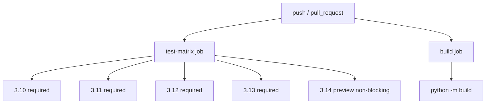

Python version support and CI matrix plan for chordelia.

## Status
Done

## Goal
Lower declared runtime compatibility from Python 3.13+ to Python 3.10+, validate the support window in CI, and document runtime/development version policy clearly for users and contributors.

## Why this comes first
1. Package metadata currently blocks installation on otherwise compatible interpreters.
2. There is no CI matrix validating support claims across maintained Python minors.
3. Version policy is currently under-documented for runtime vs contributor tooling.

## Scope
1. Update package metadata to declare Python 3.10+ runtime support.
2. Adjust development dependency constraints so contributor setup is explicit and compatible.
3. Add a CI workflow that validates core tests across Python 3.10-3.13 and captures 3.14 signal as non-blocking.
4. Document Python support policy in README and installation/development docs.

## Out of scope
1. Refactoring runtime code for pre-3.10 compatibility.
2. Reworking optional dependency architecture beyond version-policy docs and CI smoke coverage.
3. Replacing the existing publish workflow.

## Technical design details
### Canonical policy model
1. Runtime compatibility target: Python >=3.10.
2. CI-required validation set: 3.10, 3.11, 3.12, 3.13.
3. CI-preview validation set: 3.14 with non-blocking failures.
4. Development dependency policy:
   1. Keep development environment installable on 3.10+ using environment markers for IPython.
   2. Preserve existing behavior for 3.11+.

### File/module touchpoints
1. `pyproject.toml`
   1. Set `project.requires-python = ">=3.10"`.
   2. Add Python-version markers to dev dependency entries for IPython.
2. `.github/workflows/ci.yml` (new)
   1. Add core test matrix job for 3.10-3.13 (required) and 3.14 (experimental, non-blocking).
   2. Add package build job (`python -m build`) to ensure sdist/wheel build health.
3. `README.md`
   1. Update runtime requirement statement.
4. `docs/installation.md`
   1. Update requirements section and tested-version policy.
5. `docs/development.md`
   1. Add contributor-facing Python support and CI matrix notes.

### Error and validation semantics
1. CI matrix job should fail fast on real regressions for required versions.
2. 3.14 matrix run must be non-blocking and signal-only.
3. Build job must fail on packaging regressions.

### Compatibility and migration notes
1. Existing users on 3.13 remain unaffected.
2. Users on 3.10-3.12 can install once metadata is relaxed.
3. 3.14 is documented as provisional until sustained passing history.

### Implementation pseudocode
```text
update pyproject requires-python -> >=3.10
split ipython dev dependency by python_version markers
add ci workflow with matrix:
  required: 3.10,3.11,3.12,3.13
  experimental: 3.14 (continue-on-error)
run pytest in matrix
run python -m build in dedicated job
update README/docs policy text
run local pytest and validate no doc/link drift
```

### Usage pseudocode
```python
# Runtime policy expectation
# Supported runtime interpreters:
# 3.10, 3.11, 3.12, 3.13
# 3.14: preview support (best effort)
```

### CI relationship diagram


## Testing approach
Expected test delta classification: no test-code delta (CI workflow + metadata/docs only).

No test delta rationale:
1. This plan does not add or change runtime behavior APIs.
2. Validation is performed through existing test suite execution in CI matrix and local regression run.

Validation commands:
1. Local focused/full validation in active environment:
   1. `pytest`
2. CI validation per matrix interpreter via new workflow.

## Documentation approach
Expected docs delta classification: both README updates and docs updates.

1. Update `README.md` Python requirement line.
2. Update `docs/installation.md` support matrix language.
3. Update `docs/development.md` contributor/CI version policy.
4. Validate consistency of wording across all touched docs.

## Progress checklist
- [x] Phase 0: Plan moved to Implementing and policy locked
- [x] Phase 1: Metadata constraints updated for runtime/dev compatibility
- [x] Phase 2: CI matrix workflow added and validated syntactically
- [x] Phase 3: README/docs Python support policy updates completed
- [x] Phase 4: Local validation complete and plan closed

## Phases
### 0. Start implementation
1. Change plan status to Implementing.
2. Lock final runtime policy text: runtime 3.10+, preview 3.14.

### 1. Metadata updates
1. Update `pyproject.toml` `requires-python` to `>=3.10`.
2. Add IPython dev dependency markers for 3.10 vs 3.11+ compatibility.

### 2. CI workflow
1. Add `.github/workflows/ci.yml` with matrix testing for required + preview interpreters.
2. Add dedicated build job.

### 3. Documentation
1. Update `README.md` requirement line.
2. Update `docs/installation.md` requirements/policy.
3. Update `docs/development.md` contributor-facing matrix policy.

### 4. Validation and closeout
1. Run local `pytest`.
2. Update plan checklist + implementation notes.
3. Set plan status to Done and archive under `.plans/archive/`.

## Execution order recommendation
1. Lock status and policy first.
2. Apply metadata updates before CI/docs so all references use final values.
3. Add CI matrix before docs finalization so docs match implemented automation.
4. Validate locally and close out plan last.

## Implementation notes
### 2026-06-02 - Phase 0
- Scope completed: Plan promoted to Implementing and runtime policy locked (3.10+ runtime, 3.14 preview).
- Code touchpoints: `.plans/python_version_support_plan.md`.
- Tests: not applicable for planning-only phase.
- Docs: not applicable for planning-only phase.
- Commit/PR: pending implementation phases.
- Follow-ups: execute metadata, CI, and docs phases.

### 2026-06-02 - Phases 1-3
- Scope completed: lowered declared runtime minimum to Python 3.10+, added Python-version-marked IPython dev dependencies, created CI matrix workflow for 3.10-3.13 with 3.14 preview, and documented policy across README/installation/development docs.
- Code touchpoints: `pyproject.toml`, `.github/workflows/ci.yml`, `README.md`, `docs/installation.md`, `docs/development.md`.
- Tests: existing full suite passes locally (`pytest`).
- Docs: Python support policy now aligned across user and contributor docs.
- Commit/PR: pending.
- Follow-ups: archive plan after closeout.

### 2026-06-02 - Phase 4 closeout
- Scope completed: validation recorded and plan lifecycle closed.
- Code touchpoints: `.plans/python_version_support_plan.md`.
- Tests: `pytest` passed (928 tests).
- Docs: no additional docs changes in closeout phase.
- Commit/PR: pending.
- Follow-ups: none.

## Risks and mitigations
1. Risk: Optional dependency behavior differs across matrix versions.
   1. Mitigation: keep core matrix required and preview/non-core compatibility as non-blocking signal.
2. Risk: Overstating 3.14 support before stability is proven.
   1. Mitigation: explicitly label 3.14 as preview/non-blocking.

## Acceptance criteria
1. Package metadata declares Python >=3.10.
2. CI workflow validates tests on 3.10-3.13 and runs 3.14 as non-blocking preview.
3. README + docs clearly describe runtime support and contributor expectations.
4. Local pytest passes after changes.
5. Plan is marked Done and archived with implementation notes.
