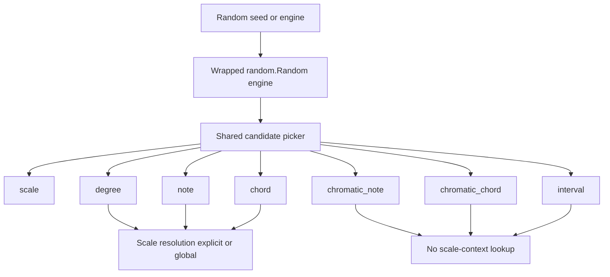

Randomization module plan for chordelia.

## Status
Done

## Completion note
Completed on 2026-05-30.
1. Added `src/chordelia/randomization.py` with seeded wrapper behavior, weighted selectors, scale-aware selectors, chromatic selectors, and dual invocation support.
2. Simplified final scale selector contract by removing mode-strategy arguments; modal output is selected directly via `ScaleType` weights.
3. Exported `Random`, `get_global_random`, `configure_global_random`, and `reset_global_random` from package root.
4. Added focused coverage in `tests/unit/chordelia/test_randomization.py` for determinism, validation, scale-context fallback, chromatic isolation, singleton lifecycle, and class/instance parity.
5. Updated `docs/api-overview.md`, `docs/cookbook.md`, and `README.md` with usage guidance and examples.
6. Validation passed: focused randomization tests, related scale/chord tests, full suite, and coverage run.

## Goal
Add a deterministic, seedable randomization module that can generate musical objects (for example scales, degrees, notes, and chords) with optional weighted choices, optional global-scale-context fallback for scale-aware selectors, explicit chromatic selectors that ignore scale context, direct access to the wrapped stdlib engine, and a lazily initialized global Random instance that powers class-level API calls when no instance is constructed.

## Why this comes first
1. Procedural generation workflows are currently ad hoc and repeated in user code.
2. A first-class randomization API enables reproducible examples, tests, and notebooks.
3. Weighted choices allow practical musical control while preserving variability.

## Scope
1. Add a new module at src/chordelia/randomization.py with a public Random class.
2. Support deterministic seeding via a wrapped standard-library random.Random instance.
3. Support weighted and unweighted selection helpers with strict validation.
4. Add scale-aware random selectors for:
    1. Scale
    2. Degree
    3. Note
    4. Chord
5. Add chromatic random selectors that explicitly ignore scale context:
    1. chromatic_note
    2. chromatic_chord
    3. interval
6. Support weighted random scale generation across root, scale type, and optional mode application.
7. Export the new API from src/chordelia/__init__.py.
8. Add focused unit tests for determinism, validation, context behavior, and domain behavior.
9. Expose the wrapped stdlib random.Random instance for advanced caller-controlled random operations.
10. Add a module-level lazily initialized global Random instance with explicit configure/get/reset helpers.
11. Support dual invocation for selector methods so callers can use either rng.method(...) or Random.method(...), with class-level calls routed through the global singleton.

## Out of scope
1. Markov or corpus-trained melodic/harmonic generation.
2. Full song or sequence generation policies.
3. Cryptographically secure randomness.
4. Implicit mutation of global random state outside explicit global-random helper APIs.
5. Backward-incompatible changes to existing Scale, Degree, or Chord APIs outside the new randomization module.

## Technical design details
1. Canonical model and invariants
    1. Add class Random that uses composition with stdlib random.Random.
    2. Constructor proposal:
        ```python
        class Random:
            def __init__(
                self,
                seed: int | float | str | bytes | bytearray | None = None,
                *,
                engine: random.Random | None = None,
            ) -> None: ...
        ```
    3. Invariants:
        1. Exactly one source of randomness may be configured: either seed or engine, not both.
        2. All selector methods must use self._engine only.
        3. Equal seed plus equal call sequence yields equal results.
        4. The wrapped stdlib engine object remains stable for the lifetime of a Random instance unless an explicit replace API is invoked.
        5. Selector APIs must behave consistently whether called via instance or class, except for source-of-random-state (instance engine vs global singleton engine).
2. Public API signatures (proposed)
```python
T = TypeVar("T")
WeightInput = Mapping[T, float] | Sequence[tuple[T, float]]


class dualmethod:
    """Descriptor that binds to instance when present, else to class."""

class Random:
    @property
    def engine(self) -> random.Random: ...

    @dualmethod
    def choice(self_or_cls, values: Sequence[T]) -> T: ...

    @dualmethod
    def weighted_choice(self_or_cls, values: Sequence[T], weights: Sequence[float]) -> T: ...

    @dualmethod
    def weighted_choice_map(self_or_cls, weighted_values: WeightInput[T]) -> T: ...

    @dualmethod
    def scale(
        self_or_cls,
        *,
        root_weights: WeightInput[Note | str] | None = None,
        scale_type_weights: WeightInput[ScaleType | str] | None = None,
        mode_strategy_weights: WeightInput[str] | None = None,
        mode_degree_weights: WeightInput[DegreeLike] | None = None,
    ) -> Scale: ...

    @dualmethod
    def degree(
        self_or_cls,
        scale: Scale | None = None,
        *,
        degree_weights: WeightInput[DegreeLike] | None = None,
    ) -> Degree: ...

    @dualmethod
    def note(
        self_or_cls,
        scale: Scale | None = None,
        *,
        degree_weights: WeightInput[DegreeLike] | None = None,
    ) -> Note: ...

    @dualmethod
    def chord(
        self_or_cls,
        scale: Scale | None = None,
        *,
        degree_weights: WeightInput[DegreeLike] | None = None,
    ) -> Chord: ...

    @dualmethod
    def chromatic_note(
        self_or_cls,
        *,
        note_weights: WeightInput[Note | str] | None = None,
    ) -> Note: ...

    @dualmethod
    def chromatic_chord(
        self_or_cls,
        *,
        root_weights: WeightInput[Note | str] | None = None,
        quality_weights: WeightInput[ChordQuality | str] | None = None,
    ) -> Chord: ...

    @dualmethod
    def interval(
        self_or_cls,
        *,
        interval_weights: WeightInput[IntervalLike] | None = None,
    ) -> Interval: ...


def get_global_random() -> Random: ...


def configure_global_random(
    *,
    seed: int | float | str | bytes | bytearray | None = None,
    engine: random.Random | None = None,
) -> Random: ...


def reset_global_random() -> None: ...
```
3. Naming rationale and rename decision
    1. Use short canonical names for scale-aware selectors: degree, note, and chord.
    2. Remove the previous _for_scale suffix from proposed method names for cleaner API ergonomics.
    3. Use chromatic_ prefix for selectors that intentionally ignore scale context.
    4. Avoid get_* names.
    5. Exception: module-level global helpers follow existing context naming precedent (for example get_global_scale_context), so get_global_random is acceptable.
    6. Keep method names identical across instance and class invocation to minimize cognitive overhead.
4. Weighted selection semantics
    1. Accepted weights must be finite numeric values.
    2. Negative weights raise ValueError.
    3. All-zero weights raise ValueError.
    4. Empty candidate sets raise ValueError.
    5. If no weights are provided, selectors default to uniform distribution over candidates.
5. Domain selection behavior
    1. scale()
        1. Candidate roots default to all 12 chromatic pitch classes as note strings.
        2. Candidate scale types default to ScaleType members, with documented default weighting that favors common tonal scales.
        3. mode_strategy_weights controls whether to apply a mode transform after selecting root and scale type.
        4. If mode strategy resolves to mode, sample mode degree and call Scale.mode_from_degree(...).
    2. degree(scale=None)
        1. Default candidates are valid unaltered degrees 1..len(scale.notes).
        2. Returns Degree for consistency with degree-aware APIs.
        3. If scale is None, resolve from get_global_scale_context().
        4. If neither an explicit scale nor global scale context is available, raise ValueError with guidance to pass scale=... or set_global_scale_context(...).
    3. note(scale=None)
        1. Resolve scale with the same precedence as degree(scale=None).
        2. Sample a degree and return scale.degree(sampled_degree).
        3. Default weighting operates over degrees, not direct note names, to keep semantics stable across enharmonic spellings.
    4. chord(scale=None)
        1. Resolve scale with the same precedence as degree(scale=None).
        2. Sample a degree and call scale.chord_for_degree(...).
        3. For non-heptatonic scales, propagate Scale.chord_for_degree validation error with context-preserving message.
    5. chromatic_note()
        1. Select from chromatic note candidates independent of any scale input or global context.
        2. Must not call get_global_scale_context().
    6. chromatic_chord()
        1. Select a chromatic root and a chord quality independent of scale context.
        2. Construct chord directly from root and quality (no scale harmonization).
        3. Must not call get_global_scale_context().
    7. interval()
        1. Select from interval candidates independent of scale context.
        2. Default candidate pool should be a documented practical musical set (for example simple intervals within an octave).
        3. Must not call get_global_scale_context().
    8. Random.engine property
        1. Returns the exact wrapped random.Random instance used internally by selector methods.
        2. Enables callers to run additional random operations while sharing sequence/state with Random methods.
        3. Should be documented as an advanced escape hatch; direct state mutation changes subsequent Random selector outputs.
    9. Global random instance behavior
        1. get_global_random() lazily constructs a module singleton Random on first call using default constructor behavior.
        2. configure_global_random(...) replaces the global instance with a newly configured Random and returns it.
        3. reset_global_random() clears the singleton so the next get_global_random() call reconstructs it.
        4. Both configured and default global usage must coexist with custom per-instance Random usage.
    10. Dual invocation behavior
        1. For instance calls (for example rng.scale(...)), use rng.engine.
        2. For class calls (for example Random.scale(...)), resolve receiver via get_global_random() and use the singleton engine.
        3. Public method signatures and semantics stay the same across both call forms.
        4. Class calls must not instantiate a temporary Random per call; they must use the persistent lazy singleton.
6. Validation and error semantics
    1. Invalid weight container types raise TypeError.
    2. Invalid degree inputs are validated through Degree.coerce and raise ValueError with examples.
    3. scale_type strings are normalized through existing Scale constructor behavior.
    4. mode_strategy_weights accepted tokens are canonicalized to: none, mode.
    5. Unknown mode strategy token raises ValueError.
    6. Scale-aware selectors use: explicit scale argument first, then get_global_scale_context() fallback.
    7. Missing scale in both places raises ValueError with actionable guidance.
    8. Chromatic selectors (chromatic_note, chromatic_chord, interval) explicitly ignore scale context.
    9. configure_global_random validates the same seed xor engine invariant used by Random.__init__.
    10. Dual invocation descriptor validates receiver binding and raises a clear TypeError if called with an invalid receiver context.
7. Module and file touchpoints
    1. Add src/chordelia/randomization.py.
    2. Update src/chordelia/__init__.py exports.
    3. Add tests/unit/chordelia/test_randomization.py.
    4. Update docs/api-overview.md with Random API summary.
    5. Update docs/cookbook.md with weighted examples.
    6. Update README.md quick usage snippet if needed.
    7. Reuse src/chordelia/scale_context.py helpers for scale-aware selectors; no new context module required.
    8. Add global random singleton helpers in src/chordelia/randomization.py.
    9. Add dualmethod descriptor (or equivalent minimal binding helper) in src/chordelia/randomization.py.
8. Compatibility and migration notes
    1. This is additive and non-breaking.
    2. User code can keep using stdlib random directly; Random is opt-in.
    3. Future extension can add sequence-level randomization without changing these signatures.
    4. Existing users can choose one of three patterns without API breakage: configured global instance, default lazy global instance, or custom Random instance.
9. Leverage stdlib random algorithms
    1. Reuse engine.choice(...) for unweighted single-item selection.
    2. Reuse engine.choices(..., weights=..., k=1) for weighted single-item selection.
    3. Keep direct access to engine.sample(...) and engine.shuffle(...) available for future no-replacement and permutation workflows.
    4. Do not reimplement distribution samplers already provided by random.Random (for example triangular, gauss, betavariate) unless a music-specific contract requires it.
    5. Preserve stdlib-compatible seed input types supported by Python 3.11+ (None, int, float, str, bytes, bytearray).
10. Mini decision: subclassing random.Random vs wrapping random.Random
    1. Option A: subclass random.Random
        1. Pros:
            1. Inherits the full random API surface automatically.
            2. Can override random(), seed(), getstate(), and setstate() if a custom base generator is needed later.
        2. Cons:
            1. Domain API and RNG primitive API become tightly coupled in one class.
            2. Public contract grows large immediately, including methods we do not need to support explicitly.
            3. Harder to enforce invariants such as seed xor injected engine because inherited mutators remain available.
            4. Future internal engine swaps may become breaking because users may depend on inherited behaviors.
    2. Option B: wrap random.Random (composition)
        1. Pros:
            1. Keeps a narrow, domain-focused API while still reusing mature stdlib algorithms internally.
            2. Allows strict constructor and validation invariants without exposing unnecessary methods.
            3. Makes dependency injection straightforward via an engine parameter for tests and advanced users.
            4. Reduces long-term compatibility burden by exposing only methods we intentionally commit to.
        2. Cons:
            1. Requires light forwarding code when we intentionally expose additional random capabilities.
            2. Users wanting the entire random.Random API must reach through an accessor (if we provide one) or use stdlib directly.
    3. Decision
        1. Choose wrapping as the default architecture for chordelia Random.
        2. Keep the optional injected engine parameter to preserve extensibility and testability.
        3. Revisit subclassing only if a future requirement needs a custom base generator with drop-in random.Random polymorphism.
11. Core algorithm pseudocode
```python
def _pick_weighted(candidates, weights, engine):
    if not candidates:
        raise ValueError("candidates cannot be empty")
    if len(candidates) != len(weights):
        raise ValueError("weights length must match candidates")

    normalized = []
    for w in weights:
        if not is_finite_number(w):
            raise TypeError("weights must be finite numbers")
        if w < 0:
            raise ValueError("weights cannot be negative")
        normalized.append(float(w))

    if sum(normalized) == 0:
        raise ValueError("at least one weight must be positive")

    return engine.choices(candidates, weights=normalized, k=1)[0]


def _resolve_scale(scale):
    resolved = scale if scale is not None else get_global_scale_context()
    if resolved is None:
        raise ValueError(
            "A scale is required. Pass scale=... or set_global_scale_context(...)."
        )
    return resolved


def degree(scale=None, degree_weights=None):
    active_scale = _resolve_scale(scale)
    return _pick_weighted_degree(active_scale, degree_weights)


def note(scale=None, degree_weights=None):
    active_scale = _resolve_scale(scale)
    sampled_degree = degree(scale=active_scale, degree_weights=degree_weights)
    return active_scale.degree(sampled_degree)


def chord(scale=None, degree_weights=None):
    active_scale = _resolve_scale(scale)
    sampled_degree = degree(scale=active_scale, degree_weights=degree_weights)
    return active_scale.chord_for_degree(sampled_degree)


def chromatic_note(note_weights=None):
    # Ignores explicit and global scale contexts by design.
    return _pick_chromatic_note(note_weights)


def chromatic_chord(root_weights=None, quality_weights=None):
    # Ignores explicit and global scale contexts by design.
    root = _pick_chromatic_note(root_weights)
    quality = _pick_chord_quality(quality_weights)
    return Chord(root, quality)


def interval(interval_weights=None):
    # Ignores explicit and global scale contexts by design.
    return _pick_interval(interval_weights)


_GLOBAL_RANDOM = None


def get_global_random():
    global _GLOBAL_RANDOM
    if _GLOBAL_RANDOM is None:
        _GLOBAL_RANDOM = Random()
    return _GLOBAL_RANDOM


def configure_global_random(seed=None, engine=None):
    global _GLOBAL_RANDOM
    _GLOBAL_RANDOM = Random(seed=seed, engine=engine)
    return _GLOBAL_RANDOM


def reset_global_random():
    global _GLOBAL_RANDOM
    _GLOBAL_RANDOM = None


def _resolve_random_receiver(receiver):
    if isinstance(receiver, Random):
        return receiver
    if receiver is Random:
        return get_global_random()
    raise TypeError("Random selector called with an invalid receiver")
```
12. Usage pseudocode
```python
from chordelia import (
    Random,
    ScaleType,
    configure_global_random,
    get_global_random,
    with_global_scale_context,
)

rng = Random(seed=202606)

scale = rng.scale(
    scale_type_weights={
        ScaleType.MAJOR: 0.45,
        ScaleType.NATURAL_MINOR: 0.35,
        ScaleType.DORIAN: 0.12,
        ScaleType.PHRYGIAN: 0.08,
    },
    mode_strategy_weights={"none": 0.7, "mode": 0.3},
)

degree = rng.degree(scale, degree_weights={1: 0.1, 4: 0.35, 5: 0.45, 6: 0.1})
note = rng.note(scale)
chord = rng.chord(scale)

with with_global_scale_context("D minor"):
    degree = rng.degree()
    note = rng.note()
    chord = rng.chord()

# Class-level selector calls use the lazy global Random singleton.
global_scale = Random.scale()

with with_global_scale_context("D minor"):
    global_degree = Random.degree()
    global_note = Random.note()
    global_chord = Random.chord()

global_chromatic = Random.chromatic_note()

chromatic_note = rng.chromatic_note()
chromatic_chord = rng.chromatic_chord()
interval = rng.interval()

# Access shared stdlib engine for additional random operations.
engine = rng.engine
coin_flip = engine.choice(["heads", "tails"])

# Global lazy singleton usage patterns.
global_rng = get_global_random()  # auto-constructs on first use
configured_global = configure_global_random(seed=12345)
default_again = get_global_random()
```
13. Relationship diagram


## Testing approach
Expected test delta classification: both new tests and updated tests.

1. Unit tests in tests/unit/chordelia/test_randomization.py
    1. Determinism: same seed and call sequence yields equal outputs.
    2. Divergence: different seeds produce different observed sequences.
    3. Validation: empty candidates, mismatched lengths, negative weights, all-zero weights, non-finite weights.
    4. Domain behavior: degree returns Degree in valid range.
    5. Domain behavior: note returns a note contained in resolved scale.
    6. Domain behavior: chord matches sampled degree and scale harmony constraints.
    7. Domain behavior: weighted scale_type selection honors zero-weight exclusions deterministically.
    8. Context behavior: degree(), note(), and chord() work without scale arg when with_global_scale_context(...) is active.
    9. Context behavior: degree(), note(), and chord() raise ValueError when scale arg is omitted and no global scale context is set.
    10. Chromatic behavior: chromatic_note(), chromatic_chord(), and interval() do not consult global scale context.
    11. Engine access behavior: Random.engine returns a shared random.Random object whose state advances consistently across Random selectors and direct engine calls.
    12. Global singleton behavior: get_global_random() lazy-constructs once and returns identical object across repeated calls.
    13. Global singleton behavior: configure_global_random(...) replaces singleton and applies seed/engine deterministically.
    14. Global singleton behavior: reset_global_random() clears singleton and causes next get_global_random() to construct a fresh instance.
    15. Dual invocation behavior: instance and class calls execute the same selector semantics for equivalent random state.
    16. Dual invocation behavior: class calls route through persistent singleton state rather than ephemeral instances.
2. Regression and integration checks
    1. Ensure no changes in existing Scale or Chord behavior when Random is unused.
    2. Verify heptatonic guard behavior is preserved through chord().
3. Test execution
    1. Focused run: pytest tests/unit/chordelia/test_randomization.py -q
    2. Related run: pytest tests/unit/chordelia/test_scales.py tests/unit/chordelia/test_chords.py -q
    3. Full suite: pytest -q

## Documentation approach
Expected docs delta classification: both README updates and docs updates.

1. Update docs/api-overview.md with:
    1. Random class overview and constructor parameters.
    2. Uniform vs weighted selection semantics.
    3. Scale-aware selector behavior for degree(), note(), and chord(), including global-scale-context fallback precedence.
    4. Chromatic selector behavior for chromatic_note(), chromatic_chord(), and interval().
    5. Random.engine escape hatch and state-sharing semantics.
    6. Global singleton lifecycle: get_global_random, configure_global_random, and reset_global_random.
    7. Dual invocation guide: when to use instance calls vs Random.class calls.
2. Update docs/cookbook.md with:
    1. Seeded reproducible progression generation example.
    2. Weighted scale-type and mode strategy example.
    3. Example using with_global_scale_context(...) to call degree(), note(), and chord() without explicit scale.
    4. Example contrasting scale-aware selectors vs chromatic selectors.
    5. Example showing configured global singleton, default lazy singleton, and custom instance usage.
    6. Side-by-side example of rng.scale(...) and Random.scale(...).
3. Update README.md with a short seeded-random snippet and link to cookbook.
4. Validation
    1. Verify examples use canonical API names without _for_scale suffix.
    2. Verify docs references and links resolve.
    3. Verify terminology matches existing Scale, Degree, Chord, and Interval vocabulary.

## Progress checklist
- [x] Phase 0 complete: API contract and defaults agreed
- [x] Phase 1 complete: random engine wrapper and weighted helpers implemented
- [x] Phase 2 complete: scale-aware selectors (degree, note, chord) and chromatic selectors implemented
- [x] Phase 3 complete: tests added and passing
- [x] Phase 4 complete: docs and README updates merged
- [x] Acceptance criteria met and plan moved to .plans/archive/ with Status updated

## Phases
### Phase 0: Contract lock
1. Finalize canonical class name, constructor contract, and method names.
2. Finalize default candidate sets and default scale-type weighting table.
3. Confirm mode strategy token set and behavior.
4. Finalize scale-resolution precedence for scale-aware selectors: explicit argument, then global scale context, then ValueError.
5. Lock naming migration from prior *_for_scale proposals to degree, note, and chord.
6. Finalize global-random helper names and singleton replacement semantics.
7. Finalize dual invocation mechanism (descriptor-based) and receiver-resolution behavior.

### Phase 1: Core weighted engine
1. Implement Random wrapper and deterministic seed behavior.
2. Implement shared weighted selection validators and helpers.
3. Add low-level tests for weighted selection correctness and failure modes.

### Phase 2: Musical selectors
1. Implement scale() with weighted root, scale type, and optional mode.
2. Implement degree(scale=None, ...) with global context fallback.
3. Implement note(scale=None, ...) with global context fallback.
4. Implement chord(scale=None, ...) using scale.chord_for_degree with global context fallback.
5. Implement chromatic_note(), chromatic_chord(), and interval() that explicitly ignore scale context.
6. Export Random from package root.
7. Add Random.engine property and module-level get_global_random(), configure_global_random(), and reset_global_random().
8. Implement dual invocation descriptor wiring so class calls delegate to global singleton.

### Phase 3: Verification
1. Add deterministic fixture-style tests for seeded sequences.
2. Add edge-case tests for non-heptatonic chord behavior.
3. Add context fallback and chromatic-isolation tests.
4. Add engine-sharing and global-singleton lifecycle tests.
5. Add dual invocation parity and singleton-routing tests.
6. Run focused, related, and full test commands.

### Phase 4: Documentation and examples
1. Update API overview and cookbook usage examples.
2. Add concise README entry-point example.
3. Validate links and terminology consistency.

## Execution order recommendation
1. Lock API and defaults before implementing weighted helpers.
2. Implement and test generic weighted selection before domain methods.
3. Implement scale-aware selectors first so note/chord can reuse degree logic.
4. Implement chromatic selectors after scale-aware selectors to avoid accidental context coupling.
5. Implement global singleton and engine access before docs so usage examples are stable.
6. Finish docs after tests establish stable behavior.
7. Validate dual invocation parity before freezing API docs.

## Risks and mitigations
1. Risk: API ambiguity between stdlib random.Random and chordelia.Random.
    1. Mitigation: keep chordelia.Random explicitly domain-focused and document wrapped-engine behavior.
2. Risk: weighted defaults may bias output in surprising ways.
    1. Mitigation: document default weights and provide easy override inputs.
3. Risk: reproducibility drift if implementation details change.
    1. Mitigation: lock deterministic tests around seed and call order for key methods.
4. Risk: context leakage into chromatic selectors.
    1. Mitigation: add explicit tests that chromatic selectors do not consult scale context.
5. Risk: chord selection on non-heptatonic scales may confuse users.
    1. Mitigation: preserve clear error messages inherited from Scale.chord_for_degree and document constraints.
6. Risk: global singleton use causes hidden cross-call coupling in large apps.
    1. Mitigation: document when to prefer custom instances and provide reset_global_random() for test isolation.
7. Risk: direct engine access may surprise users by changing selector outputs.
    1. Mitigation: document shared-state semantics clearly and test deterministic interleaving behavior.
8. Risk: descriptor-based dual invocation introduces maintenance complexity.
    1. Mitigation: keep descriptor minimal, heavily unit test binding behavior, and avoid metaclass-level magic.

## Acceptance criteria
1. Public Random class exists in src/chordelia/randomization.py and is exported from src/chordelia/__init__.py.
2. Random supports deterministic seed-based behavior and optional injected random.Random engine.
3. Random.scale supports weighted root, weighted scale type, and weighted mode strategy.
4. Random.degree, Random.note, and Random.chord are the canonical scale-aware selector names.
5. Random.degree, Random.note, and Random.chord resolve scale via explicit arg first, then global scale context, and raise clear ValueError when neither is available.
6. Random.chromatic_note, Random.chromatic_chord, and Random.interval exist and explicitly ignore scale context.
7. Random.chord returns diatonic triads for valid heptatonic resolved scales and raises clear errors otherwise.
8. Random.engine exposes the exact wrapped random.Random instance used by selector methods.
9. get_global_random() lazily constructs a global Random singleton on first use.
10. configure_global_random(...) allows explicit global configuration and replacement.
11. reset_global_random() clears singleton state for reconstruct-on-next-use behavior.
12. Selector methods support both instance calls (rng.scale()) and class calls (Random.scale()) with consistent semantics.
13. Class calls route through the lazy global singleton rather than constructing per-call transient Random instances.
14. Unit tests for determinism, weighted validation, context fallback, chromatic isolation, engine sharing, global singleton lifecycle, and dual invocation pass.
15. README/docs updates describe seeded, weighted, scale-aware, chromatic, engine-sharing, global-singleton, and dual invocation usage with valid examples.
