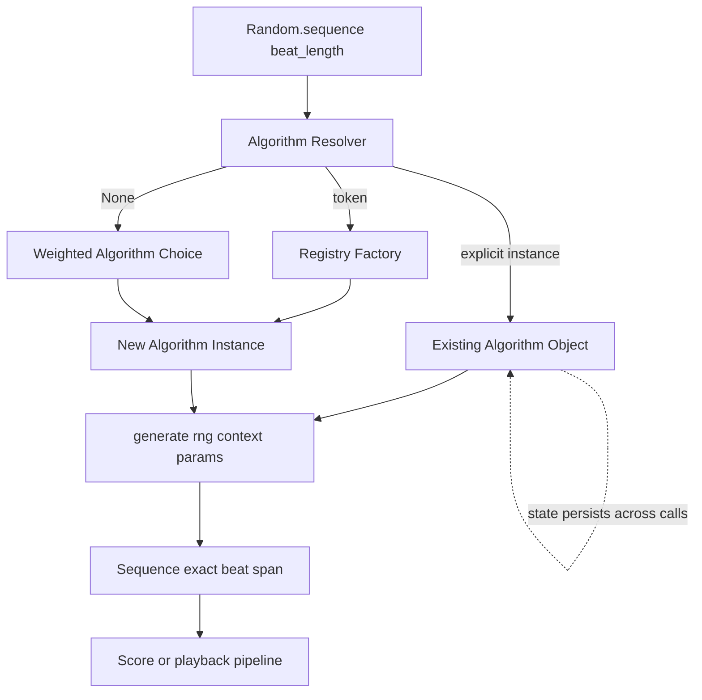

Sequence randomization plan for chordelia.

## Status
Done

## Goal
Add a musical sequence randomization API that generates `Sequence` values to a requested beat length, supports optional algorithm selection, supports weighted random algorithm selection when unspecified, and uses object-based algorithm instances so callers can reuse stateful generators (for example motif carry-forward across successive calls).

## Why this comes first
1. Prerequisite complete: `.plans/archive/randomization_module_plan.md` established deterministic seeded random foundations and weighted selectors.
2. Current randomization API selects individual musical objects but does not generate phrase-length material.
3. Sequence-level generation unlocks practical composition workflows (motifs, walks, phrase continuation) while preserving deterministic reproducibility.

## Scope
1. Extend randomization APIs to generate `Sequence` timelines with explicit beat-length targets.
2. Define an object-based sequence-randomization algorithm contract that supports stateful reuse across calls.
3. Support algorithm selection via:
   1. Explicit algorithm instance
   2. Algorithm name/token
   3. Random weighted algorithm choice when unspecified
4. Allow algorithm-specific extra parameters while requiring each algorithm to operate when parameters are omitted.
5. Implement an initial algorithm set:
   1. Pure random selector (configurable note/rest/chord/tie-like continuation behavior)
   2. Motif variation selector (short motif repeated with controlled variation)
   3. Scale walk/run selector (random walk plus directional runs)
   4. Chord-anchor walk selector (starts/ends phrase fragments on chord tones)
6. Ensure generated material is constrained to musical context when scale/chord context is supplied.
7. Add focused unit tests for deterministic behavior, API validation, weighted algorithm dispatch, and algorithm-specific constraints.
8. Update user-facing docs and examples for sequence randomization.

## Out of scope
1. Corpus-trained, Markov, or ML-driven composition models.
2. Full multi-track arrangement generation, orchestration, or song-form planning.
3. Real-time interactive improvisation engines.
4. Notation-specific tie glyph fidelity guarantees in this phase.
5. Breaking changes to existing `Sequence`, `Score`, or non-randomization APIs.

## Technical design details
1. Canonical models and invariants
   1. Keep implementation additive under `src/chordelia/randomization.py` with optional helper module extraction if needed.
   2. Introduce object-based algorithm contract (protocol or abstract base class) with instance methods, not free functions, so state can persist between calls.
   3. Invariants:
      1. `Random.sequence(...)` must always return a `Sequence` with total consumed beats equal to requested beat length.
      2. Algorithm instances are reusable and may keep internal state (for example motif memory, previous pitch, previous direction).
      3. Weighted random algorithm selection occurs only when algorithm is omitted.
      4. Every built-in algorithm must function with no required algorithm-specific parameters.
      5. All algorithm outputs are deterministic for equal RNG seed plus equal call sequence plus equal algorithm state.
2. Proposed public API shape
```python
from typing import Any, ClassVar, Protocol


class SequenceRandomizationAlgorithm(Protocol):
    name: ClassVar[str]
    default_selection_weight: ClassVar[float]

    def generate(
        self,
        *,
        rng: Random,
        beat_length: float,
        scale: Scale | str | None = None,
        chord: Chord | str | None = None,
        **params: Any,
    ) -> Sequence: ...


class Random:
    @dualmethod
    def sequence(
        self_or_cls,
        beat_length: TimelineLike,
        *,
        algorithm: SequenceRandomizationAlgorithm | str | None = None,
        algorithm_weights: WeightInput[str] | None = None,
        scale: Scale | str | None = None,
        chord: Chord | str | None = None,
        **algorithm_params: Any,
    ) -> Sequence: ...
```
3. Object-based algorithm architecture decision
   1. Require algorithms to be instance-based and passed by object when caller wants stateful continuation.
   2. Support passing algorithm by string/token for convenience; runtime resolves token to a new algorithm instance via registry/factory.
   3. If no algorithm is provided, pick one from registered algorithms using predefined default selection weights (caller can override via `algorithm_weights`).
   4. If random selection chooses an algorithm and caller omitted parameters, chosen algorithm fills missing values using RNG-driven defaults.
4. Algorithm registry and dispatch behavior
   1. Maintain a canonical algorithm registry keyed by stable names.
   2. Validate that override weights reference known algorithm names.
   3. Reject unknown names with actionable errors listing valid options.
   4. Preserve ability to pass custom user-defined algorithm instances that satisfy the protocol.
5. Beat-length and timing semantics
   1. `beat_length` is required and must resolve to beat-mode timeline duration.
   2. Zero or negative beat length raises `ValueError`.
   3. Algorithms fill the requested span exactly; final event duration may be clipped to fit the remaining beats.
   4. Tie-like continuation in phase one is represented as duration extension of prior pitched entry (playback-equivalent), not a new canonical tie payload type.
6. Musical context resolution
   1. `scale` argument: explicit scale context for scale-aware algorithms.
   2. `chord` argument: optional chord anchor context for chord-based algorithms.
   3. If an algorithm requires scale/chord context and it is missing, either:
      1. use algorithm fallback defaults, or
      2. raise `ValueError` with explicit guidance
      according to that algorithm contract.
7. Built-in algorithm contracts (phase one)
   1. `PureRandomSequenceAlgorithm`
      1. Supports event-type weighting over note/rest/chord/tie-like continuation actions.
      2. Supports pitch-range bounds and same-note vs change-note probabilities.
      3. Supports optional pitch bias map.
   2. `MotifVariationSequenceAlgorithm`
      1. Generates a short motif window (for example 1-2 bars) then repeats with local mutations.
      2. Persists motif state on the algorithm instance so successive calls can continue the motif family.
      3. Supports mutation controls (rhythm variation, pitch substitution, transposition window).
   3. `ScaleWalkSequenceAlgorithm`
      1. Generates directionally coherent runs plus random-walk inflections in resolved scale degrees.
      2. Supports run-length and direction-change probabilities.
      3. Keeps previous direction as optional state for cross-call continuity.
   4. `ChordAnchorWalkSequenceAlgorithm`
      1. Constrains phrase fragments to begin/end on chord tones.
      2. Allows interior adjacent passing tones and direction changes.
      3. Supports jump probability among chord tones and walk probability between adjacent scale tones.
8. File touchpoints
   1. `src/chordelia/randomization.py` (public entrypoint and dispatch)
   2. `src/chordelia/sequences.py` (only if helper constructors are needed for ergonomic event emission)
   3. `src/chordelia/__init__.py` (exports for algorithm classes/protocol as appropriate)
   4. `tests/unit/chordelia/test_randomization.py` and/or `tests/unit/chordelia/test_randomization_sequences.py`
   5. `docs/api-overview.md`, `docs/cookbook.md`, `README.md`
9. Core dispatch pseudocode
```python
def sequence(
    beat_length,
    *,
    algorithm=None,
    algorithm_weights=None,
    scale=None,
    chord=None,
    **algorithm_params,
):
    rng = _resolve_random_receiver(self_or_cls)
    total_beats = _coerce_positive_beat_length(beat_length)

    algorithm_instance = _resolve_algorithm_instance(
        rng=rng,
        algorithm=algorithm,
        algorithm_weights=algorithm_weights,
    )

    # Algorithm is responsible for filling missing optional params using rng.
    result = algorithm_instance.generate(
        rng=rng,
        beat_length=total_beats,
        scale=scale,
        chord=chord,
        **algorithm_params,
    )

    _validate_sequence_consumes_exact_beats(result, total_beats)
    return result
```
10. Usage pseudocode with stateful reuse
```python
rng = Random(seed=202606)

# Stateful motif generator reused across phrases.
motif_algo = MotifVariationSequenceAlgorithm(motif_beats=4)

phrase_a = rng.sequence(8, algorithm=motif_algo, scale="D dorian")
phrase_b = rng.sequence(8, algorithm=motif_algo, scale="D dorian")
phrase_c = rng.sequence(8, algorithm=motif_algo, scale="D dorian")

# Weighted random algorithm dispatch.
phrase_random = rng.sequence(
    16,
    algorithm_weights={
        "motif_variation": 40,
        "scale_walk": 30,
        "chord_anchor_walk": 20,
        "pure_random": 10,
    },
    scale="A minor",
)
```
11. Relationship diagram


## Testing approach
Expected test delta classification: both new tests and updated tests.

1. Unit tests for API dispatch and validation
   1. `Random.sequence(...)` rejects non-positive beat lengths.
   2. Unknown algorithm names raise `ValueError` listing valid names.
   3. Unknown `algorithm_weights` keys raise `ValueError`.
   4. Weighted random algorithm choice is deterministic for seeded RNG.
2. Unit tests for object-based state reuse
   1. Reusing the same motif algorithm instance across calls preserves motif continuity behavior.
   2. New motif algorithm instance with same seed produces baseline motif initialization behavior.
   3. Equivalent calls with same seed and same algorithm state produce identical outputs.
3. Unit tests for built-in algorithms
   1. Pure random honors event-type and pitch-bias constraints.
   2. Motif variation repeats motif structure with bounded mutations.
   3. Scale walk/run remains in resolved scale degrees.
   4. Chord-anchor walk begins/ends fragments on chord tones.
4. Sequence span validation tests
   1. Generated sequences consume exactly requested beat length.
   2. Tie-like continuation action extends prior pitched duration while preserving total span.
5. Regression checks
   1. Existing object-level random selectors (`scale`, `degree`, `note`, `chord`, `interval`, chromatic selectors) remain unchanged.
6. Test execution plan
   1. Focused: `pytest tests/unit/chordelia/test_randomization.py -q`
   2. Focused/new: `pytest tests/unit/chordelia/test_randomization_sequences.py -q` (if split file is added)
   3. Related: `pytest tests/unit/chordelia/test_sequences.py tests/unit/chordelia/test_score.py -q`
   4. Full: `pytest -q`

## Documentation approach
Expected docs delta classification: both README updates and docs updates.

1. `docs/api-overview.md`
   1. Add `Random.sequence(...)` contract and argument precedence.
   2. Document algorithm instance reuse and stateful behavior expectations.
   3. Document weighted algorithm selection defaults and override behavior.
2. `docs/cookbook.md`
   1. Add examples for each built-in algorithm.
   2. Add motif instance reuse example across successive calls.
   3. Add weighted random algorithm-selection example.
3. `README.md`
   1. Add concise quickstart snippet for generating a seeded 8-beat sequence.
   2. Link to cookbook for advanced algorithm parameterization.
4. Validation
   1. Verify examples run with canonical imports.
   2. Verify terminology consistency for sequence, motif, walk, and chord-anchor constraints.
   3. Verify docs note that phase-one tie behavior is playback-equivalent continuation, not notation-specific tie rendering.

## Progress checklist
- [x] Phase 0 complete: algorithm object contract and registry semantics locked
- [x] Phase 1 complete: `Random.sequence(...)` dispatch and validation implemented
- [x] Phase 2 complete: built-in algorithms implemented with default self-configuration
- [x] Phase 3 complete: deterministic/stateful tests passing
- [x] Phase 4 complete: docs and README updates merged
- [x] Acceptance criteria met

## Phases
### Phase 0: Contract lock
1. Finalize canonical method name and signature for sequence generation.
2. Finalize algorithm object protocol/ABC and lifecycle semantics (stateful reuse allowed).
3. Finalize registry keys and default algorithm-selection weights.
4. Finalize tie-like continuation semantics for phase one.

### Phase 1: Dispatch foundation
1. Implement `Random.sequence(...)` receiver resolution and beat-length validation.
2. Implement algorithm resolution for instance/token/weighted-default paths.
3. Implement validation for `algorithm_weights` and unknown algorithm names.

### Phase 2: Built-in algorithm implementations
1. Implement pure random sequence algorithm.
2. Implement motif variation algorithm with persisted motif state.
3. Implement scale walk/run algorithm.
4. Implement chord-anchor walk algorithm.
5. Ensure each algorithm can self-populate missing params using RNG-driven defaults.

### Phase 3: Verification
1. Add tests for dispatch, determinism, and algorithm-state reuse.
2. Add algorithm-specific musical-constraint tests.
3. Add beat-length exact-consumption tests.
4. Run focused, related, and full test commands.

### Phase 4: Documentation and examples
1. Update API overview and cookbook.
2. Add README quickstart snippet.
3. Validate examples and docs consistency.

## Execution order recommendation
1. Lock object contract and tie-like continuation semantics first.
2. Implement dispatch before algorithm internals to stabilize external API.
3. Implement motif algorithm early to validate stateful reuse contract.
4. Implement remaining algorithms after shared helper utilities are stable.
5. Complete tests before docs to avoid documenting unstable behavior.

## Risks and mitigations
1. Risk: algorithm protocol too rigid for future models.
   1. Mitigation: allow `**algorithm_params` extensibility and custom algorithm instances.
2. Risk: weighted default algorithm choice yields non-musical outputs in some contexts.
   1. Mitigation: start with conservative default weights and validate with deterministic test fixtures.
3. Risk: stateful algorithm objects are reused unintentionally across unrelated contexts.
   1. Mitigation: document instance lifecycle and provide examples for creating fresh algorithm instances.
4. Risk: tie-like continuation semantics diverge from notation expectations.
   1. Mitigation: explicitly scope phase one to playback-equivalent continuation and defer notation tie model decisions.
5. Risk: exact beat-fill logic introduces edge-case truncation artifacts.
   1. Mitigation: test clipping/remaining-beat behavior and constrain minimal rhythmic units.

## Acceptance criteria
1. `Random.sequence(...)` exists and accepts required beat-length plus optional algorithm selection.
2. Sequence-randomization algorithms are object-based and support instance reuse across successive calls.
3. Omitting algorithm triggers weighted random selection from registered built-in algorithms.
4. Callers can pass algorithm-specific parameters, and built-in algorithms operate when those parameters are omitted.
5. Built-in algorithms include pure random, motif variation, scale walk/run, and chord-anchor walk strategies.
6. Generated sequences consume exactly requested beat length.
7. Motif algorithm demonstrates stateful continuity when the same instance is reused.
8. Deterministic tests pass for seeded runs, including weighted algorithm-selection paths.
9. Public docs and README include sequence-generation examples, including stateful motif reuse.
