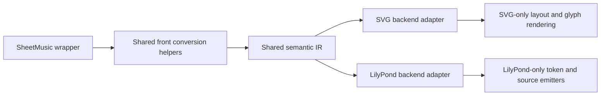

Shared backend helpers extraction plan for sheet-music rendering.

## Status
Done

## Goal
Extract backend-agnostic sheet-music helper logic into a shared module at `src/chordelia/sheetmusic_backends/helpers.py`, maximize canonical reuse across SVG and LilyPond, and remove rendering/helper methods from `SheetMusic` so it remains a thin wrapper and backend dispatcher.

## Why this comes first
1. Current helper placement still leaks backend-support behavior into `SheetMusic`, which conflicts with the wrapper abstraction goal.
2. SVG and LilyPond currently duplicate some low-level notation parsing/conversion logic.
3. A canonical helper layer reduces behavior drift between backends while preserving backend-specific output formatting.

## Scope
1. Create a shared backend helper module for backend-agnostic notation utilities.
2. Move eligible helper logic out of `sheet_music.py` into shared helpers or backend-local modules.
3. Update SVG backend to consume shared helpers where logic is canonical.
4. Update LilyPond backend to consume shared helpers where logic is canonical.
5. Remove obsolete helper methods/constants from `SheetMusic` after migration.
6. Add/adjust tests to protect helper behavior and backend parity for shared logic.

## Out of scope
1. Redesigning engraving style heuristics for SVG (spacing/aesthetic tuning beyond helper extraction).
2. Replacing LilyPond-specific syntax-generation helpers with generic abstractions where output format is inherently LilyPond-only.
3. Introducing new user-facing API options unrelated to helper extraction.

## Technical design details
1. Canonical module and boundaries
   1. New module: `src/chordelia/sheetmusic_backends/helpers.py`.
   2. Module contains only backend-agnostic notation/domain helpers.
   3. Backend-specific serialization/rendering stays in:
      1. `src/chordelia/sheetmusic_backends/svg.py`
      2. `src/chordelia/sheetmusic_backends/lilypond.py`

2. Shared semantic abstraction (front conversion IR)
   1. Add a canonical semantic layer used by both backends before output formatting.
   2. This layer represents notation meaning, not renderer geometry or output syntax.
   3. Canonical front-conversion values:
      1. `AccidentalMap`: `dict[str, int]` keyed by note letter (`A`-`G`) with signed accidental offsets.
      2. `OrderedKeySignature`: `list[tuple[str, int]]` in canonical accidental order.
      3. `MeasureScaleAnnotation`: `tuple[Fraction, OrderedKeySignature, str]`.
      4. `ActiveKeyMapForBeat`: resolved `AccidentalMap` for one beat position.
      5. `ParsedSpelling`: `(letter, accidental_offset, octave_or_none)`.
   4. IR invariants:
      1. IR must be clef-agnostic and staff-line-agnostic.
      2. IR must be output-format-agnostic (no SVG coordinates, no LilyPond tokens).
      3. IR must be deterministic for identical score + scale annotations.
   5. Backend responsibilities after front conversion:
      1. SVG backend maps IR to staff steps, glyph positions, and SVG shapes/text.
      2. LilyPond backend maps IR to LilyPond directives/tokens/source text.
   6. No backend may bypass canonical IR for in-scope shared semantics unless documented as an explicit exception.

3. Candidate helper inventory and destination
   1. Move from `SheetMusic` to shared helpers (or equivalent refactor target):
      1. scale-to-accidental-map logic (currently `_key_accidental_map_from_scale`)
      2. accidental ordering logic (currently `_key_signature_accidentals_for_map` + sharp/flat order constants)
      3. measure annotation projection helper (currently `_scale_measure_annotations_for_render` semantics)
      4. beat-scoped active key accidental resolution (currently `_key_accidental_map_for_beat` semantics)
   2. Move duplicated parsing/conversion logic to shared helpers:
      1. spelling regex/parser logic currently duplicated between SVG and LilyPond
      2. optional generic duration decomposition utility if both backends consume it without format coupling
   3. Keep backend-specific helpers local:
      1. LilyPond token/text emitters (`keyAlterations`, pitch token text, score serialization)
      2. SVG geometry/layout/render primitives (stems, beams, glyph positions, staff coordinates)

4. Canonical helper API sketch
   1. Scale/key helpers
      1. `key_accidental_map_from_scale(scale: Scale | None) -> dict[str, int]`
      2. `ordered_key_signature_accidentals(accidental_map: dict[str, int]) -> list[tuple[str, int]]`
      3. `measure_scale_annotations_for_render(annotations: tuple[tuple[Fraction, Scale, str], ...]) -> tuple[tuple[Fraction, list[tuple[str, int]], str], ...]`
      4. `key_accidental_map_for_beat(beat: Duration, base_map: dict[str, int], annotations: tuple[tuple[Fraction, Scale, str], ...]) -> dict[str, int]`
   2. Spelling helper
      1. `parse_spelling(spelling: str) -> tuple[str, int, int | None] | None`
      2. Contract: returns uppercase note letter, signed accidental offset, optional octave.
   3. Optional duration helper
      1. `split_fractional_duration(duration: Fraction, supported_values: tuple[Fraction, ...]) -> list[Fraction]`
      2. Keep this helper only if both backends actually consume it post-migration.

5. Helper ownership matrix (initial)

| Logic piece | Canonical home | Consumers | Notes |
| --- | --- | --- | --- |
| Scale -> accidental map | `sheetmusic_backends/helpers.py` | SVG, LilyPond | Shared semantic IR input |
| Ordered key-signature accidentals | `sheetmusic_backends/helpers.py` | SVG, LilyPond | Shared order semantics; backend maps output |
| Measure-scale annotation projection | `sheetmusic_backends/helpers.py` | SVG, LilyPond | Shared timeline/key context projection |
| Active key map for beat | `sheetmusic_backends/helpers.py` | SVG, LilyPond | Shared event-time key expectation |
| Spelling parse (letter/accidental/octave) | `sheetmusic_backends/helpers.py` | SVG, LilyPond | Replace duplicated regex parsing |
| Clef line-step mapping | `sheetmusic_backends/svg.py` | SVG only | Geometry concern, not shared IR |
| Key accidental staff-line placement | `sheetmusic_backends/svg.py` | SVG only | Renderer geometry |
| LilyPond keyAlterations syntax emission | `sheetmusic_backends/lilypond.py` | LilyPond only | Format-specific syntax |
| LilyPond pitch token formatting | `sheetmusic_backends/lilypond.py` | LilyPond only | Format-specific syntax |
| Fractional duration decomposition | TBD (shared if dual-use; else LilyPond local) | LilyPond (+SVG optional) | Decide in Phase 0 |

6. `SheetMusic` responsibilities after extraction
   1. Retain source coercion, score assembly, backend format dispatch, and public API semantics.
   2. Retain wrapper-level state needed by backends (for example resolved scale context data), but not helper methods that transform/render this state.
   3. Remove helper methods/constants whose only role is backend rendering support.

7. Touchpoints by file
   1. `src/chordelia/sheetmusic_backends/helpers.py` (new)
   2. `src/chordelia/sheet_music.py` (remove helper methods/constants and switch to helper-driven data wiring)
   3. `src/chordelia/sheetmusic_backends/svg.py` (consume shared helpers)
   4. `src/chordelia/sheetmusic_backends/lilypond.py` (consume shared helpers where format-agnostic)
   5. `tests/unit/chordelia/test_sheet_music.py` (adjust architecture assertions as needed)
   6. `tests/unit/chordelia/test_sheetmusic_backend_helpers.py` (new focused helper tests)

8. Error and validation semantics
   1. Helper functions preserve current behavior for supported tonal signatures.
   2. Mixed/inconsistent accidental maps remain explicitly handled (documented fallback behavior).
   3. Invalid spelling parsing returns `None` or raises as defined per helper contract; behavior is deterministic and tested.
   4. No public API behavioral regressions for `SheetMusic.to_file(...)` output format dispatch.

9. Compatibility and migration notes
   1. Public user API is unchanged.
   2. Internal method names in `SheetMusic` that were not part of public API may be removed.
   3. Tests referencing removed private methods must be updated to target shared helpers or backend output behavior.

10. Implementation pseudocode

```text
phase_inventory():
    classify each helper as shared-domain, svg-only, lilypond-only

build_shared_helpers_module():
    implement canonical shared-domain helpers
    add focused unit tests for helper contracts

migrate_svg_and_lilypond():
    replace duplicated logic with shared imports
    keep backend-only formatting/rendering code local

thin_sheet_music_wrapper():
    remove rendering-support helper methods from SheetMusic
    keep only wrapper state and backend dispatch

validate():
    run focused helper tests + sheet_music backend tests
    run full test suite
```

11. Usage pseudocode (internal call pattern)

```text
# SVG path
base_map = key_accidental_map_from_scale(sheet._staff_scale)
measure_annotations = measure_scale_annotations_for_render(sheet._measure_scale_annotations)
active_map = key_accidental_map_for_beat(event.beat, base_map, sheet._measure_scale_annotations)

# LilyPond path
parsed = parse_spelling(spelling_text)
# keep LilyPond text token formatting local
```

12. Architecture diagram


## Testing approach
Expected test delta classification: both new tests and updated tests.

1. New tests
   1. Add focused helper contract tests in `tests/unit/chordelia/test_sheetmusic_backend_helpers.py`.
   2. Add parser tests for spelling parsing edge cases (single/double accidentals, with/without octave).
   3. Add scale/key accidental-map tests for major/minor and iterable scale annotations.
   4. Add semantic IR invariant tests (clef-agnostic and output-format-agnostic semantics).
2. Updated tests
   1. Update existing sheet-music tests that reference removed private `SheetMusic` helper methods.
   2. Keep backend-output regression tests to ensure unchanged rendering semantics.
   3. Add parity tests that compare backend-consumed IR inputs for identical score contexts.
3. Edge cases
   1. empty/no-scale context
   2. mixed accidental maps
   3. measure annotation boundary behavior at exact beat markers
   4. invalid spelling strings fallback behavior
   5. identical scale context with different clefs still yields same semantic key IR
4. Validation commands
   1. Focused: `pytest tests/unit/chordelia/test_sheet_music.py tests/unit/chordelia/test_sheetmusic_backend_helpers.py -q`
   2. Full: `pytest`

## Documentation approach
Expected docs delta classification: no docs delta.

No docs delta rationale:
1. The plan is an internal architecture refactor with no user-facing API or behavior changes.
2. Existing public docs can remain unchanged if acceptance criteria prove no behavior regression.

Validation:
1. Reconfirm examples and existing docs-based workflows still pass tests after refactor.
2. If any public behavior wording changes during implementation, promote docs delta to docs updates.

## Progress checklist
- [x] Phase 0: Helper inventory and ownership matrix finalized
- [x] Phase 1: Shared helper module created with canonical contracts
- [x] Phase 1a: Shared semantic IR contract and invariants codified
- [x] Phase 2: SVG backend migrated to shared helpers where applicable
- [x] Phase 3: LilyPond backend migrated to shared helpers where applicable
- [x] Phase 4: `SheetMusic` helper removals completed; wrapper stays thin
- [x] Phase 5: Focused and full test validation completed
- [x] Shared helper architecture accepted

## Phases
### Phase 0: Inventory and classification
1. Build a helper matrix: shared-domain vs SVG-only vs LilyPond-only.
2. Lock canonical ownership for each helper to avoid duplicate implementations.
3. Confirm removal list for `sheet_music.py` private helper methods/constants.

### Phase 1: Shared helper module + tests
1. Create `sheetmusic_backends/helpers.py` with agreed canonical helper APIs.
2. Add unit tests for helper semantics and edge cases.
3. Document helper contracts in module docstrings.

### Phase 1a: Semantic IR contract lock
1. Add a helper ownership matrix table to the plan and mirror it in code comments/docstrings where useful.
2. Define IR invariants and backend adapter responsibilities as explicit non-goals/guardrails.
3. Add contract tests that fail if backend-only concerns leak into shared IR helpers.

### Phase 2: SVG migration
1. Replace SVG-local duplicated parsing/key-context logic with shared helper imports.
2. Keep SVG geometry/rendering primitives backend-local.
3. Verify SVG output parity via focused baseline tests.

### Phase 3: LilyPond migration
1. Replace LilyPond-local duplicated parsing/key-context logic with shared helper imports where format-agnostic.
2. Keep LilyPond tokenization/source formatting backend-local.
3. Verify LilyPond source behavior parity in existing tests.

### Phase 4: Thin `SheetMusic` cleanup
1. Remove rendering-support helper methods/constants from `sheet_music.py`.
2. Keep only wrapper-level orchestration and state needed for backend calls.
3. Ensure no backend imports helper methods from `SheetMusic`.

### Phase 5: Verification and closeout
1. Run focused test set then full suite.
2. Confirm no duplicate helper implementations remain across backends for shared-domain logic.
3. Capture follow-up items for any non-critical remaining duplication.

## Execution order recommendation
1. Lock helper ownership matrix before moving code to prevent ping-pong refactors.
2. Land shared helper contracts and tests first.
3. Migrate one backend at a time (SVG then LilyPond) with focused tests after each.
4. Remove `SheetMusic` helpers only after both backends are consuming canonical shared logic.
5. Run full-suite validation before marking plan approved/implementing.

## Implementation notes
### 2026-06-19 - Phase 0 through Phase 5
- Scope completed: extracted shared semantic helper logic into `src/chordelia/sheetmusic_backends/helpers.py`, migrated SVG and LilyPond to consume shared helpers, and removed rendering-support helper methods from `SheetMusic`.
- Code touchpoints: `src/chordelia/sheetmusic_backends/helpers.py`, `src/chordelia/sheet_music.py`, `src/chordelia/sheetmusic_backends/svg.py`, `src/chordelia/sheetmusic_backends/lilypond.py`, `tests/unit/chordelia/test_sheetmusic_backend_helpers.py`, `.plans/shared_backend_helpers_extraction_plan.md`.
- Tests: `pytest tests/unit/chordelia/test_sheetmusic_backend_helpers.py tests/unit/chordelia/test_sheet_music.py -q` (79 passed), `pytest -q` (999 passed, 3 skipped).
- Docs: no docs delta (internal architecture refactor, no public API behavior changes).
- Commit/PR: not created in this implementation session.
- Follow-ups: if future backends are added, require consumption of shared semantic IR helpers by default unless explicitly exempted.

## Risks and mitigations
1. Risk: helper extraction changes accidental/key behavior subtly.
   1. Mitigation: contract tests for helper outputs and regression tests for backend outputs.
2. Risk: over-sharing forces backend-specific compromises.
   1. Mitigation: strict boundary rule: share only notation-domain logic, keep output-format logic local.
3. Risk: private-method removal breaks hidden test assumptions.
   1. Mitigation: migrate tests to helper-module contracts and external output behavior assertions.
4. Risk: duplicate logic persists under renamed helpers.
   1. Mitigation: add explicit duplication audit in closeout checklist.

## Acceptance criteria
1. `sheet_music.py` contains no rendering-support helpers; only wrapper/orchestration logic remains.
2. Shared-domain helper logic has exactly one canonical implementation in `sheetmusic_backends/helpers.py`.
3. SVG and LilyPond both consume shared helpers for agreed common logic.
4. Backend-specific formatting/rendering logic remains in backend modules.
5. Focused and full tests pass with no behavior regressions.
6. Helper ownership matrix is reflected in code (no unresolved duplicate implementations for in-scope helpers).
7. Shared semantic IR exists and is consumed by both backends before backend-specific conversion.
8. Shared IR contains no SVG geometry or LilyPond syntax artifacts.
