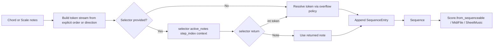

Chord and scale arpeggiation plan for chordelia.

## Status
Drafting

## Goal
Add a flexible, deterministic arpeggiation API that supports both Chord and Scale sources, explicit note-order patterns, and callback-driven note selection.

## Why this comes first
1. Chord currently renders as one simultaneous score event and cannot directly express broken-chord behavior.
2. Users can manually build Sequence values, but arpeggio intent (pattern, repeats, overflow handling) is verbose and error-prone.
3. Scale workflows already expose degree semantics and should support the same arpeggiation entry point.
4. A selector callback unlocks dynamic note choice (for example pressed-note arpeggiators) without changing Score, MidiFile, or SheetMusic architecture.

## Scope
1. Add public arpeggiation transforms on Chord and Scale.
2. Support explicit positional order input such as arpeggiate(1, 2, 5, 4, 3).
3. Define mismatch behavior when pattern positions exceed source note count.
4. Support deterministic direction presets when explicit order is not provided.
5. Support selector callbacks that can choose each emitted note from active notes and step index.
6. Keep output as Sequence so existing score conversion and rendering pipelines remain unchanged.

## Out of scope
1. Humanized timing randomness, velocity humanization, and swing behavior.
2. Real-time clock/scheduler implementation in playback engines.
3. Chord-string parser syntax additions for arpeggio patterns.
4. DAW-style latch/hold/pedal state management.

## Technical design details
### Canonical types and invariants
1. Add ArpeggioDirection enum:
   1. UP
   2. DOWN
   3. UP_DOWN
2. Add ArpeggioOverflowPolicy enum:
   1. WRAP_OCTAVE (default)
   2. CLAMP
   3. ERROR
3. Add ArpeggioSelector callback protocol:
   1. Input: active_notes tuple and step index.
   2. Optional input: selector context containing order token and cycle index.
   3. Output: selected Note or 1-based position token.
4. Chord.arpeggiate and Scale.arpeggiate return new Sequence values and never mutate source objects.
5. Arpeggiation requires octave-bearing notes for deterministic MIDI output; raise ValueError when missing.

### Pattern semantics and mismatch behavior
1. Explicit order values are 1-based positional tokens over source notes.
2. For source length N and token T:
   1. Base index = (T - 1) % N
   2. Octave shift = (T - 1) // N
3. WRAP_OCTAVE behavior:
   1. token 5 on triad [C4, E4, G4] maps to E5.
   2. Negative/zero tokens are rejected in v1.
4. CLAMP behavior:
   1. token > N maps to N (top note, no octave carry).
5. ERROR behavior:
   1. token > N raises ValueError.
6. When the source has more notes than explicit order length, only referenced notes are used by design.

### Recommendation for source-count mismatches
1. Default to WRAP_OCTAVE because it is musically useful and handles both short and long patterns naturally.
2. Keep ERROR for strict users and testability.
3. Keep CLAMP for legacy-style top-note repetition patterns.

### Proposed public API signatures
1. In [src/chordelia/chords.py](src/chordelia/chords.py):

```python
class Chord:
    def arpeggiate(
        self,
        *order: int,
        direction: ArpeggioDirection | str = ArpeggioDirection.UP,
        step_duration: Duration | int | float = 1,
        repeat_count: int = 1,
        overflow_policy: ArpeggioOverflowPolicy | str = ArpeggioOverflowPolicy.WRAP_OCTAVE,
        selector: ArpeggioSelector | None = None,
    ) -> Sequence:
        ...
```

2. In [src/chordelia/scales.py](src/chordelia/scales.py):

```python
class Scale:
    def arpeggiate(
        self,
        *order: int,
        direction: ArpeggioDirection | str = ArpeggioDirection.UP,
        step_duration: Duration | int | float = 1,
        repeat_count: int = 1,
        overflow_policy: ArpeggioOverflowPolicy | str = ArpeggioOverflowPolicy.WRAP_OCTAVE,
        selector: ArpeggioSelector | None = None,
    ) -> Sequence:
        ...
```

3. Shared arpeggio models in a new module [src/chordelia/arpeggiation.py](src/chordelia/arpeggiation.py):

```python
class ArpeggioDirection(Enum): ...
class ArpeggioOverflowPolicy(Enum): ...

@dataclass(frozen=True, slots=True)
class ArpeggioStepContext:
    step_index: int
    order_token: int | None
    cycle_index: int

class ArpeggioSelector(Protocol):
    def __call__(
        self,
        active_notes: tuple[Note, ...],
        step_index: int,
        context: ArpeggioStepContext,
    ) -> Note | int:
        ...
```

### Selector behavior rules
1. If selector is provided, selector controls final note choice per step.
2. If both explicit order and selector are provided:
   1. order drives context.order_token for each step.
   2. selector may ignore or use that token.
3. Selector int return values are interpreted as 1-based tokens and resolved via overflow_policy.
4. Selector Note return values are emitted directly.
5. Invalid selector outputs raise TypeError with actionable guidance.

### Direction presets
1. If order is provided, direction is ignored for note ordering (documented behavior).
2. If order is empty:
   1. UP uses ascending source notes.
   2. DOWN uses descending source notes.
   3. UP_DOWN uses ascent then descent without endpoint duplication.

### Module and file touchpoints
1. [src/chordelia/arpeggiation.py](src/chordelia/arpeggiation.py)
   1. Shared enums, selector protocol, and note-resolution helpers.
2. [src/chordelia/chords.py](src/chordelia/chords.py)
   1. Add Chord.arpeggiate by delegating to shared arpeggiation helpers.
3. [src/chordelia/scales.py](src/chordelia/scales.py)
   1. Add Scale.arpeggiate with same contract as Chord.arpeggiate.
4. [src/chordelia/__init__.py](src/chordelia/__init__.py)
   1. Export ArpeggioDirection and ArpeggioOverflowPolicy.
5. [tests/unit/chordelia/test_chords.py](tests/unit/chordelia/test_chords.py)
6. [tests/unit/chordelia/test_scales.py](tests/unit/chordelia/test_scales.py)
7. [tests/unit/chordelia/test_sequenceable.py](tests/unit/chordelia/test_sequenceable.py)
8. New focused tests in [tests/unit/chordelia/test_arpeggiation.py](tests/unit/chordelia/test_arpeggiation.py)

### Error and validation semantics
1. Source with empty notes -> ValueError.
2. Source notes missing octave -> ValueError.
3. repeat_count must be int > 0.
4. order tokens must be int >= 1 in v1.
5. Invalid direction or overflow string -> ValueError with accepted values.
6. selector exceptions are propagated with step context preserved in error message where practical.

### Compatibility and migration notes
1. Additive-only API; existing Chord.render_for_context and Scale behavior remain unchanged.
2. Output remains Sequence, so Score.from_sequenceable and wrapper flows need no contract change.
3. Existing direction-only plan remains valid as a subset of this expanded contract.

### Implementation pseudocode
1. Token resolution

```text
function resolve_token(notes, token, overflow_policy):
   n = len(notes)
   if token < 1:
      raise ValueError

   if overflow_policy == ERROR and token > n:
      raise ValueError

   if overflow_policy == CLAMP:
      return notes[min(token, n) - 1]

   # WRAP_OCTAVE
   base_idx = (token - 1) % n
   octaves_up = (token - 1) // n
   return notes[base_idx].with_octave(notes[base_idx].octave + octaves_up)
```

2. Sequence generation

```text
function arpeggiate_source(notes, order, direction, repeat_count, selector):
   base_tokens = order if order else direction_tokens(notes, direction)
   entries = []
   for cycle in range(repeat_count):
      for i, token in enumerate(base_tokens):
         step_index = cycle * len(base_tokens) + i
         context = ArpeggioStepContext(step_index, token, cycle)
         if selector is None:
            note = resolve_token(notes, token, overflow_policy)
         else:
            selected = selector(notes, step_index, context)
            note = selected if selected is Note else resolve_token(notes, selected, overflow_policy)
         entries.append((note, step_duration))
   return Sequence(entries)
```

### Usage pseudocode
```python
from chordelia import Chord, Scale, Score, ArpeggioOverflowPolicy

# Explicit order with wrap-octave behavior on triad
arp = Chord("C4").arpeggiate(1, 2, 5, 4, 3)

# Scale arpeggiation
scale_arp = Scale("C4", "major").arpeggiate(1, 3, 5, 7, 9)

# Callback-based selection
def bounce_selector(active_notes, step_index, context):
    if step_index % 2 == 0:
        return context.order_token or 1
    return len(active_notes)

dynamic = Chord("Am4").arpeggiate(1, 2, 3, 4, selector=bounce_selector)
score = Score.from_sequenceable(dynamic, tempo=120)
```

### Diagram


## Cross-plan references
1. [common musical interfaces plan](common_musical_interfaces_plan.md) for Sequenceable and Score conversion boundary behavior.
2. [duration model unification plan](duration_model_unification_plan.md) for timing coercion alignment.

## Testing approach
Expected test delta classification: both new tests and updated tests.

1. Unit tests in [tests/unit/chordelia/test_arpeggiation.py](tests/unit/chordelia/test_arpeggiation.py)
   1. WRAP_OCTAVE, CLAMP, and ERROR behavior for out-of-range tokens.
   2. selector return type behavior (Note vs int token).
   3. selector context contents and deterministic step indexing.
2. Unit tests in [tests/unit/chordelia/test_chords.py](tests/unit/chordelia/test_chords.py)
   1. explicit order examples including 1,2,5,4,3.
3. Unit tests in [tests/unit/chordelia/test_scales.py](tests/unit/chordelia/test_scales.py)
   1. scale arpeggiation for heptatonic and non-heptatonic scales.
4. Integration tests in [tests/unit/chordelia/test_sequenceable.py](tests/unit/chordelia/test_sequenceable.py)
   1. sequence normalization and consumed duration from arpeggiated chord/scale outputs.
5. Regression tests
   1. existing simultaneous chord rendering remains unchanged.
6. Validation runs
   1. Focused: arpeggiation, chords, scales, sequenceable.
   2. Full: pytest -q.

## Documentation approach
Expected docs delta classification: both README updates and docs updates.

1. Update [README.md](README.md) with explicit-order and selector examples.
2. Update [docs/api-overview.md](docs/api-overview.md) with new arpeggiation API and enums.
3. Update [docs/quickstart.md](docs/quickstart.md) with chord and scale arpeggiation examples.
4. Add guidance for mismatch policies (wrap_octave, clamp, error) and when to use each.

## Progress checklist
- [ ] Shared arpeggiation contract finalized (direction, overflow, selector)
- [ ] Shared arpeggiation module implemented
- [ ] Chord.arpeggiate implemented with explicit-order support
- [ ] Scale.arpeggiate implemented with identical contract
- [ ] Selector callback semantics implemented and validated
- [ ] Public exports updated
- [ ] Focused tests added/updated and passing
- [ ] Full test suite passing
- [ ] README/docs updates completed and validated

## Phases
### 1. Contract lock
1. Finalize token semantics and overflow-policy defaults.
2. Finalize selector callback signature and precedence rules.

### 2. Shared implementation
1. Add arpeggiation shared module and helper functions.
2. Implement enums and coercion helpers.

### 3. Source integrations
1. Add Chord.arpeggiate.
2. Add Scale.arpeggiate.
3. Export new API models from package init.

### 4. Verification
1. Add focused tests for token resolution and selector behavior.
2. Add chord/scale integration tests through Score.
3. Run focused then full test suite.

### 5. Documentation
1. Update README and docs with explicit-order, scale, and selector examples.

## Execution order recommendation
1. Lock contract first so order/selector behavior is not re-litigated mid-implementation.
2. Build shared helpers before touching Chord and Scale.
3. Add tests immediately after helper implementation to freeze semantics.
4. Integrate source methods and docs after tests are stable.

## Risks and mitigations
1. Risk: ambiguity when order and selector are both present.
   1. Mitigation: document that order seeds context tokens and selector has final choice.
2. Risk: unexpected octave jumps with wrap_octave policy.
   1. Mitigation: clear docs and optional clamp/error alternatives.
3. Risk: callback misuse introduces non-deterministic behavior.
   1. Mitigation: keep core engine deterministic; callback gets deterministic inputs.

## Acceptance criteria
1. Chord and Scale both expose arpeggiate with the same core contract.
2. Explicit order patterns including out-of-range positions are supported by configurable overflow policy.
3. A selector callback can select notes based on active notes and sequential step index.
4. Arpeggiated outputs normalize correctly through Score.from_sequenceable.
5. Existing chord simultaneous rendering behavior remains unchanged.
6. Focused tests and full suite pass.
7. README/docs show chord, scale, explicit-order, and selector usage.
