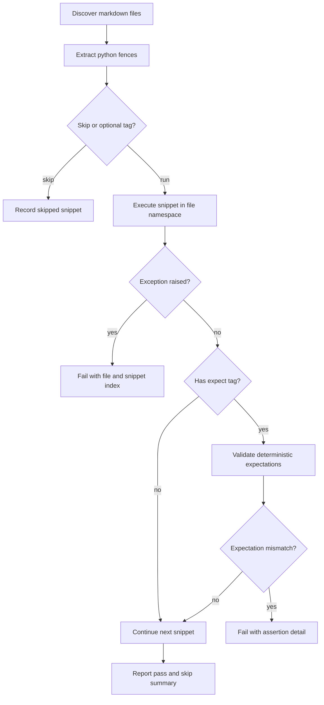

Documentation testing plan for chordelia.

## Status
Drafting

## Goal
Adopt a hybrid documentation testing strategy: execute fenced Python snippets in README/docs for broad runnability coverage, and add selective deterministic output assertions for a small subset of contract-critical examples, with import simplification guidance that uses `from chordelia import *` when symbol lists become long.

## Why this comes first
1. Docs currently contain many Python snippets, but there is no automated guard that they still execute after API changes.
2. Import lists are growing in several guides, which increases copy/paste friction and maintenance churn.
3. A doc-test harness reduces regressions for new users by keeping examples executable.

## Scope
1. Add a markdown snippet test harness for Python fenced code blocks in:
   1. README.md
   2. docs/*.md
   3. docs/guides/*.md
   4. docs/tutorials/*.md
2. Add a focused test module under tests/unit/chordelia for documentation snippet execution.
3. Add smoke validation for example scripts under examples/ that are intended to run in non-hardware environments.
4. Add a fixture strategy for:
   1. temporary working directories for file outputs
   2. deterministic context reset between snippets
   3. optional dependency and hardware-sensitive blocks
5. Add an import-style normalization pass for docs snippets:
   1. prefer explicit imports for short lists
   2. use `from chordelia import *` when import lists are long and all symbols come from the top-level package
6. Add a selective assertion mechanism for deterministic snippets without converting to doctest prompt format.
7. Add validation commands to contributor docs/CI workflow.

## Out of scope
1. Converting all markdown examples to doctest prompt style.
2. Converting all snippet outputs into strict text assertions.
3. Rewriting public API behavior solely to make examples pass.
4. End-to-end hardware playback validation against real MIDI/audio devices.

## Technical design details
1. Canonical execution model
   1. Parse markdown files and extract fenced `python` blocks.
   2. Execute each block in a controlled namespace.
   3. Group snippets by file and execute sequentially per file so tutorial-style "continue from previous block" flows still work.
   4. Reset namespace between files to avoid cross-document leakage.
2. Snippet eligibility rules
   1. Default: execute all fenced Python blocks.
   2. Skip criteria:
      1. shell blocks (`bash`, `sh`) are ignored.
      2. blocks explicitly marked with metadata such as `# doc-test: skip` are skipped.
      3. optional-feature blocks may use `# doc-test: optional-audio` or `# doc-test: optional-midi` to route to conditional execution.
      4. deterministic assertion blocks may use `# doc-test: expect` to enable explicit result assertions.
3. Hybrid assertion policy
   1. Baseline: all eligible snippets must execute without exception.
   2. Optional strict checks: only deterministic snippets use expectations.
   3. Expectation format options:
      1. inline assertion statements in snippet code (preferred)
      2. lightweight metadata markers consumed by the runner when needed
   4. Do not require REPL-style `>>>` formatting.
4. Import simplification rule
   1. For snippet-local imports that only reference top-level `chordelia` exports:
      1. keep explicit imports when the symbol count is 1-3.
      2. replace long imports (4+ symbols) with `from chordelia import *`.
   2. Keep explicit imports for submodule-only APIs, for example `from chordelia.scales import major_scale`.
   3. Preserve readability by adding one short comment when wildcard import is used for snippet brevity.
5. File and module touchpoints
   1. tests/unit/chordelia/test_documentation_examples.py (new)
   2. conftest.py (shared fixtures only if needed)
   3. docs/development.md (test command docs)
   4. README.md and docs markdown files containing long top-level import lists
   5. pyproject.toml (pytest config additions only if required)
6. Error and validation semantics
   1. Any unhandled exception in an executable snippet fails the test with file path and snippet index context.
   2. Optional blocks fail only when dependency is installed but runtime contract breaks.
   3. Missing optional dependencies should report skip, not failure.
   4. Expectation-tagged snippets fail when declared deterministic assertions do not match observed behavior.
7. Execution pipeline pseudocode

```python
def iter_python_snippets(markdown_path):
    blocks = parse_fenced_blocks(markdown_path)
    for i, block in enumerate(blocks, start=1):
        if block.language != "python":
            continue
        if has_tag(block, "doc-test: skip"):
            continue
        yield Snippet(path=markdown_path, index=i, code=block.code, tags=block.tags)


def run_markdown_file(markdown_path):
    ns = {"__name__": "__doc_examples__"}
    for snippet in iter_python_snippets(markdown_path):
        if snippet_requires_optional(snippet.tags):
            assert_optional_dependency_or_skip(snippet.tags)
        exec(compile(snippet.code, f"{markdown_path}:{snippet.index}", "exec"), ns, ns)
        if has_tag(snippet, "doc-test: expect"):
            validate_deterministic_expectations(snippet, ns)


def test_docs_examples_execute():
    for path in discover_markdown_paths():
        run_markdown_file(path)
```

8. Flow diagram



## Testing approach
Expected test delta classification: both new tests and updated tests.

1. New tests
   1. Add a dedicated test file that executes markdown snippets.
   2. Add parser-level tests for fenced-code discovery and tag handling.
   3. Add expectation-path tests for deterministic snippet assertions.
2. Updated tests
   1. Update any affected docs-related assertions if existing tests reference old import style.
3. Edge cases
   1. multi-block continuation in a single doc file
   2. snippets with file output operations routed to tmp paths
   3. optional dependency blocks correctly skipped without extras
   4. wildcard import snippets resolve expected names from package exports
   5. expectation-tagged snippets fail with clear mismatch diagnostics
4. Validation commands
   1. Focused: `pytest tests/unit/chordelia/test_documentation_examples.py`
   2. Full: `pytest tests/`

## Documentation approach
Expected docs delta classification: both README updates and docs updates.

1. Update documentation snippets with long top-level imports to use `from chordelia import *` where appropriate.
2. Document doc-test tags and snippet authoring rules in docs/development.md.
3. Add guidance for when to include deterministic assertions versus run-only snippets.
4. Add a short maintainer note describing when wildcard imports are acceptable in docs snippets.
5. Validation
   1. Ensure all touched markdown snippets execute in the new test harness.
   2. Ensure deterministic expectation snippets validate correctly.
   3. Verify links and prose still match the final snippet behavior.

## Progress checklist
- [ ] Phase 0: Snippet inventory and tagging strategy finalized
- [ ] Phase 1: Markdown snippet runner tests added
- [ ] Phase 2: Optional dependency, temp-path, and expectation handling added
- [ ] Phase 3: Deterministic assertion subset selected and validated
- [ ] Phase 4: Long import lists simplified with wildcard imports where appropriate
- [ ] Phase 5: Development docs and contributor guidance updated
- [ ] Phase 6: Full test validation completed
- [ ] Documentation testing adoption complete

## Phases
### Phase 0: Inventory and rules lock
1. Inventory executable Python blocks across README/docs.
2. Mark blocks needing skip/optional tags.
3. Lock import simplification threshold and exceptions.

### Phase 1: Core runner implementation
1. Add markdown parser/executor tests in tests/unit/chordelia/test_documentation_examples.py.
2. Add failure messages with file and snippet index.

### Phase 2: Environment and dependency controls
1. Add temp directory fixture routing for snippet file output.
2. Add optional dependency skip policy for audio/MIDI blocks.
3. Add deterministic expectation handling for tagged snippets.

### Phase 3: Deterministic assertion subset
1. Identify contract-critical deterministic snippets in README/docs.
2. Add expectation tags or inline assertions for those snippets only.
3. Confirm expectation mismatch messages are actionable.

### Phase 4: Docs snippet normalization
1. Replace long top-level import lists with `from chordelia import *` where the rule applies.
2. Keep explicit imports for short lists and submodule imports.
3. Re-run focused doc tests after each markdown batch update.

### Phase 5: Contributor workflow updates
1. Update docs/development.md with command and authoring policy.
2. Add CI invocation notes if needed.

### Phase 6: Verification and closeout
1. Run full tests.
2. Confirm deterministic pass/skip behavior in environments without optional extras.

## Execution order recommendation
1. Lock parser/tagging and import-style rules before touching many docs files.
2. Build runnability execution first for broad coverage.
3. Add selective deterministic assertions only for stable, contract-critical examples.
4. Normalize imports and land workflow docs after command behavior is finalized.

## Risks and mitigations
1. Risk: False failures from snippets that intentionally depend on prior blocks in other files.
   1. Mitigation: per-file shared namespace only; no cross-file state.
2. Risk: Optional playback examples fail in minimal environments.
   1. Mitigation: explicit optional tags plus dependency-aware skip handling.
3. Risk: Wildcard imports hide missing exports.
   1. Mitigation: keep explicit imports for submodule APIs and add export-resolution tests.
4. Risk: Over-asserting output makes docs brittle.
   1. Mitigation: apply expectations only to deterministic, contract-critical snippets.

## Acceptance criteria
1. Python snippets in README/docs are automatically executed by a dedicated test module.
2. Test output clearly identifies failing markdown file and snippet index.
3. Optional dependency snippets are skipped deterministically when extras are unavailable.
4. A documented subset of deterministic snippets uses explicit expectations without adopting full doctest prompt format.
5. Long top-level `from chordelia import ...` lists are simplified to `from chordelia import *` where the plan rule applies.
6. docs/development.md documents hybrid snippet testing strategy and import-style guidance.
7. Focused and full pytest commands pass for the final implementation.

