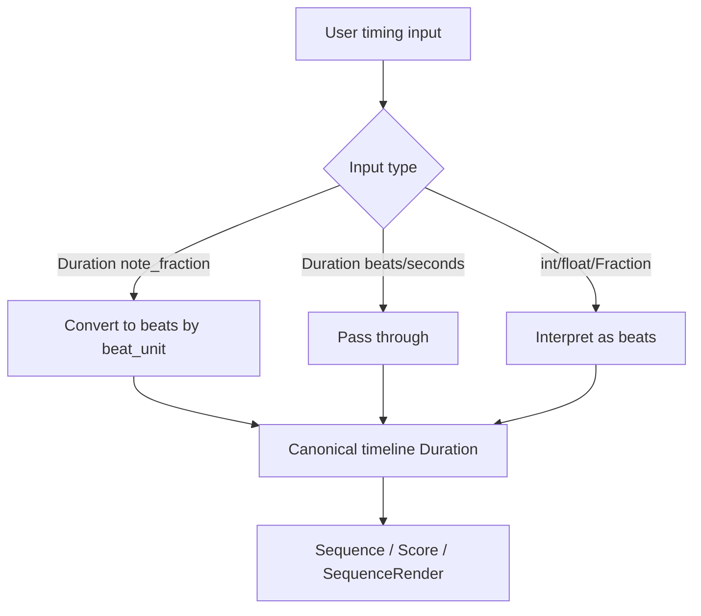

Duration model unification plan for chordelia.

## Status
Implementing

## Goal
Unify and simplify timing inputs so users can reason about durations with one consistent model across Sequence, Score, and playback workflows.

## Why this comes first
1. Current duration inputs are split across note fractions, beats, seconds, and enum note values with inconsistent coercion paths.
2. Sequence, Score, and SequenceRender each implement similar but separate duration coercion logic.
3. User-facing APIs expose named-note helpers (for example quarter-note forms), but scheduling boundaries reject note-fraction mode values, which is surprising.

## Scope
1. Audit and normalize duration input contracts across Duration, Sequence, SequenceRender, ScoreEvent, and ScoreEventContext.
2. Introduce one canonical timing coercion path shared by scheduling boundaries.
3. Support note-fraction Duration and Fraction as accepted timing inputs at scheduling boundaries.
4. Reduce duplicated DurationLike definitions and align type hints to accepted runtime inputs.
5. Preserve compatibility where practical, with staged deprecation for ambiguous constructs.
6. Update docs and examples to reflect a single mental model.

## Out of scope
1. Redesigning Tempo or TimeSignature musical theory behavior beyond timing-input normalization.
2. Replacing all rhythm helper APIs (dotted, triplet, quarter_note, etc.).
3. Changing MIDI timing algorithms in this plan beyond adapting new coercion contracts.

## Technical design details
### Current-state audit summary
1. Duration currently has three internal modes in [src/chordelia/rhythm.py](src/chordelia/rhythm.py):
   1. note_fraction (Duration("quarter"), Duration("eighth"), etc.)
   2. beats (Duration.from_beats(...))
   3. seconds (Duration.from_seconds(...))
2. Scheduling boundaries reject note_fraction mode explicitly:
   1. [src/chordelia/sequences.py](src/chordelia/sequences.py)
   2. [src/chordelia/score.py](src/chordelia/score.py)
   3. [src/chordelia/sequenceable.py](src/chordelia/sequenceable.py)
3. Duration coercion is duplicated across multiple modules with near-identical rules.
4. DurationLike aliases are inconsistent with runtime behavior:
   1. Type hints usually allow Duration | int | float.
   2. Runtime often accepts Fraction via Fraction-compatible conversion.
5. Documentation exposes both named-note and beat-based APIs, but does not clearly define which is canonical for timeline scheduling.

### Unification model
1. Canonical scheduling model:
   1. All timeline scheduling uses Duration in beats mode or seconds mode.
   2. note_fraction remains an authoring notation form only, never required at scheduling boundaries.
2. Canonical coercion function:
   1. Add shared utility in [src/chordelia/rhythm.py](src/chordelia/rhythm.py), for example Duration.coerce_timeline(...).
   2. This function accepts:
      1. Duration (all modes)
      2. int, float, Fraction (interpreted as beats)
      3. Fraction/int/float (interpreted as beats)
   3. It returns Duration in beats or seconds only.
3. Beat-unit policy for note_fraction conversion:
   1. Use beat_unit from context when available (for example ScoreEventContext.time_signature denominator).
   2. Use default beat_unit=4 when no context exists (for example bare SequenceEntry construction).
4. Input type unification:
   1. Introduce a canonical timing alias (for example TimelineLike) in [src/chordelia/rhythm.py](src/chordelia/rhythm.py).
   2. Consume that alias in Sequence, Sequenceable, and Score models.
5. Ergonomic input policy:
   1. Keep beat fractions as the primary scheduling primitive because they are explicit and meter-aware.
   2. Add a tiny convenience helper for readability, for example beats(1, 2) -> Duration.from_beats(Fraction(1, 2), None).
   3. Support named note-fraction Duration shorthand by converting through beat_unit.
   4. Document the rule: "same symbol, different beat counts by meter" when beat_unit changes (for example quarter note in 6/8 equals 2 beats).

### Module touchpoints
1. [src/chordelia/rhythm.py](src/chordelia/rhythm.py)
   1. Add centralized timeline coercion helper and note_fraction conversion helper.
   2. Add explicit conversion from note_fraction to beats with configurable beat_unit.
2. [src/chordelia/sequences.py](src/chordelia/sequences.py)
   1. Replace local _coerce_duration with centralized coercion.
   2. Accept note-fraction Duration/Fraction durations in SequenceEntry.
3. [src/chordelia/score.py](src/chordelia/score.py)
   1. Replace local _coerce_duration with centralized coercion.
   2. Ensure context-aware beat_unit is applied where possible.
4. [src/chordelia/sequenceable.py](src/chordelia/sequenceable.py)
   1. Replace _coerce_consumed_duration with centralized coercion.
5. [src/chordelia/audio_playback.py](src/chordelia/audio_playback.py) and [src/chordelia/playback_notes.py](src/chordelia/playback_notes.py)
   1. Verify compatibility of note_fraction inputs after coercion unification.
6. [src/chordelia/__init__.py](src/chordelia/__init__.py)
   1. Export any new canonical timing aliases/helpers if public.

### Error and validation semantics
1. Invalid duration types should raise TypeError with explicit accepted forms.
2. Negative and zero constraints remain unchanged for duration, offset, beat, and consumed_duration invariants.
3. Mixed mode arithmetic rules inside Duration remain explicit; unification focuses on boundary coercion, not arithmetic semantics.

### Compatibility and migration
1. Backward-compatible in first rollout:
   1. Existing beat/seconds inputs continue to work unchanged.
   2. Additive support for note-fraction Duration and Fraction at scheduling boundaries.
2. Optional second-stage deprecation:
   1. Warn when note_fraction Duration reaches scheduling boundaries and is auto-normalized.
   2. Later, document note_fraction as authoring-only representation.

### Implementation pseudocode
1. Shared timeline coercion

function coerce_timeline_duration(value, field_name, beat_unit=4):
   if value is Duration:
      if value.mode == "note_fraction":
         beats = value.as_beats(beat_unit=beat_unit)
         duration = Duration.from_beats(beats, None)
      else:
         duration = value
   elif value is int|float|Fraction:
      duration = Duration.from_beats(value, None)
   else:
      raise TypeError("Expected Duration, int, float, or Fraction")

   return duration

2. Context-aware beat-unit resolution

function context_beat_unit(time_signature=None, default=4):
   if time_signature exists:
      return time_signature[1]
   return default

### Usage pseudocode
1. Sequence entry with note-fraction Duration

seq = Sequence(((Note("E4"), Duration("eighth")),))

2. Score event with note-fraction Duration input

event = ScoreEvent(
   beat=Duration("quarter"),
   duration=Duration("eighth"),
   pitches=(60,),
)
# normalized internally to beat-based Duration

3. Sequence entry with Fraction

seq = Sequence(((Note("E4"), Fraction(1, 2)),))

4. 4/4 eighth-note scheduling with beat fractions

time_signature = (4, 4)
seq = Sequence(((Note("E4"), Fraction(1, 2)),))
# 1/2 beat = one eighth note in 4/4

5. 6/8 quarter-note scheduling with beat fractions

time_signature = (6, 8)
seq = Sequence(((Note("E4"), 2),))
# 2 beats (eighth-note beats) = one quarter note in 6/8

6. Meter-aware note-fraction shorthand

time_signature = (6, 8)
seq = Sequence(((Note("E4"), Duration("quarter")),))
# normalized to 2 beats by beat_unit=8

### Diagram

## Testing approach
Expected test delta classification: both new tests and updated tests.

1. Unit tests in [tests/unit/chordelia/test_rhythm.py](tests/unit/chordelia/test_rhythm.py)
   1. Add coverage for shared coercion helper and note_fraction conversion by beat_unit.
2. Unit tests in [tests/unit/chordelia/test_sequenceable.py](tests/unit/chordelia/test_sequenceable.py)
   1. Add SequenceEntry cases for note-fraction Duration and Fraction durations.
3. Unit tests in [tests/unit/chordelia/test_score.py](tests/unit/chordelia/test_score.py)
   1. Update rejection behavior if note_fraction inputs become auto-normalized.
4. Regression coverage for existing beat/seconds workflows to confirm no behavior regressions.
5. Validation runs:
   1. Focused: rhythm, score, sequenceable, playback_notes.
   2. Full: pytest -q.

## Documentation approach
Expected docs delta classification: both README and docs updates.

1. Update [docs/api-overview.md](docs/api-overview.md) to define the canonical scheduling model and accepted timing inputs.
2. Update [docs/guides/rhythm-and-timing.md](docs/guides/rhythm-and-timing.md) with explicit note-fraction-to-beats examples at scheduling boundaries.
3. Update [docs/quickstart.md](docs/quickstart.md) examples to use unified duration guidance.
4. Update selected examples under [examples](examples) to use the clarified canonical model.

## Progress checklist
- [x] Audit matrix documented for all timing entry points and coercion boundaries
- [x] Shared timeline coercion helper implemented in rhythm module
- [x] Sequence module migrated to shared timing coercion
- [x] Score module migrated to shared timing coercion
- [x] SequenceRender coercion migrated to shared timing coercion
- [x] DurationLike aliases unified across modules
- [x] Focused timing tests added/updated and passing
- [x] Full test suite passing
- [ ] Docs and examples updated to canonical model

## Phases
### 1. Contract and coercion foundation
1. Finalize canonical scheduling model and accepted inputs.
2. Implement shared timeline coercion and beat-unit conversion semantics in rhythm.
3. Add foundational unit tests for coercion behavior.

### 2. Boundary migration
1. Migrate Sequence, Score, and Sequenceable coercion call sites to shared helper.
2. Remove duplicated local coercion logic where possible.
3. Add compatibility tests for old and new inputs.

### 3. Type-hint and API cleanup
1. Introduce and adopt canonical timing alias across modules.
2. Align function signatures and dataclass field hints with actual accepted values.
3. Add or stage deprecation warnings for ambiguous note_fraction scheduling usage if adopted.

### 4. Documentation and example alignment
1. Update API docs and rhythm guide.
2. Update quickstart and representative example scripts.
3. Validate examples execute with new guidance.

## Execution order recommendation
1. Phase 1 first to establish one coercion authority.
2. Phase 2 next to eliminate inconsistency hotspots.
3. Phase 3 to lock type/system consistency.
4. Phase 4 last to publish stable user-facing guidance.

## Risks and mitigations
1. Risk: subtle timing regressions in 6/8 or non-4 beat-unit contexts.
   1. Mitigation: explicit beat_unit tests and context-driven conversion tests.
2. Risk: breaking behavior where tests expect note_fraction rejection.
   1. Mitigation: stage behavior change behind clear migration and targeted test updates.
3. Risk: duplicated conversion semantics surviving in less-visible modules.
   1. Mitigation: grep-based audit for Duration.from_beats coercion call sites during migration.

## Acceptance criteria
1. Scheduling boundaries accept Duration, Fraction, int, and float consistently.
2. Sequence/Score/SequenceRender use one shared timing coercion path.
3. Timing mode behavior is documented with one canonical mental model.
4. Focused timing tests and full suite pass.
5. Updated examples demonstrate the unified contract without special-case workarounds.
6. Documentation includes explicit 4/4 and 6/8 recipes for eighth and quarter note scheduling.
