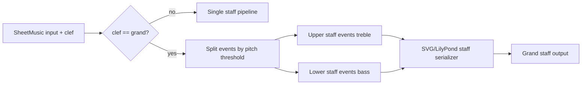

Grand staff rendering support plan for sheet music.

## Status
Drafting

## Goal
Add grand staff rendering (paired treble and bass staves) for sheet-music output while preserving current single-staff behavior and API compatibility.

## Why this comes first
1. Grand staff depends on the clef model and clef-aware positioning introduced by the additional clef plan.
2. Low+high register material currently collapses into one staff, creating readability issues for piano-style notation.
3. A clear grand-staff contract now prevents ad-hoc layout branches later (cross-staff beaming, voice policies, advanced engraving).

Prerequisite:
1. Complete `.plans/additional_clef_rendering_plan.md` through accepted status before implementation begins.

## Scope
1. Extend sheet rendering to support `clef="grand"` as a paired-staff mode.
2. Split score events into upper and lower staff streams using a deterministic MVP split policy.
3. Render two five-line staves in SVG with treble clef (upper) and bass clef (lower).
4. Render LilyPond source using `\\new PianoStaff` with two staves and paired clefs.
5. Keep key signature, time signature, and measure alignment synchronized across both staves.
6. Add tests and docs for grand-staff API and rendering behavior.

## Out of scope
1. Cross-staff beaming and advanced piano engraving conventions.
2. Mid-score clef changes per staff.
3. Independent key/time signatures per staff.
4. Manual hand assignment controls beyond the MVP split policy.
5. Staff-specific articulation, stem, or voice optimization beyond current heuristics.

## Technical design details
1. Canonical types/data models and invariants
   1. Extend `SheetClef` (or equivalent canonical clef set) with `grand`.
   2. Add a grand-staff split option:
      1. `grand_staff_split_pitch: int = 60` (Middle C threshold for upper/lower split).
      2. Invariant: `0 <= grand_staff_split_pitch <= 127`.
   3. Invariants:
      1. `clef="grand"` always means two staves: upper treble, lower bass.
      2. For non-grand modes, rendering output remains unchanged from additional-clef behavior.
      3. Grand-staff splitting is deterministic for identical inputs.

2. API signatures for new/changed public methods
   1. `SheetMusic.__init__(..., clef: str | SheetClef = "auto", grand_staff_split_pitch: int = 60, ...)`
   2. `SheetMusic.score_to_file(..., clef: str | SheetClef = "auto", grand_staff_split_pitch: int = 60, ...)`
   3. New helper boundaries:
      1. `_split_events_for_grand_staff(events, split_pitch) -> tuple[tuple[ScoreEvent, ...], tuple[ScoreEvent, ...]]`
      2. `_render_svg_staff_block(..., clef, staff_top, staff_bottom, events, ...) -> list[str]`

3. Module/file touchpoints
   1. `src/chordelia/sheet_music.py`
   2. `src/chordelia/sheetmusic_backends/lilypond.py`
   3. `src/chordelia/__init__.py` (if clef enum exports include `grand`)
   4. `tests/unit/chordelia/test_sheet_music.py`
   5. `tests/unit/chordelia/test_sheetmusic_backends_runtime.py` (only if runtime options surface changes)
   6. `docs/api-overview.md`
   7. `docs/tutorials/sheet-music-rendering.md`
   8. `README.md` (brief feature mention after behavior is stable)

4. Error and validation semantics
   1. Unknown clef values raise `ValueError` with accepted values including `grand`.
   2. `grand_staff_split_pitch` outside MIDI range raises `ValueError`.
   3. Split operation must preserve event beat/duration ordering and must not mutate source score events.
   4. Chords that span the split threshold are split into synchronized upper/lower staff events.

5. Grand-staff event split strategy (MVP)
   1. Split per pitch at event level:
      1. upper staff pitches: `pitch >= split_pitch`
      2. lower staff pitches: `pitch < split_pitch`
   2. Maintain event timing in both staves when both sides receive pitches.
   3. Preserve spelling alignment by filtering `(pitch, spelling)` pairs together.
   4. If one side is empty for an event, omit event from that side (rests are implied by timeline gaps).

6. SVG rendering strategy for grand staff
   1. Introduce dual staff geometry:
      1. upper staff block (treble)
      2. lower staff block (bass)
      3. configurable vertical gap constant
   2. Render start/end barlines spanning both staves for visual grouping.
   3. Render measure barlines aligned across both staves.
   4. Render key signatures on both staves with clef-aware accidental placement.
   5. Reuse notehead/stem/ledger logic per staff block with clef-aware staff-step mapping.

7. LilyPond rendering strategy for grand staff
   1. Emit structure:

```text
\\score {
  \\new PianoStaff <<
    \\new Staff { \\clef treble ...upper tokens... }
    \\new Staff { \\clef bass ...lower tokens... }
  >>
}
```

   2. Keep tokenization deterministic; split once, then serialize each staff independently.
   3. Preserve current tempo/key/time behavior unless explicitly changed by this plan.

8. Compatibility and migration notes
   1. Existing defaults remain single-staff (`auto`/`treble`/`bass` from prior plan), where auto falls back to treble unless all notes are below middle C.
   2. `clef="grand"` is additive; no migration required for existing users.
   3. Existing baselines for non-grand rendering remain valid.

9. Implementation pseudocode

```text
resolve_render_mode(clef):
    if clef in {treble, bass, auto}: return single_staff_mode
    if clef == grand: return grand_staff_mode
    raise ValueError

split_events_for_grand_staff(events, split_pitch):
    upper_events = []
    lower_events = []
    for event in events:
        pairs = zip(event.pitches, event.spelling_or_none)
        upper_pairs = [(p, s) for (p, s) in pairs if p >= split_pitch]
        lower_pairs = [(p, s) for (p, s) in pairs if p < split_pitch]
        if upper_pairs:
            upper_events.append(event_copy_with_pairs(upper_pairs))
        if lower_pairs:
            lower_events.append(event_copy_with_pairs(lower_pairs))
    return tuple(upper_events), tuple(lower_events)
```

10. Usage pseudocode

```text
sheet = SheetMusic(sequence_or_score, clef="grand")
sheet.to_file("piano_grand_staff.svg")

sheet_split = SheetMusic(sequence_or_score, clef="grand", grand_staff_split_pitch=57)
sheet_split.to_file("left_hand_favoring_split.svg")
```

11. Diagram


## Testing approach
Expected test delta classification: both new tests and updated tests.

1. Unit tests in `tests/unit/chordelia/test_sheet_music.py`
   1. `clef="grand"` renders two aligned staves in SVG.
   2. Chords crossing split threshold are split between staves with preserved timing.
   3. `grand_staff_split_pitch` validation raises for out-of-range values.
   4. Existing non-grand renders remain unchanged (treble baseline regressions blocked).
   5. Ledger lines and accidentals remain correct in both staves with representative low/high samples.

2. LilyPond/backend tests
   1. LilyPond source contains `\\new PianoStaff`, `\\clef treble`, and `\\clef bass` for grand mode.
   2. Grand-mode source contains independent upper/lower token streams with synchronized timing.
   3. Non-grand LilyPond output remains unchanged.

3. Regression and baseline tests
   1. Keep all existing single-staff SVG baselines unchanged.
   2. Add dedicated grand-staff SVG baselines for:
      1. split melody+bass line
      2. threshold-crossing chord sequence
      3. key-signature sample with both staves

4. Validation commands
   1. Focused: `pytest tests/unit/chordelia/test_sheet_music.py tests/unit/chordelia/test_sheetmusic_backends_runtime.py`
   2. Full: `pytest`

## Documentation approach
Expected docs delta classification: both README updates and docs updates.

1. Update `docs/api-overview.md` with `clef="grand"` and `grand_staff_split_pitch` parameter guidance.
2. Update `docs/tutorials/sheet-music-rendering.md` with a piano-style grand-staff example.
3. Add a brief feature note in `README.md` under sheet-music capabilities.
4. Validate terminology consistency: always use "grand staff" for paired treble+bass output.

## Progress checklist
- [ ] Phase 0: Contract and split-policy decisions locked
- [ ] Phase 1: Event splitting model implemented and validated
- [ ] Phase 2: SVG grand-staff rendering integrated
- [ ] Phase 3: LilyPond grand-staff rendering integrated
- [ ] Phase 4: Tests updated and passing
- [ ] Phase 5: Docs and examples updated
- [ ] Grand staff rendering support accepted

## Phases
### Phase 0: Contract lock
1. Finalize `clef="grand"` semantics and interactions with existing clef options.
2. Lock split threshold default and validation behavior.
3. Confirm prerequisite completion from additional clef plan.

### Phase 1: Event split core
1. Implement deterministic upper/lower split helper with spelling preservation.
2. Add focused unit tests for split behavior and edge cases.

### Phase 2: SVG integration
1. Introduce dual staff geometry and aligned barline rendering.
2. Render clefs/key signatures on both staves via clef-aware helper tables.
3. Route event rendering through reusable staff-block logic.

### Phase 3: LilyPond integration
1. Emit `\\new PianoStaff` for grand mode.
2. Serialize upper/lower staff token streams with matching timeline semantics.
3. Preserve existing non-grand source format.

### Phase 4: Verification
1. Add regression tests and baselines for grand and non-grand paths.
2. Run focused tests and then full suite.

### Phase 5: Documentation
1. Update API and tutorial docs with examples and constraints.
2. Add README mention after tests pass and API wording stabilizes.

## Execution order recommendation
1. Finish/merge additional-clef groundwork first.
2. Lock grand-staff API contract before SVG refactors.
3. Build split logic + SVG path first (canonical renderer).
4. Add LilyPond support after split model stabilizes.
5. Complete tests before documentation polish.

## Implementation notes
- No implementation notes yet.

## Risks and mitigations
1. Risk: single-staff regression while introducing shared staff-block rendering.
   1. Mitigation: keep non-grand code path stable and protect with existing baselines.
2. Risk: musically surprising split results near threshold.
   1. Mitigation: expose `grand_staff_split_pitch` override and document default behavior clearly.
3. Risk: LilyPond and SVG divergence in split/timing behavior.
   1. Mitigation: share split helper and assert backend parity with focused tests.

## Acceptance criteria
1. `SheetMusic(..., clef="grand")` renders valid paired treble+bass output in SVG.
2. LilyPond backend emits valid grand-staff source (`\\new PianoStaff`) for grand mode.
3. Existing non-grand rendering behavior remains unchanged and baseline tests continue to pass.
4. Split behavior is deterministic, validated, and documented.
5. Focused and full test suites pass.
6. API/tutorial/README docs include grand-staff usage and split-threshold guidance.
