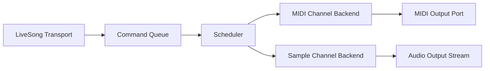

Interactive live song channels plan for chordelia.

## Status
Drafting

## Goal
Support an interactive live mode where multiple looping channels can run concurrently, channels can be mutated at runtime (replace sequence, stop, mute, unmute, etc.), and each mutation can be applied immediately or quantized to musical boundaries (for example next bar or next loop).

## Why this comes first
1. Current playback surfaces are strong for one-shot MIDI score playback and separate audio playback, but there is no unified runtime for live, mutable, concurrent channels.
2. Quantized mutation timing is foundational for predictable live performance behavior and must be designed before API growth.
3. A single live-song transport enables mixed-output workflows (MIDI plus sample playback) without duplicating scheduling logic.

## Scope
1. Define a canonical `LiveSong` runtime model for multi-channel loop playback.
2. Add channel-level mutation APIs: replace clip, stop/start channel, mute/unmute, gain/velocity-level updates.
3. Add mutation timing policies: immediate, next bar, next loop, and explicit beat/time scheduling.
4. Introduce backend abstraction that supports both MIDI channels and sample-file channels under one transport.
5. Ensure deterministic command ordering, concurrency safety, and stuck-note/audio cleanup on stop/error paths.
6. Add focused and integration tests for scheduler logic and mixed backend behavior.

## Out of scope
1. DAW-style editing UI, arrangement views, or timeline scrubbing.
2. Full external MIDI clock sync and transport slave/master capabilities in v1.
3. Time-stretching/pitch-shifting sample loops for arbitrary tempo matching in v1.
4. Effects automation lanes, mixer buses, and plugin hosting.
5. Cross-process/network live collaboration features.

## Technical design details
### Canonical runtime model
1. Add new live-song runtime module:
   1. `src/chordelia/live_song.py`.
2. Introduce core types:
   1. `LiveSong`: mutable runtime controller owning transport, channels, scheduler thread(s), and command queue.
   2. `LiveSongConfig`: tempo, time signature, scheduler tick interval, and quantization defaults.
   3. `LiveChannelId`: canonical string identifier.
   4. `ChannelState`: runtime state (`running`, `muted`, `pending_command_count`, current clip metadata).
   5. `ApplyWhen`: timing policy model (`immediate`, `next_bar`, `next_loop`, `at_beat`, `at_seconds`).
   6. `ChannelCommand`: immutable command payload queued for future application.
3. Introduce backend protocol:
   1. `src/chordelia/live_backends/runtime.py` with `LiveChannelBackend` protocol.
   2. Required operations:
      1. `start_loop(...)`.
      2. `stop_loop(...)`.
      3. `replace_loop(...)`.
      4. `set_muted(...)`.
      5. `shutdown(...)`.
      6. `loop_span(...) -> Duration` (or normalized seconds/beat span).
4. Backend implementations:
   1. MIDI backend in `src/chordelia/live_backends/midi.py` built on `MidiPlayback` scheduling helpers.
   2. Sample backend in `src/chordelia/live_backends/sample.py` built on a lightweight sample playback engine (new helper module if needed).

### Transport and timing model
1. `LiveSong` owns a monotonic transport origin and computes:
   1. current beat,
   2. current bar index,
   3. absolute wall-clock target times for scheduled commands.
2. Bar boundary formula (for beat-based transport):
   1. `bar_length_beats = time_signature_numerator`.
   2. `next_bar = ceil(current_beat / bar_length_beats) * bar_length_beats`.
3. Loop boundary behavior:
   1. each channel tracks `next_loop_start_beat` (or seconds equivalent for seconds-mode clips),
   2. `next_loop` quantization resolves to that channel-local boundary.
4. Mixed timing modes:
   1. beat-based clips stay beat-native,
   2. seconds-based clips use seconds-native loop span,
   3. scheduler keeps a unified monotonic wall-clock due time for execution.

### Channel mutation semantics
1. API surface sketch on `LiveSong`:
   1. `add_midi_channel(channel_id, source, *, output_name=None, channel=0, velocity=64, start=True)`.
   2. `add_sample_channel(channel_id, sample_path, *, loop=True, gain=1.0, start=True)`.
   3. `replace_channel(channel_id, source_or_sample, *, apply_when="immediate")`.
   4. `stop_channel(channel_id, *, apply_when="immediate")`.
   5. `start_channel(channel_id, *, apply_when="immediate")`.
   6. `mute_channel(channel_id, *, apply_when="immediate")`.
   7. `unmute_channel(channel_id, *, apply_when="immediate")`.
   8. `remove_channel(channel_id, *, apply_when="next_loop")`.
   9. `channel_state(channel_id) -> ChannelState`.
   10. `start()` / `stop()` / `close()`.
2. Command ordering rules:
   1. Commands sort by `(due_time, channel_id, sequence_number)`.
   2. For same timestamp on same channel, terminal commands (`stop`, `remove`) apply before `replace`, then mute-state updates.
3. Immediate behavior:
   1. apply command as soon as scheduler thread sees it.
4. Quantized behavior:
   1. resolve due-time at enqueue-time from current transport snapshot and channel loop metadata,
   2. execute when transport reaches due-time.

### Concurrency and lifecycle
1. Single scheduler thread for command dispatch plus backend-specific worker logic where required.
2. Shared lock around channel registry and pending command queue.
3. Non-blocking public mutations enqueue commands and return immediately.
4. `stop()` semantics:
   1. stop command intake,
   2. flush/abort pending commands,
   3. call backend shutdown for every channel,
   4. guarantee MIDI all-notes-off and audio stream cleanup.
5. Error model:
   1. invalid channel id or duplicate id raises `ValueError`,
   2. unknown channel raises `KeyError`,
   3. invalid `apply_when` raises `ValueError`,
   4. backend runtime exceptions transition channel to error state and emit actionable error message.

### Module and file touchpoints
1. New modules:
   1. `src/chordelia/live_song.py`.
   2. `src/chordelia/live_backends/runtime.py`.
   3. `src/chordelia/live_backends/midi.py`.
   4. `src/chordelia/live_backends/sample.py`.
2. Updated modules:
   1. `src/chordelia/midi_playback.py` (extract/reuse low-level scheduling hooks needed by live backend).
   2. `src/chordelia/audio_playback.py` (sample-loop helper extraction or backend-friendly streaming entry points).
   3. `src/chordelia/__init__.py` (public exports).
3. Tests:
   1. `tests/unit/chordelia/test_live_song.py` (new).
   2. `tests/unit/chordelia/test_live_backends_midi.py` (new).
   3. `tests/unit/chordelia/test_live_backends_sample.py` (new).
   4. targeted updates in `tests/unit/chordelia/test_midi_playback.py` and `tests/unit/chordelia/test_playback.py`.

### Compatibility and migration notes
1. Existing `MidiPlayback` and `Playback` APIs remain valid in v1.
2. `LiveSong` is additive and becomes the canonical interactive orchestration surface.
3. Internal extraction from existing playback modules should preserve existing behavior under current tests.

### Core algorithm pseudocode
1. Scheduler loop and command application

```text
while song_running:
    now = monotonic_time()
    due_commands = pop_commands_where(command.due_time <= now)
    for command in due_commands_sorted:
        channel = channels[command.channel_id]
        apply_command(channel, command)
    sleep(scheduler_tick)
```

2. Quantized due-time resolution

```text
function resolve_due_time(apply_when, transport_snapshot, channel_state):
    if apply_when == immediate:
        return transport_snapshot.now_seconds
    if apply_when == next_bar:
        target_beat = ceil(now_beat / bar_length_beats) * bar_length_beats
        return beat_to_seconds(target_beat)
    if apply_when == next_loop:
        return channel_state.next_loop_start_seconds
    if apply_when == at_beat(x):
        return beat_to_seconds(x)
    if apply_when == at_seconds(x):
        return transport_origin + x
    raise ValueError
```

### Usage pseudocode
```text
song = LiveSong(tempo=120, time_signature=(4, 4))
song.add_midi_channel("bass", Sequence(...), output_name="LoopBe Internal MIDI 1")
song.add_sample_channel("drums", "./loops/drums_120bpm.wav")
song.start()

song.replace_channel("bass", Sequence(...), apply_when="next_loop")
song.mute_channel("drums", apply_when="next_bar")
song.stop_channel("bass", apply_when="immediate")
```

### Diagram


## Testing approach
Expected test delta classification: both new tests and updated tests.

1. Unit tests:
   1. quantization boundary math for immediate/next_bar/next_loop/at_beat/at_seconds.
   2. command ordering at identical due-time.
   3. channel lifecycle transitions and error-state handling.
2. Backend tests:
   1. MIDI backend emits deterministic note-on/off patterns and cleanup on stop.
   2. sample backend starts/stops/replaces loops and obeys mute semantics.
3. Integration tests:
   1. mixed song with one MIDI and one sample channel runs concurrently under fake clock.
   2. quantized mutation applies on expected boundaries without race conditions.
4. Regression tests:
   1. existing `MidiPlayback` and `Playback` behavior remains unchanged.
5. Validation commands:
   1. focused: `pytest tests/unit/chordelia/test_live_song.py tests/unit/chordelia/test_live_backends_midi.py tests/unit/chordelia/test_live_backends_sample.py`.
   2. regression-focused: `pytest tests/unit/chordelia/test_midi_playback.py tests/unit/chordelia/test_playback.py`.
   3. full: `pytest`.

## Documentation approach
Expected docs delta classification: both README updates and docs updates.

1. Update `README.md` with a short LiveSong interactive example.
2. Update `docs/api-overview.md` with `LiveSong` and channel mutation API reference.
3. Add a focused guide: `docs/guides/live-song-interactive-mode.md` (workflow and timing-policy examples).
4. Update `docs/quickstart.md` with a mixed MIDI + sample channel scenario.
5. Add/update example scripts under `examples/` demonstrating channel replacement, mute, and quantized updates.

## Progress checklist
- [ ] Phase 0 contract and timing policies locked
- [ ] Phase 1 transport and scheduler foundation implemented
- [ ] Phase 2 MIDI live backend integrated
- [ ] Phase 3 sample live backend integrated
- [ ] Phase 4 channel mutation API and quantized semantics implemented
- [ ] Phase 5 reliability hardening and cleanup guarantees implemented
- [ ] Phase 6 focused + regression + full test validation completed
- [ ] Phase 7 docs and examples updated

## Phases
### Phase 0: Contract lock and decisions
1. Finalize public `LiveSong` API signatures and `ApplyWhen` policy forms.
2. Lock command ordering semantics for same-time channel mutations.
3. Confirm sample-backend dependency strategy (reuse current deps where possible; document any new optional dependency).

### Phase 1: Transport and scheduler foundation
1. Implement transport time conversion helpers and scheduler queue.
2. Add channel registry and command enqueue/dispatch mechanics.
3. Add deterministic tests for due-time resolution and ordering.

### Phase 2: MIDI backend integration
1. Implement `LiveChannelBackend` MIDI adapter over `MidiPlayback`/score scheduling logic.
2. Support loop start, replace-at-boundary, stop, mute/unmute semantics.
3. Add cleanup tests for stop/error and stuck-note prevention.

### Phase 3: Sample backend integration
1. Implement sample-loop backend with repeat, stop, replace, and mute semantics.
2. Support channel-local loop boundaries for quantized `next_loop` operations.
3. Add deterministic tests with mocked audio backend.

### Phase 4: Unified channel mutation APIs
1. Wire public `LiveSong` mutation methods to command queue.
2. Ensure immediate and quantized policies share one due-time resolution path.
3. Add mixed-channel integration tests for timing correctness.

### Phase 5: Reliability hardening
1. Guarantee thread-safe stop/shutdown across running channels.
2. Ensure backend errors isolate to channel state and do not crash full song runtime.
3. Add stress tests for rapid mutation bursts.

### Phase 6: Verification
1. Run focused live-song/backend tests and fix deterministic race issues.
2. Run existing playback regression tests.
3. Run full test suite.

### Phase 7: Documentation and examples
1. Publish API and guide updates.
2. Add mixed MIDI/sample examples with quantized mutation patterns.
3. Verify docs/examples remain consistent with shipped API names.

## Execution order recommendation
1. Lock contracts first to avoid backend-specific API drift.
2. Build scheduler core before backend implementation.
3. Integrate MIDI backend before sample backend to reuse existing timing/test patterns.
4. Add mixed-backend integration only after both backends are stable in isolation.
5. Finish with docs/examples after tests validate behavior.

## Risks and mitigations
1. Risk: timing jitter causes boundary slop under load.
   1. Mitigation: monotonic transport clock, small scheduler tick, and deterministic ordering.
2. Risk: stuck MIDI notes on abrupt stop or backend exception.
   1. Mitigation: mandatory finally-path all-notes-off in MIDI backend and centralized shutdown calls.
3. Risk: sample and MIDI channels drift over long sessions.
   1. Mitigation: schedule from shared transport origin and periodically reconcile channel loop-next markers.
4. Risk: concurrency races between rapid user mutations and scheduler dispatch.
   1. Mitigation: single serialized command queue per song with explicit lock boundaries.

## Acceptance criteria
1. A `LiveSong` can run multiple channels concurrently and keep looping until stopped.
2. Channel mutations (`replace`, `stop`, `mute`, `unmute`, `remove`) work both immediately and quantized to next bar/next loop.
3. One live song can run at least one MIDI channel and one sample channel concurrently with predictable timing semantics.
4. Stop/shutdown guarantees no lingering MIDI notes and no leaked audio streams.
5. Focused new tests, playback regression tests, and full suite pass.
6. README/docs/examples reflect canonical interactive usage.
