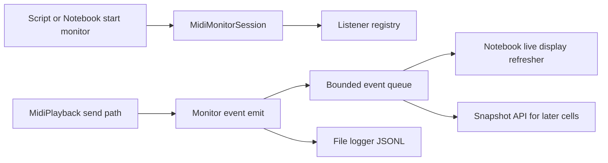

Real-time MIDI message monitoring plan for notebook and runtime workflows.

## Status
Approved

## Goal
Add a real-time MIDI message monitoring feature that works both in notebooks and in non-notebook Python runtimes, with optional log-file output that can include wall-clock timestamps and/or offset times in seconds and beats.

## Why this comes first
1. MIDI observability is a prerequisite for debugging timing, channel routing, and velocity behavior in interactive notebook workflows.
2. A canonical monitoring surface reduces ad-hoc print debugging and supports scripts, REPL sessions, and long-running runtime services.
3. Designing event hooks now avoids API churn once higher-level live transport features depend on monitoring.

## Scope
1. Add outbound MIDI event hooks in MidiPlayback so generated messages are emitted as structured monitor events.
2. Add a thread-safe monitor session API that can be started and stopped independently of playback calls.
3. Add filtering, buffering, and snapshot/export utilities for monitor data in any Python runtime.
4. Add optional file logging for monitor events with configurable timestamp and offset fields.
5. Add notebook-friendly live display support that is non-blocking and suitable for long-running interactive sessions.
6. Add tests for concurrency, ordering, non-notebook operation, and notebook fallback behavior.
7. Add docs and usage examples for both notebook and non-notebook monitoring workflows.

## Out of scope
1. Capturing inbound MIDI from external hardware ports in v1.
2. Full DAW-style timeline visualization or piano-roll views.
3. Database/streaming storage backends beyond local file logging.
4. Network streaming of monitor events.

## Technical design details
1. Canonical data model and invariants
   1. Add a new immutable event model, for example MidiMonitorEvent, with fields:
      1. event_index (monotonic integer per session).
      2. monotonic_time_seconds.
      3. wall_time_iso.
      4. elapsed_seconds_from_session_start.
      5. elapsed_beats_from_session_start (optional when tempo context is available).
      4. direction (outbound for v1).
      5. port_name.
      6. source_method (play_note, update_chord, play_score, or equivalent).
      7. message_type (note_on, note_off, other).
      8. channel.
      9. note.
      10. velocity.
      11. raw_message_repr.
   2. Invariants:
      1. event_index increases strictly by 1 within a session.
      2. Queue retention uses bounded max_events with oldest-drop semantics.
      3. Snapshot reads are lock-safe and never mutate stored events.
      4. File log records preserve event_index order.

2. Public API signatures
   1. In src/chordelia/midi_playback.py:
      1. add_message_listener(listener) -> int
      2. remove_message_listener(listener_id: int) -> None
      3. Internal callback emit path invoked by _send_note_on and _send_note_off.
   2. New module src/chordelia/midi_monitor.py:
      1. class MidiMonitorSession
      2. start(playback: MidiPlayback | None = None, *, max_events: int = 5000, include_message_types: tuple[str, ...] | None = None, tempo_bpm: float | None = None, log_file: str | Path | None = None, include_wall_time: bool = True, include_elapsed_seconds: bool = True, include_elapsed_beats: bool = False) -> MidiMonitorSession
      3. stop() -> None
      4. clear() -> None
      5. snapshot(limit: int | None = None) -> tuple[MidiMonitorEvent, ...]
      6. to_rows(limit: int | None = None) -> list[dict]
      7. to_dataframe(limit: int | None = None) -> Any (optional pandas dependency path if available)
      8. set_tempo_bpm(tempo_bpm: float | None) -> None
      9. display_live(*, refresh_hz: float = 8.0, max_rows: int = 30) -> Any (notebook display handle)
   3. Export surface updates in src/chordelia/__init__.py for monitor session types/helpers.

3. Runtime behavior (notebook and non-notebook)
   1. Monitor startup is non-blocking and returns immediately.
   2. Session stores events in a thread-safe deque and can be queried from scripts, tests, REPLs, and later notebook cells.
   3. File logging is optional and writes line-delimited records (JSONL or equivalent deterministic text format).
   4. Timestamp and offset field emission is independently configurable:
      1. wall-clock timestamp
      2. elapsed seconds
      3. elapsed beats (when tempo context exists)
   5. Notebook live display uses periodic refresh that does not require the start cell to remain active.
   6. If rich notebook display dependencies are unavailable, fallback to text snapshot mode with no runtime failure for core monitoring.

4. Module and file touchpoints
   1. src/chordelia/midi_playback.py
   2. src/chordelia/midi_monitor.py (new)
   3. src/chordelia/__init__.py
   4. tests/unit/chordelia/test_midi_playback.py
   5. tests/unit/chordelia/test_midi_monitor.py (new)
   6. tests/unit/chordelia/test_midi_monitor_logging.py (new or merged into test_midi_monitor.py)
   7. docs/tutorials/playback-and-midi.md
   8. docs/api-overview.md
   9. examples/midi_monitor_notebook_example.py (new or update existing midi example)
   10. examples/midi_monitor_runtime_example.py (new)

5. Error and validation semantics
   1. Invalid max_events (< 1) raises ValueError.
   2. Invalid refresh_hz (<= 0) raises ValueError.
   3. Invalid tempo_bpm (<= 0) raises ValueError.
   4. Starting a session twice without stop is idempotent or raises a clear ValueError (contract to be locked in Phase 0).
   5. If include_elapsed_beats=True without tempo context, either:
      1. emit null beat offsets, or
      2. raise clear configuration error.
      Contract to be locked in Phase 0.
   4. Removing unknown listener id is a no-op.
   5. Listener exceptions are isolated so playback continues and monitor records an internal error counter.
   6. Log file open/write failures surface as actionable RuntimeError or ValueError with path context.

6. Compatibility and migration notes
   1. Existing MidiPlayback behavior remains unchanged when no monitor listeners are registered.
   2. Monitoring APIs are additive and optional.
   3. Optional notebook display path must not add hard runtime dependency requirements to non-notebook use.

7. Core algorithm pseudocode

```text
on midi_send(message, source_method):
    output_port.send(message)
    emit_monitor_event(message, source_method, monotonic_time)

emit_monitor_event(message, source_method, t):
    for listener in listeners_snapshot:
        try:
            listener(event_from_message(message, source_method, t))
        except Exception:
            increment_listener_error_counter
```

8. Notebook monitor session pseudocode

```text
start_monitor(playback, max_events):
    create bounded deque
    register listener on playback
    return session(handle)

display_live(refresh_hz):
    start lightweight refresher loop/task
    every tick: read latest snapshot and update display region
```

9. File logging pseudocode

```text
on_event(event):
   if log_file is enabled:
      row = serialize(event, include_wall_time, include_elapsed_seconds, include_elapsed_beats)
      append row + newline to log file
```

10. Usage pseudocode

```text
from chordelia import MidiPlayback, start_midi_monitor

playback = MidiPlayback()
monitor = start_midi_monitor(playback, max_events=2000)
view = monitor.display_live(refresh_hz=10)

# Run later cells that call playback.play_note / playback.play_score
# Monitor continues collecting events in background.

recent = monitor.snapshot(limit=50)
monitor.stop()
```

```text
from chordelia import MidiPlayback, start_midi_monitor

playback = MidiPlayback()
monitor = start_midi_monitor(
   playback,
   tempo_bpm=120,
   log_file="midi_monitor.jsonl",
   include_wall_time=True,
   include_elapsed_seconds=True,
   include_elapsed_beats=True,
)

playback.play_note(...)
playback.play_note(...)

monitor.stop()
```

11. Diagram


## Testing approach
Expected test delta classification: both new tests and updated tests.

1. Unit tests
   1. Listener registration/removal and id management.
   2. Outbound note_on and note_off events are emitted with correct channel, note, velocity.
   3. Bounded queue drops oldest entries when capacity is exceeded.
   4. Snapshot ordering remains stable and monotonic under concurrent writes.
   5. Listener exception isolation does not break playback path.

2. Notebook behavior tests
   1. display_live can be created without blocking and returns a handle.
   2. Fallback behavior works when rich display dependencies are unavailable.
   3. Session collects events while other playback calls execute in separate thread contexts used by tests.

3. Non-notebook and logging tests
   1. Monitor session works without importing notebook display dependencies.
   2. Log file contains ordered records with selected timestamp fields.
   3. elapsed_seconds is monotonic and non-negative.
   4. elapsed_beats is emitted correctly when tempo_bpm is configured.
   5. include_elapsed_beats behavior without tempo context matches locked contract.

4. Regression tests
   1. Existing midi playback tests remain green with no monitor attached.

5. Validation commands
   1. Focused: pytest tests/unit/chordelia/test_midi_monitor.py tests/unit/chordelia/test_midi_playback.py
   2. Full: pytest

## Documentation approach
Expected docs delta classification: both README updates and docs updates.

1. Add monitor API and lifecycle section to docs/api-overview.md.
2. Add notebook and non-notebook workflow steps and examples in docs/tutorials/playback-and-midi.md.
3. Add short discoverability mention in README.md under MIDI capabilities.
4. Provide example snippet showing one cell starts monitor and subsequent cells generate events.
5. Document file logging fields and timestamp/offset toggles.

## Progress checklist
- [ ] Phase 0: Monitoring API contract locked
- [ ] Phase 1: MidiPlayback event hook integration complete
- [ ] Phase 2: Monitor session core implemented
- [ ] Phase 3: File logging with timestamp/offset options implemented
- [ ] Phase 4: Notebook live display adapter implemented
- [ ] Phase 5: Focused and regression tests passing
- [ ] Phase 6: Documentation and examples updated
- [ ] Real-time MIDI monitoring accepted for notebook and runtime workflows

## Phases
### Phase 0: Contract lock
1. Finalize event schema and listener semantics.
2. Decide idempotency behavior for repeated start and stop calls.
3. Confirm optional dependency boundaries for live notebook display.

### Phase 1: MidiPlayback hook integration
1. Add listener registry and thread-safe emit helper to MidiPlayback.
2. Emit structured events in _send_note_on and _send_note_off paths.
3. Keep zero-listener fast path minimal.

### Phase 2: Monitor session core
1. Implement MidiMonitorSession with bounded queue and lifecycle methods.
2. Implement start, stop, snapshot, clear, and export helpers.
3. Add filtering by message type/channel as optional session config.

### Phase 3: File logging support
1. Implement optional log writer path with deterministic line-oriented format.
2. Add field-toggle controls for wall-clock timestamp, elapsed seconds, and elapsed beats.
3. Add tempo context support for beat-offset emission.

### Phase 4: Notebook live display
1. Implement display_live non-blocking adapter for notebook cells.
2. Add fallback text rendering path for non-rich environments.
3. Verify monitor remains active across subsequent cell execution.

### Phase 5: Verification
1. Add new unit tests for monitor module and listener emission.
2. Update existing playback tests as needed for hook compatibility.
3. Run focused then full test suite.

### Phase 6: Documentation and examples
1. Update API docs and tutorial guidance.
2. Add notebook and runtime usage example scripts.
3. Validate docs consistency with final API names.

## Execution order recommendation
1. Lock event contract before any implementation.
2. Add playback hooks first so all downstream monitor features use one canonical event source.
3. Implement session core before logging and notebook display so all sinks share one event model.
4. Complete tests before docs finalization.

## Implementation notes
- No implementation notes yet.

## Risks and mitigations
1. Risk: listener overhead affects playback timing.
   1. Mitigation: keep zero-listener fast path and avoid heavy work inside send lock.
2. Risk: notebook display refresh causes excessive CPU usage.
   1. Mitigation: bounded refresh_hz and row limits, with explicit stop lifecycle.
3. Risk: thread-safety bugs in concurrent snapshot and emit paths.
   1. Mitigation: single lock around queue writes, copy-on-read snapshots, stress tests.
4. Risk: logging I/O overhead affects playback timing.
   1. Mitigation: minimal per-event serialization work and buffered append strategy.
5. Risk: dependency drift for notebook display components.
   1. Mitigation: optional import boundaries and text fallback behavior.

## Acceptance criteria
1. A monitor can be started and used in non-notebook runtimes (scripts/REPL/tests) without notebook dependencies.
2. A monitor can be started in one notebook cell and remains active for subsequent cells until explicitly stopped.
3. Outbound MIDI messages generated by MidiPlayback are visible in monitor snapshots in near real time.
4. Optional file logging writes ordered events with configurable wall-clock timestamp and/or elapsed offsets in seconds and beats.
5. Live notebook display is non-blocking and updates without requiring playback APIs to change existing call patterns.
6. Existing MIDI playback behavior remains unchanged when monitoring is disabled.
7. Focused monitor and playback tests pass, and full test suite passes.
8. API and notebook/runtime workflow documentation are updated with runnable examples.
