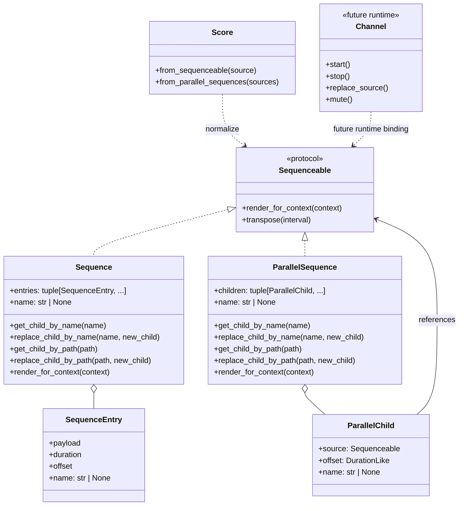

Parallel composition and named recomposition plan for chordelia.

## Status
Drafting

## Goal
Enable explicit parallel composition with `ParallelSequence` while keeping `Sequence` as the canonical sequential model, and add optional naming/path-based immutable recomposition APIs so targeted edits are possible at any nesting level.

## Why this comes first
1. Current nested `Sequence` composition is deterministic and reusable, but it is primarily sequential and awkward for simultaneous part layering.
2. Upcoming mutable runtime `Channel` workflows need stable static composition boundaries first, but runtime mutability should stay out of score/export models.
3. Providing named/path-based immutable edits now reduces pressure to introduce a separate public lane concept prematurely.

## Scope
1. Keep both `Sequence` and `ParallelSequence` as distinct public composition models.
2. Add explicit parallel composition support via `ParallelSequence` and `Score.from_parallel_sequences(...)` convenience.
3. Add optional composition metadata in sequence trees (names/paths) and immutable child-selection/replacement APIs.
4. Ensure recomposition operations are useful at all nesting levels, not only top-level score construction.
5. Preserve a clear boundary: composition models are immutable; runtime `Channel` remains future mutable transport work.

## Out of scope
1. Implementing mutable runtime channel controls (`start`, `stop`, `replace`, `mute`, routing).
2. Building DAW-style transport/session orchestration.
3. Replacing `SheetMusic` iterable gallery semantics.
4. Requiring or exposing a new public `Lane` class in v1.

## Technical design details
### Canonical types and invariants
1. `Sequence` remains canonical for sequential composition.
2. `ParallelSequence` is introduced (or formalized) as canonical for simultaneous composition.
3. `Sequence` and `ParallelSequence` both satisfy `Sequenceable`.
4. `Sequence` gains optional child identity metadata and immutable child-edit helpers:
   1. sibling-scope child names,
   2. path addressing for nested lookups/replacements,
   3. immutable replacement operations returning new trees.
5. `ParallelSequence` supports per-child offset placement and optional per-child names, with deterministic merge semantics.
6. No public `Lane` type in this plan; if a lane-like record is needed internally, it remains internal/private.

### Class relationships and hierarchy boundaries
1. `Sequence` and `ParallelSequence` are composition models.
2. `Score` is the normalized event boundary.
3. `Channel` remains a future mutable runtime concept and is not used for score normalization.



### Why both `Sequence` and `ParallelSequence` stay separate
1. Sequential and simultaneous composition have different mental models and timing semantics.
2. A dedicated `ParallelSequence` avoids mode flags and ambiguous behavior in one monolithic class.
3. Keeping both models explicit improves readability of user code and docs.

### Why no public `Lane` class in v1
1. Requested functionality can be covered by:
   1. explicit `ParallelSequence` children for simultaneous placement,
   2. optional naming/path-based recomposition on `Sequence`/`ParallelSequence` trees.
2. A public lane concept is top-level-biased and can overlap with future runtime channel terminology.
3. If stable id records are needed before `Channel`, they can be internal implementation detail, not public API commitment.

### Public API sketch
1. In `src/chordelia/sequences.py`:

```python
class Sequence:
    name: str | None

    def get_child_by_name(self, name: str, *, recursive: bool = False):
        ...

    def replace_child_by_name(self, name: str, new_child, *, recursive: bool = False) -> "Sequence":
        ...

    def get_child_by_path(self, path: str):
        ...

    def replace_child_by_path(self, path: str, new_child) -> "Sequence":
        ...
```

2. In `src/chordelia/sequences.py`:

```python
class ParallelSequence:
    name: str | None

    def __init__(self, children: Iterable[Sequenceable | tuple[Sequenceable, DurationLike] | tuple[str, Sequenceable, DurationLike]]):
        ...

    def get_child_by_name(self, name: str, *, recursive: bool = False):
        ...

    def replace_child_by_name(self, name: str, new_child, *, recursive: bool = False) -> "ParallelSequence":
        ...

    def get_child_by_path(self, path: str):
        ...

    def replace_child_by_path(self, path: str, new_child) -> "ParallelSequence":
        ...
```

3. In `src/chordelia/score.py`:

```python
class Score:
    @classmethod
    def from_parallel_sequences(
        cls,
        sources: Iterable[Sequenceable],
        *,
        tempo: int = 120,
        time_signature: tuple[int, int] = (4, 4),
        key_signature: str | None = None,
        default_duration: DurationLike | None = None,
        ppq: int = 480,
        gate_width: float = 0.9,
        gate_offset: float = 0.0,
        retrigger_policy: RetriggerPolicy = "retrigger_all",
    ) -> "Score":
        ...
```

4. Keep `Score.from_sequenceable(source, ...)` strict single-source behavior.
5. Keep explicit constructor choice; do not auto-detect arbitrary iterables in `Score.from_sequenceable`.

### Naming/path semantics for recomposition
1. Name uniqueness rule: names are unique among siblings in one container (`Sequence` or `ParallelSequence`).
2. Path rule: dot-separated child names for nested traversal (for example `verse.bass.fill_a`).
3. Missing-name behavior: lookup/replacement raises `KeyError` with nearest resolved path segment.
4. Duplicate-name behavior: constructor or replacement raises `ValueError`.
5. Immutable behavior: replacements return new instances and preserve unchanged subtrees when possible.

### Parallel merge semantics
1. `ParallelSequence` child start is `context.start_offset + child.offset`.
2. Child offset defaults to zero.
3. Combined events are merged and later normalized by canonical `Score` ordering.
4. Consumed span is max child end minus container start.
5. Child offset must be non-negative and mode-compatible with context and child render span.

### Composition usage guidance
1. Use `Sequence` when order/cursor advancement is the primary intent.
2. Use `ParallelSequence` when simultaneous layering and per-child offsets are primary intent.
3. Use names/paths when you need targeted immutable recomposition at any depth.
4. Use `Score` as output boundary for playback/export/notation pipelines.
5. Treat `Channel` as future mutable runtime control, separate from these immutable composition models.

### File and module touchpoints
1. `src/chordelia/sequences.py`
   1. Add/extend `ParallelSequence` and child-offset support.
   2. Add optional naming/path lookup and replacement APIs.
2. `src/chordelia/score.py`
   1. Add `Score.from_parallel_sequences` convenience that builds/accepts `ParallelSequence`.
3. `src/chordelia/__init__.py`
   1. Export `ParallelSequence` and finalized composition helpers.
4. Tests:
   1. `tests/unit/chordelia/test_sequenceable.py`
   2. `tests/unit/chordelia/test_score.py`
   3. `tests/unit/chordelia/test_midifile.py`
   4. `tests/unit/chordelia/test_sheet_music.py`
   5. new focused file `tests/unit/chordelia/test_parallel_sequences.py`

### Error and validation semantics
1. `Score.from_parallel_sequences([])` raises `ValueError`.
2. Non-sequenceable children raise `TypeError` with child index/path context.
3. Negative child offsets raise `ValueError`.
4. Timing mode mismatches raise `ValueError`.
5. Name collisions among siblings raise `ValueError`.
6. Missing path/name lookups raise `KeyError`.

### Compatibility and migration notes
1. Existing `Sequence((child_a, child_b))` behavior remains sequential and unchanged.
2. New parallel path is explicit via `ParallelSequence` and `Score.from_parallel_sequences`.
3. Existing wrappers remain additive:
   1. `MidiFile(Score.from_parallel_sequences(...))`
   2. `SheetMusic(Score.from_parallel_sequences(...))`
4. Existing `SheetMusic` iterable gallery behavior remains sequential/measure-aligned.
5. No public lane API commitment is introduced in this plan.

### Core algorithm pseudocode
1. Parallel render

```text
function render_parallel(children, context):
    normalized_children = normalize_children(children)
    span_end = context.start_offset
    events = []

    for child in normalized_children:
        child_start = context.start_offset + child.offset
        child_context = context.with_start_offset(child_start)
        child_render = sequence_render_for(child.source, child_context)

        events.extend(child_render.events)
        child_end = child_start + child_render.consumed_duration
        span_end = max(span_end, child_end)

    return SequenceRender(events=events, consumed_duration=span_end - context.start_offset)
```

2. Named path replacement (tree-immutable)

```text
function replace_child_by_path(node, path, new_child):
    parts = path.split(".")
    if len(parts) == 1:
        return node.replace_child_by_name(parts[0], new_child)

    head = parts[0]
    tail = ".".join(parts[1:])
    target = node.get_child_by_name(head)
    replaced_target = replace_child_by_path(target, tail, new_child)
    return node.replace_child_by_name(head, replaced_target)
```

### Usage pseudocode
```python
motif = Sequence(((Note("C4"), 1), (Note("D4"), 1)), name="motif")
verse = Sequence((
    (motif, 2, 0, "lead_line"),
), name="verse")

bass = Sequence(((Note("C2"), 2),), name="bass")
lead = Sequence(((Note("G4"), 1), (Note("A4"), 1)), name="lead")

arrangement = ParallelSequence([
    ("lead_part", lead, 0),
    ("bass_part", bass, 1),
], name="song")

# Immutable deep recomposition by path
updated = arrangement.replace_child_by_path("lead_part", lead.transpose(12))
score = Score.from_parallel_sequences([updated])
```

### Diagram


### Cross-plan references
1. `interactive_live_song_channels_plan.md` for future mutable runtime channels and transport.
2. `composite_sequence_tree_plan.md` for broader tree-model follow-up beyond this focused parallel work.

## Testing approach
Expected test delta classification: both new tests and updated tests.

1. Parallel composition tests:
   1. `ParallelSequence` zero offsets produce simultaneous first events.
   2. Positive child offsets shift only those children.
   3. Score duration equals longest parallel child end.
2. Naming/path recomposition tests:
   1. sibling uniqueness enforced,
   2. lookup by name and by path,
   3. immutable replacement by name/path,
   4. missing path segments raise `KeyError`.
3. Sequence/parallel regression tests:
   1. existing sequential `Sequence` scheduling unchanged,
   2. mixed nested sequence + parallel composition remains deterministic.
4. Wrapper regression tests:
   1. MIDI absolute start ticks match expected parallel placements,
   2. SheetMusic iterable gallery behavior unchanged.
5. Validation commands:
   1. Focused:
      1. `pytest tests/unit/chordelia/test_parallel_sequences.py tests/unit/chordelia/test_sequenceable.py tests/unit/chordelia/test_score.py tests/unit/chordelia/test_midifile.py tests/unit/chordelia/test_sheet_music.py`
   2. Full:
      1. `pytest`

## Documentation approach
Expected docs delta classification: both README updates and docs updates.

1. Update `README.md` with side-by-side sequential (`Sequence`) and simultaneous (`ParallelSequence`) examples.
2. Update `docs/api-overview.md` with naming/path recomposition APIs.
3. Update `docs/guides/sequences-and-score.md` with practical guidance:
   1. when to choose `Sequence`,
   2. when to choose `ParallelSequence`,
   3. how named/path replacement works.
4. Update `docs/quickstart.md` with one minimal deep replacement example.
5. Explicitly document that runtime mutable `Channel` is future work and separate from immutable composition APIs.

## Progress checklist
- [ ] Phase 0: Sequence and ParallelSequence responsibilities locked
- [ ] Phase 1: Naming/path recomposition contract finalized
- [ ] Phase 2: ParallelSequence and score integration implemented
- [ ] Phase 3: Focused + regression tests passing
- [ ] Phase 4: Documentation updates completed

## Phases
### 1. Contract lock
1. Lock public model split: `Sequence` (sequential) and `ParallelSequence` (simultaneous).
2. Lock naming/path rules and error semantics.
3. Lock no-public-lane decision for this plan.

### 2. Composition API implementation
1. Implement/extend `ParallelSequence` child offset and naming support.
2. Implement `get_child_by_name` / `replace_child_by_name` on composition models.
3. Implement `get_child_by_path` / `replace_child_by_path` for recursive immutable edits.

### 3. Score integration
1. Add `Score.from_parallel_sequences` convenience path.
2. Keep `Score.from_sequenceable` strict and unchanged for iterable auto-detection.
3. Export finalized symbols in package init.

### 4. Verification
1. Add new focused parallel/naming tests.
2. Run focused regression suites.
3. Run full test suite.

### 5. Documentation
1. Publish model-choice guidance and examples.
2. Clarify future `Channel` boundary and cross-link live runtime plan.

## Execution order recommendation
1. Lock semantic contracts first (`Sequence` vs `ParallelSequence`, naming/path behavior).
2. Implement composition APIs before score convenience glue.
3. Freeze behavior with focused tests before docs examples.
4. Complete docs after API naming is final.

## Risks and mitigations
1. Risk: naming/path APIs introduce ambiguity in large trees.
   1. Mitigation: enforce sibling uniqueness and explicit path errors.
2. Risk: overlap confusion between `ParallelSequence` and future runtime `Channel`.
   1. Mitigation: keep immutable composition vs mutable runtime boundary explicit in docs and API names.
3. Risk: feature growth in `Sequence` creates API bloat.
   1. Mitigation: keep naming/path features optional and focused on immutable recomposition only.

## Acceptance criteria
1. `Sequence` and `ParallelSequence` are both public and clearly differentiated by timing semantics.
2. Optional naming/path APIs enable targeted immutable recomposition at nested levels.
3. `Score.from_parallel_sequences` supports explicit parallel source construction with deterministic offsets.
4. Existing sequential `Sequence` behavior remains unchanged.
5. No public `Lane` type is required for this plan; any lane-like internals remain implementation detail.
6. Docs clearly explain composition (`Sequence`/`ParallelSequence`) versus future runtime mutability (`Channel`).
7. `Score.from_sequenceable` remains strict and does not auto-detect arbitrary iterables as parallel composition.
