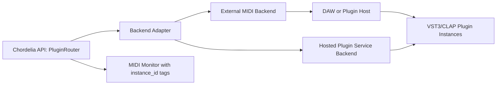

Plugin hosting and per-instance MIDI routing plan for chordelia.

## Status
Drafting

## Goal
Provide a clear path to launch multiple plugin instances through an API and send independent MIDI messages to each instance, with a pragmatic delivery order: external-host MIDI routing first, optional embedded plugin hosting second.

## Why this comes first
1. The immediate user need is independent MIDI control per plugin instance, which can be delivered without full embedded plugin hosting complexity.
2. Chordelia already has canonical score and MIDI transport surfaces; this plan should extend those workflows instead of bypassing them.
3. Deferring embedded hosting reduces crash/isolation risk and avoids locking into irreversible binary-hosting choices too early.

## Scope
1. Define canonical plugin-format policy for v1 and near-term expansion.
2. Add an instance-oriented routing API for launching targets and sending MIDI per instance.
3. Deliver an MVP backend that routes MIDI to externally hosted plugins via MIDI ports/channels.
4. Add monitorable, deterministic event routing with per-instance observability.
5. Define optional embedded-host service boundaries (VST3 first, CLAP next) for a later phase.
6. Add tests and docs for API contracts and routing semantics.

## Out of scope
1. In-process Python loading of VST binaries in v1.
2. DAW-style plugin UI embedding, automation lanes, and mixer UX.
3. Audio rendering/mixing in chordelia for v1 external-host mode.
4. Full support for AU, LV2, and AAX in v1.
5. Preset browser/editor workflows beyond simple load/save hooks.

## Technical design details
### Format and backend policy
1. Canonical plugin format policy:
   1. Primary: VST3.
   2. Secondary: CLAP.
   3. Conditional: AU (macOS-only requirement), LV2 (Linux-only requirement), AAX (Pro Tools-only requirement).
2. Canonical backend policy:
   1. Default backend for v1: external host plus MIDI routing (lowest operational risk).
   2. Optional backend for later phases: separate embedded host service process (not in the Python process).
3. Selection invariant:
   1. API contracts remain backend-agnostic so callers can switch from external host to embedded host service without changing call shape.

### Canonical API surface
1. New module proposal: `src/chordelia/plugin_hosting.py`.
2. Core immutable models:
   1. `PluginInstanceId`: canonical string id.
   2. `PluginFormat`: enum (`vst3`, `clap`, `au`, `lv2`, `aax`).
   3. `PluginRef`: plugin identity and optional path/uri metadata.
   4. `MidiRoute`: output port name plus channel and optional bank/program defaults.
   5. `HostedPluginState`: lifecycle state (`starting`, `ready`, `error`, `closed`).
3. Runtime controller:
   1. `PluginRouter`.
4. Proposed public methods on `PluginRouter`:
   1. `create_instance(plugin_ref, *, route=None, backend="external_midi", startup_timeout_seconds=5.0) -> PluginInstanceId`
   2. `configure_route(instance_id, route) -> None`
   3. `send_midi(instance_id, message, *, at_seconds=None) -> None`
   4. `send_notes(instance_id, notes, *, velocity=96, duration=None, at_seconds=None) -> None`
   5. `send_score(instance_id, score, *, channel_override=None) -> None`
   6. `panic(instance_id) -> None`
   7. `close_instance(instance_id) -> None`
   8. `close_all() -> None`
   9. `instance_state(instance_id) -> HostedPluginState`
5. Error and validation semantics:
   1. Unknown instance id raises `KeyError`.
   2. Invalid channel/range values raise `ValueError`.
   3. Backend startup failure raises `RuntimeError` with actionable details.
   4. `panic(instance_id)` is idempotent.

### Backend design
1. Backend protocol proposal in `src/chordelia/plugin_backends/runtime.py`:
   1. `PluginBackend.start_instance(plugin_ref, route) -> PluginInstanceHandle`
   2. `PluginBackend.configure_route(handle, route) -> None`
   3. `PluginBackend.send_midi(handle, message, at_seconds=None) -> None`
   4. `PluginBackend.panic(handle) -> None`
   5. `PluginBackend.close_instance(handle) -> None`
2. v1 backend: `ExternalMidiBackend`:
   1. Treat plugin instances as externally hosted targets identified by MIDI port/channel.
   2. Use existing `MidiPlayback` send paths for output dispatch.
   3. Keep deterministic routing table: `instance_id -> route`.
3. Later backend: `HostedPluginServiceBackend`:
   1. Out-of-process service responsible for plugin binary loading and audio/plugin-thread constraints.
   2. IPC boundary (gRPC/stdio/named-pipe) from Python to service.
   3. Service supports VST3 first, then CLAP.

### Data flow and timing model
1. Per-instance command ordering invariant:
   1. Commands are processed in enqueue order per instance.
   2. Timestamped commands sort by `(at_seconds, sequence_number)`.
2. Multi-instance behavior:
   1. Different instances can dispatch concurrently.
   2. Failure in one instance must not stop others.
3. Monitor integration:
   1. Every outbound event includes `instance_id` and route metadata.
   2. Existing monitor session can snapshot/filter per instance.

### File touchpoints
1. New modules:
   1. `src/chordelia/plugin_hosting.py`
   2. `src/chordelia/plugin_backends/runtime.py`
   3. `src/chordelia/plugin_backends/external_midi.py`
   4. `src/chordelia/plugin_backends/hosted_service.py` (phase-gated scaffold)
2. Updated modules:
   1. `src/chordelia/midi_playback.py` (route metadata and dispatch helpers)
   2. `src/chordelia/midi_monitor.py` (instance tagging in events)
   3. `src/chordelia/__init__.py` (export surface)
3. Tests:
   1. `tests/unit/chordelia/test_plugin_hosting.py` (new)
   2. `tests/unit/chordelia/test_plugin_external_midi_backend.py` (new)
   3. `tests/unit/chordelia/test_midi_monitor.py` (update)
   4. `tests/unit/chordelia/test_midi_playback.py` (update)

### Compatibility and migration notes
1. Existing `MidiPlayback` workflows remain valid without plugin APIs.
2. Plugin routing APIs are additive.
3. External-host mode remains the canonical "easy MIDI" path even if embedded host backend is added later.

### Core algorithm pseudocode
1. Instance creation and route registration

```text
function create_instance(plugin_ref, route, backend):
    backend_handle = backend.start_instance(plugin_ref, route)
    instance_id = allocate_instance_id()
    instances[instance_id] = {handle: backend_handle, route: route, state: ready}
    return instance_id
```

2. Per-instance message send

```text
function send_midi(instance_id, message, at_seconds=None):
    instance = lookup_instance(instance_id)
    enqueue(instance.queue, (at_seconds or now(), next_seq(), message))
```

3. Dispatch loop

```text
while router_running:
    for each instance in instances:
        due = pop_due_commands_sorted(instance.queue, now())
        for cmd in due:
            backend.send_midi(instance.handle, cmd.message, cmd.at_seconds)
            emit_monitor_event(instance_id=instance.id, route=instance.route, message=cmd.message)
```

### Usage pseudocode
```text
router = PluginRouter(default_backend="external_midi")

synth_a = router.create_instance(
    PluginRef(name="Serum", format="vst3"),
    route=MidiRoute(output_name="LoopMIDI Port A", channel=0),
)

synth_b = router.create_instance(
    PluginRef(name="Vital", format="vst3"),
    route=MidiRoute(output_name="LoopMIDI Port B", channel=1),
)

router.send_notes(synth_a, ["C4", "E4", "G4"], velocity=90, duration="1/4")
router.send_notes(synth_b, ["C2"], velocity=100, duration="1")
router.panic(synth_a)
router.close_all()
```

### Diagram


## Testing approach
Expected test delta classification: both new tests and updated tests.

1. Unit tests for API contracts:
   1. Instance lifecycle (create/configure/send/panic/close).
   2. Route validation and error semantics.
   3. Idempotent close and panic behaviors.
2. Backend tests:
   1. External backend dispatches to correct port/channel per instance.
   2. Concurrent multi-instance sends remain isolated.
3. Monitor tests:
   1. Outbound monitor records include `instance_id`.
   2. Per-instance filtering yields deterministic snapshots.
4. Regression tests:
   1. Existing non-plugin MIDI playback paths remain unchanged.
5. Validation commands:
   1. Focused: `pytest tests/unit/chordelia/test_plugin_hosting.py tests/unit/chordelia/test_plugin_external_midi_backend.py tests/unit/chordelia/test_midi_monitor.py tests/unit/chordelia/test_midi_playback.py`
   2. Full: `pytest`

## Documentation approach
Expected docs delta classification: both README updates and docs updates.

1. Update `README.md` with a concise "multiple plugin targets via MIDI routing" example.
2. Update `docs/api-overview.md` with plugin routing API and backend strategy.
3. Update `docs/tutorials/playback-and-midi.md` with multi-instance routing workflow.
4. Add a focused guide: `docs/guides/plugin-hosting-and-routing.md`.
5. Validate docs by checking terminology consistency: PluginRouter, PluginRef, PluginInstanceId, ExternalMidiBackend.

## Progress checklist
- [ ] Phase 0: Format policy and API contracts locked
- [ ] Phase 1: Backend protocol and router skeleton implemented
- [ ] Phase 2: External MIDI backend implemented and wired
- [ ] Phase 3: Monitor integration and per-instance observability completed
- [ ] Phase 4: Focused and full tests passing
- [ ] Phase 5: README/docs/tutorial updates completed
- [ ] Phase 6: Embedded-host service decision gate evaluated (VST3 then CLAP)

## Phases
### Phase 0: Contract lock
1. Lock plugin format policy (VST3 primary, CLAP secondary).
2. Finalize `PluginRouter` public API signatures and error semantics.
3. Confirm external-host MVP boundaries and non-goals.

### Phase 1: Router and backend protocol
1. Add runtime backend protocol and `PluginRouter` instance registry.
2. Add per-instance queues and deterministic dispatch ordering.
3. Add lifecycle state model and validation.

### Phase 2: External MIDI backend (MVP)
1. Implement route-to-port/channel backend using existing MIDI transport.
2. Implement `send_midi`, `send_notes`, and `send_score` dispatch paths.
3. Add panic/close semantics with cleanup guarantees.

### Phase 3: Observability and reliability
1. Tag monitor events with `instance_id` and route details.
2. Add robust startup/error messages and partial-failure isolation.
3. Add timeout and retry policies for startup and route reconfiguration.

### Phase 4: Verification
1. Add new routing/backend tests and update monitor/playback tests.
2. Run focused plugin+MIDI suites.
3. Run full suite and resolve regressions.

### Phase 5: Documentation
1. Update README, API docs, and tutorial pages with canonical workflows.
2. Add a dedicated guide for routing strategy and host recommendations.

### Phase 6: Embedded-host service decision gate
1. Re-evaluate requirements after MVP usage feedback.
2. If needed, create decision doc for service tech choice and IPC contract.
3. Implement `HostedPluginServiceBackend` behind stable `PluginRouter` API.

## Execution order recommendation
1. Build and validate the external-host MVP first.
2. Keep plugin API backend-agnostic from day one.
3. Delay embedded host service until concrete requirements show external-host limitations.
4. Add formats incrementally in this order: VST3, CLAP, then platform-specific formats only when required.

## Implementation notes
- No implementation notes yet.

## Risks and mitigations
1. Risk: users assume in-process plugin hosting in v1.
   1. Mitigation: document external-host MVP explicitly and show setup examples.
2. Risk: per-instance routing conflicts when ports/channels overlap.
   1. Mitigation: validate unique route constraints where configured and warn on collisions.
3. Risk: timing jitter under high message volume.
   1. Mitigation: use monotonic scheduling, bounded queues, and deterministic ordering.
4. Risk: backend lock-in around one format.
   1. Mitigation: enforce backend protocol and keep format handling behind adapters.

## Acceptance criteria
1. A caller can create at least two plugin instances and send independent MIDI streams to each.
2. Routing semantics are deterministic and isolated per instance.
3. VST3 is documented as primary target format and CLAP as secondary.
4. Existing `MidiPlayback` and monitor workflows continue to work unchanged when plugin APIs are unused.
5. Focused and full tests pass.
6. README/docs/tutorial content describes the recommended easy path and expansion path clearly.
