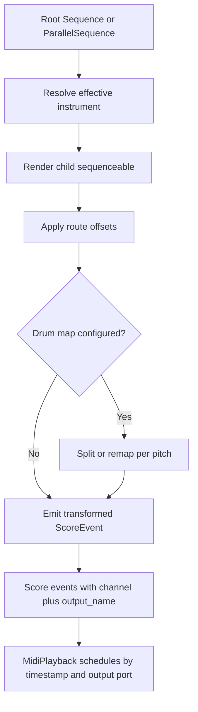
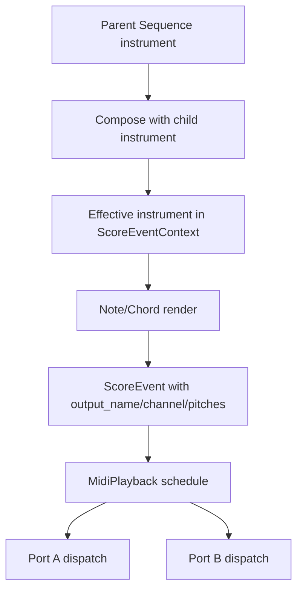

Sequence instrument routing plan for chordelia.

## Status
Drafting

## Goal
Introduce a first-pass, MIDI-only instrument model that can be attached to sequence containers and used to control routing behavior (channel, output port, pitch/velocity offsets, and drum note remapping) with deterministic parent-over-child precedence.

## Why this comes first
1. Current sequence-to-score conversion has no reusable instrument abstraction, so channel/output behavior is either global or manually encoded per event.
2. Parallel sequence workflows need independent synth routing for each child source.
3. A MIDI-first instrument contract creates a stable foundation for future sample-based instrument backends without mixing concerns in v1.

## Scope
1. Add immutable instrument models for MIDI routing and remapping.
2. Allow instrument assignment on sequence containers used in tree/parallel composition.
3. Define and implement parent/child precedence rules for nested sequence rendering.
4. Apply instrument routing during score normalization so playback/export operate on canonical events.
5. Support drum-style note remapping to channel and note targets.
6. Extend MIDI playback to honor per-event output-port routing.
7. Add tests and documentation for new behavior.

## Out of scope
1. Audio sample mapping or sample-library instrument definitions.
2. DAW-style instrument browser or preset management UI.
3. External MIDI clock sync, transport slave/master features, or live quantized mutation APIs.
4. Full GM patch library modeling beyond explicit user-provided routing values.
5. Breaking/removing existing Score and MidiPlayback entry points.

## Technical design details
### Canonical models and invariants
1. Add `src/chordelia/instruments.py` with immutable models:
   1. `MidiRoute`:
      1. `output_name: str | None`
      2. `channel: int | None`
      3. `transpose_semitones: int`
      4. `velocity_offset: int`
      5. `gate_width_offset: float`
      6. `gate_offset_offset: float`
   2. `DrumNoteRoute`:
      1. `target_note: int`
      2. `channel: int | None`
      3. `output_name: str | None`
      4. `velocity_offset: int`
   3. `InstrumentSpec`:
      1. `name: str | None`
      2. `route: MidiRoute`
      3. `drum_map: dict[int, DrumNoteRoute]`
      4. `drop_unmapped_drum_notes: bool`
2. Validation invariants:
   1. MIDI channels constrained to 0-15 when provided.
   2. MIDI notes constrained to 0-127 after transposition/remap.
   3. Velocity clamped to 0-127 after offsets.
   4. Gate values clamped to [0.0, 1.0] after offsets.
3. Add optional `instrument: InstrumentSpec | None` to:
   1. `Sequence`
   2. `ParallelSequence`
4. Add optional event routing field on `ScoreEvent`:
   1. `output_name: str | None = None`
5. Extend `ScoreEventContext` with instrument carry-through state:
   1. `instrument: InstrumentSpec | None = None`

### Precedence and inheritance semantics
1. Rule: higher-level sequence instrument information overrides lower-level information.
2. Rule: when a parent has no instrument, child instrument information remains active.
3. Resolution strategy is field-wise, parent-first override:
   1. If parent field is set, it wins.
   2. If parent field is unset, child field is preserved.
4. Drum-map merge semantics:
   1. Parent map entries override child entries on identical source-note keys.
   2. Unique child map entries remain active unless parent overrides that key.

### Event transformation semantics
1. Instrument application occurs during sequence rendering before events are returned to `Score.from_sequenceable`.
2. Non-drum routing applies channel/output/offset transforms to each event.
3. Drum routing expands/remaps source pitches per mapped note:
   1. Each mapped pitch emits one output pitch event with mapped channel/output/velocity.
   2. Unmapped behavior follows `drop_unmapped_drum_notes`.
4. Chord events with mixed drum mappings may split into multiple `ScoreEvent` values to preserve per-target routing.

### MIDI playback integration
1. Update `MidiPlayback` to support multi-output dispatch:
   1. Maintain output-port cache keyed by `output_name`.
   2. Resolve default output for events with `output_name is None`.
   3. Schedule tuples include output identity.
2. Backward compatibility:
   1. Existing single-output behavior remains the default path.
   2. Existing `channel_override` in `play_score` remains supported and is treated as top-level playback override.

### Module and file touchpoints
1. New modules:
   1. `src/chordelia/instruments.py`
2. Updated modules:
   1. `src/chordelia/sequences.py`
   2. `src/chordelia/score.py`
   3. `src/chordelia/midi_playback.py`
   4. `src/chordelia/__init__.py`
3. Tests:
   1. `tests/unit/chordelia/test_instruments.py` (new)
   2. `tests/unit/chordelia/test_parallel_sequences.py` (update)
   3. `tests/unit/chordelia/test_score.py` (update)
   4. `tests/unit/chordelia/test_midi_playback.py` (update)

### Compatibility and migration notes
1. Instrument fields are additive and optional; no instrument means existing behavior.
2. Existing score creation and playback calls remain valid without code changes.
3. `MidiFile` export should ignore `output_name` while preserving transformed channel/pitch values.

### Core algorithm pseudocode
1. Instrument resolution during traversal

```text
function resolve_effective_instrument(inherited, local):
    if inherited is None and local is None:
        return None
    if inherited is None:
        return local
    if local is None:
        return inherited
    return merge_with_parent_precedence(parent=inherited, child=local)
```

2. Sequence container render flow

```text
effective = resolve_effective_instrument(context.instrument, self.instrument)
for child in children:
    child_context = context.with_(instrument=effective)
    child_events = render(child, child_context)
    output_events.extend(apply_instrument(child_events, effective))
```

3. Drum-map transform sketch

```text
for event in incoming_events:
    for pitch in event.pitches:
        route = effective.drum_map.get(pitch)
        if route is None and effective.drop_unmapped_drum_notes:
            continue
        transformed.append(remap_pitch_channel_output(event, pitch, route, effective.route))
```

### Usage pseudocode
```text
lead = Sequence(
    (("C4", 1), ("E4", 1)),
    name="lead",
    instrument=InstrumentSpec(route=MidiRoute(output_name="Synth A", channel=0)),
)

bass = Sequence(
    (("C2", 1), ("G1", 1)),
    name="bass",
    instrument=InstrumentSpec(route=MidiRoute(output_name="Synth B", channel=1, transpose_semitones=-12)),
)

drums = Sequence(
    (("C3", 1), ("D3", 1)),
    name="drums",
    instrument=InstrumentSpec(
        route=MidiRoute(output_name="Drum Rack", channel=9),
        drum_map={48: DrumNoteRoute(target_note=36), 50: DrumNoteRoute(target_note=38)},
    ),
)

song = ParallelSequence((("lead", lead, 0), ("bass", bass, 0), ("drums", drums, 0)))
score = Score.from_sequenceable(song)
MidiPlayback().play_score(score)
```

### Diagram


## Testing approach
Expected test delta classification: both new tests and updated tests.

1. Unit tests for instrument model validation:
   1. Channel and note bound checks.
   2. Offset and gate clamping behavior.
2. Sequence rendering precedence tests:
   1. Parent instrument overrides child route fields.
   2. Parent without instrument defers to child instrument.
   3. Nested override chains remain deterministic.
3. Drum mapping tests:
   1. Source-note to target-note remap.
   2. Per-note channel/output remap.
   3. Unmapped note keep/drop behavior.
4. MIDI playback routing tests:
   1. Events with different `output_name` values dispatch to distinct mocked ports.
   2. Default output fallback remains stable.
5. Regression tests:
   1. Existing no-instrument score normalization and playback continue to pass.
6. Validation commands:
   1. Focused: `pytest tests/unit/chordelia/test_instruments.py tests/unit/chordelia/test_parallel_sequences.py tests/unit/chordelia/test_score.py tests/unit/chordelia/test_midi_playback.py`
   2. Full: `pytest`

## Documentation approach
Expected docs delta classification: both README updates and docs updates.

1. Update `README.md` with a concise parallel-instrument routing example.
2. Update `docs/api-overview.md` with instrument data model and precedence rules.
3. Update `docs/guides/sequences-and-score.md` with nested override examples.
4. Update `docs/tutorials/playback-and-midi.md` with multi-synth output-port routing example.
5. Validate docs by checking terminology consistency for Sequence, ParallelSequence, InstrumentSpec, and MidiPlayback.

## Progress checklist
- [ ] Phase 0: Instrument contract and precedence rules locked
- [ ] Phase 1: Instrument models and validation implemented
- [ ] Phase 2: Sequence/ParallelSequence integration implemented
- [ ] Phase 3: Score event routing fields and transforms implemented
- [ ] Phase 4: MIDI multi-output playback routing implemented
- [ ] Phase 5: Focused and full test validation completed
- [ ] Phase 6: README/docs/examples updated

## Phases
### Phase 0: Contract lock
1. Finalize instrument model field set and parent-over-child merge semantics.
2. Confirm split-event behavior for drum mapping edge cases.

### Phase 1: Instrument model implementation
1. Add `instruments.py` with immutable models and validation.
2. Add merge helpers and route application utilities.

### Phase 2: Sequence integration
1. Add optional instrument fields to sequence containers.
2. Thread instrument state through render contexts.
3. Apply resolved instrument transforms in nested and parallel rendering.

### Phase 3: Score model updates
1. Add `output_name` to `ScoreEvent`.
2. Ensure sort and normalization behavior remains deterministic.
3. Preserve backward-compatible defaults.

### Phase 4: MIDI playback routing
1. Extend schedule payload to carry output selection.
2. Route note on/off to per-output ports.
3. Keep stop/cleanup semantics correct across all opened ports.

### Phase 5: Verification
1. Add new unit tests and update existing coverage.
2. Run focused tests for instruments, score, parallel sequences, and MIDI playback.
3. Run full suite and resolve regressions.

### Phase 6: Documentation
1. Update README and docs pages with canonical examples.
2. Ensure examples demonstrate parent override and child defer semantics.

## Execution order recommendation
1. Lock precedence and split-event semantics before coding to avoid API churn.
2. Implement immutable instrument models before sequence integration.
3. Integrate sequence rendering before playback routing so score-level contracts stabilize first.
4. Complete tests before docs to ensure examples match shipped behavior.

## Implementation notes
- No implementation notes yet.

## Risks and mitigations
1. Risk: drum remapping can multiply event counts and impact runtime performance.
   1. Mitigation: keep transforms linear in number of input pitches and avoid repeated sorting.
2. Risk: multi-output port lifecycle may leak resources on exceptions.
   1. Mitigation: centralize output-port cache cleanup in `stop()` and destructor paths.
3. Risk: precedence semantics may be misinterpreted by users.
   1. Mitigation: encode explicit examples in tests and docs for parent override vs parent defer cases.
4. Risk: playback-level overrides conflict with instrument-derived routing.
   1. Mitigation: document precedence stack and enforce deterministic override order in code.

## Acceptance criteria
1. Sequences and parallel sequence trees can carry instrument definitions without breaking existing APIs.
2. Parent instrument information overrides child instrument information when both exist.
3. Parent sequences without instruments defer to child instruments.
4. Drum instrument mappings can remap source pitches to target channel/note combinations.
5. Parallel child sequences can route to separate MIDI outputs in one playback run.
6. Focused tests and full test suite pass.
7. README/docs describe canonical instrument usage and precedence rules clearly.
Sequence instrument routing plan for chordelia.

## Status
Drafting

## Goal
Add a first-pass instrument model that can be attached to sequence containers and can control MIDI behavior for rendered events, including output port, channel, note/velocity offsets, and drum note remapping.

## Why this comes first
1. Current sequence composition can express parallel structure, but routing intent (which synth/port/channel should receive which child) is not first-class.
2. A sequence-attached instrument model unlocks common live-writing workflows where sibling children in a parallel arrangement drive separate synthesizers.
3. Defining instrument precedence now avoids ad-hoc per-feature routing flags later in playback/export APIs.

## Scope
1. Introduce immutable MIDI-only instrument models and coercion helpers.
2. Add optional instrument attachment on `Sequence` and `ParallelSequence`.
3. Implement inheritance and override semantics across nested sequence trees:
   1. higher-level instrument fields override lower-level fields,
   2. missing higher-level fields defer to lower-level values,
   3. parent with no instrument fully defers to child instrument values.
4. Add first-pass drum mapping support that remaps input note numbers to target channel/note combinations.
5. Extend score normalization and MIDI playback so routed events can target different MIDI output ports concurrently.

## Out of scope
1. Audio-sample instrument mapping (sample paths, envelopes, velocity layers, round-robin playback).
2. DAW-style mixer features (effect chains, aux buses, automation lanes).
3. External MIDI clock sync redesign.
4. Full preset management or patch librarian workflows.

## Technical design details
### Canonical models and invariants
1. New module: `src/chordelia/instruments.py`.
2. Introduce immutable routing models:
   1. `MidiRouteTarget`: target channel/note plus optional velocity delta.
   2. `SequenceInstrument`: optional `output_name`, optional `channel`, `transpose_semitones`, `velocity_offset`, optional per-note drum map.
3. Validation invariants:
   1. channel values are constrained to 0-15 when present,
   2. MIDI notes are constrained to 0-127 after remap/transpose,
   3. velocity values are clamped to 0-127 after offsets,
   4. remap keys/targets only accept integer MIDI note values.

### Precedence and composition semantics
1. Add `compose_sequence_instrument(lower, higher) -> SequenceInstrument | None`.
2. Composition contract:
   1. if `higher is None`, return `lower`,
   2. if `lower is None`, return `higher`,
   3. for overlapping fields, `higher` wins,
   4. for fields absent on `higher`, keep `lower` values.
3. Sequence tree rule:
   1. effective instrument for a child subtree is `compose_sequence_instrument(child_local, parent_effective)`,
   2. this gives parent-first precedence while preserving child defaults when parent leaves fields unspecified,
   3. parent with no instrument naturally defers to child.

### Rendering and score integration
1. Update `ScoreEvent` in `src/chordelia/score.py` to carry optional `output_name` for playback routing.
2. Update `ScoreEventContext` in `src/chordelia/score.py` to carry optional effective instrument during recursive rendering.
3. Update `Sequence` and `ParallelSequence` in `src/chordelia/sequences.py`:
   1. add optional `instrument` constructor field,
   2. propagate effective composed instrument in child contexts.
4. Update note/chord rendering in `src/chordelia/notes.py` and `src/chordelia/chords.py`:
   1. apply effective instrument transforms when creating `ScoreEvent` values,
   2. for drum mapping where pitches resolve to multiple channels, split into multiple score events by `(output_name, channel)` group.
5. Keep compatibility with existing non-instrument flows:
   1. no instrument attached means current behavior remains unchanged,
   2. existing explicit context channel/velocity remains the fallback base when instrument leaves those fields unset.

### MIDI playback integration
1. Extend `MidiPlayback` in `src/chordelia/midi_playback.py` with multi-port dispatch:
   1. keep one default output from constructor,
   2. lazily open additional output ports when events carry `output_name`,
   3. send note on/off to the selected event port.
2. Expand schedule tuple shape to include `output_name` and preserve deterministic sorting with output dimension.
3. Expand active-note tracking keys to include output identity so all-notes-off cleanup works across multiple ports.

### Public API and exports
1. Export new instrument types from `src/chordelia/__init__.py`.
2. Keep API additive; avoid renaming existing sequence or playback APIs in first pass.

### File touchpoints
1. New:
   1. `src/chordelia/instruments.py`
   2. `tests/unit/chordelia/test_instruments.py`
2. Updated:
   1. `src/chordelia/score.py`
   2. `src/chordelia/sequences.py`
   3. `src/chordelia/notes.py`
   4. `src/chordelia/chords.py`
   5. `src/chordelia/midi_playback.py`
   6. `src/chordelia/__init__.py`
   7. `tests/unit/chordelia/test_score.py`
   8. `tests/unit/chordelia/test_parallel_sequences.py`
   9. `tests/unit/chordelia/test_midi_playback.py`

### Core algorithm pseudocode
```text
function resolve_effective_instrument(parent_effective, local_instrument):
    return compose_sequence_instrument(local_instrument, parent_effective)

function render_sequence_node(node, context):
    effective = resolve_effective_instrument(context.instrument, node.instrument)
    child_context = context.with_(instrument=effective)
    return render_children(node, child_context)

function apply_instrument_to_event(event, instrument, fallback_channel, fallback_velocity):
    if instrument is None:
        return [event]

    output_name = instrument.output_name or event.output_name
    base_channel = instrument.channel if instrument.channel is not None else event.channel
    base_velocity = clamp(event.velocity + instrument.velocity_offset, 0, 127)

    routed = []
    for pitch in event.pitches:
        mapped = instrument.map_pitch(pitch)
        target_channel = mapped.channel if mapped.channel is not None else base_channel
        target_pitch = mapped.note
        routed.append((output_name, target_channel, target_pitch, base_velocity + mapped.velocity_delta))

    return group_routed_notes_as_score_events(event, routed)
```

### Usage pseudocode
```text
lead = Sequence([(Note("C4"), 1)], instrument=SequenceInstrument(output_name="Synth A", channel=0))
bass = Sequence([(Note("C2"), 1)], instrument=SequenceInstrument(output_name="Synth B", channel=1))
drums = Sequence(
    [(Chord.from_string("C4 E4 G4"), 1)],
    instrument=SequenceInstrument.drum_map({60: (9, 36), 64: (9, 38), 67: (9, 42)}),
)

song = ParallelSequence([("lead", lead, 0), ("bass", bass, 0), ("drums", drums, 0)])
score = Score.from_sequenceable(song)
MidiPlayback().play_score(score)
```

### Diagram


## Testing approach
Expected test delta classification: both new tests and updated tests.

1. New unit tests in `tests/unit/chordelia/test_instruments.py`:
   1. instrument coercion and validation,
   2. composition precedence (parent-over-child with field-level fallback),
   3. drum note remap behavior including per-note channel mapping,
   4. velocity/note offset clamping and bounds behavior.
2. Sequence integration tests in `tests/unit/chordelia/test_parallel_sequences.py`:
   1. parent instrument overrides child instrument,
   2. parent with no instrument defers to child,
   3. sibling children with different instruments produce distinct channels/output names.
3. Score model tests in `tests/unit/chordelia/test_score.py`:
   1. `ScoreEvent.output_name` validation and normalization,
   2. deterministic sort stability remains intact with output dimension.
4. MIDI playback tests in `tests/unit/chordelia/test_midi_playback.py`:
   1. multi-port schedule and dispatch,
   2. note-on/off cleanup across all opened output ports,
   3. fallback behavior when `output_name` is unset.
5. Validation commands:
   1. focused: `pytest tests/unit/chordelia/test_instruments.py tests/unit/chordelia/test_parallel_sequences.py tests/unit/chordelia/test_score.py tests/unit/chordelia/test_midi_playback.py`
   2. full: `pytest`

## Documentation approach
Expected docs delta classification: both README updates and docs updates.

1. Update `README.md` with a concise sequence-instrument routing example.
2. Update `docs/api-overview.md` with new instrument model and precedence rules.
3. Update `docs/guides/sequences-and-score.md` (or add equivalent guide section) describing parent/child override semantics and parallel routing use cases.
4. Update `docs/tutorials/playback-and-midi.md` with multi-synth parallel playback example.
5. Documentation validation:
   1. verify all example snippets use exported API names,
   2. verify precedence description is consistent across README and docs pages.

## Progress checklist
- [ ] Phase 0: Instrument contract and precedence rules locked
- [ ] Phase 1: Instrument models and score context support implemented
- [ ] Phase 2: Sequence propagation and render-time routing implemented
- [ ] Phase 3: MIDI playback multi-port routing implemented
- [ ] Phase 4: Focused and full tests pass
- [ ] Phase 5: README/docs/tutorial updates completed

## Phases
### Phase 0: Contract lock
1. Finalize instrument model fields and validation boundaries.
2. Lock parent/child precedence semantics with examples.
3. Confirm drum-map first-pass constraints (one input note to one target channel/note).

### Phase 1: Core models and context
1. Add `instruments.py` immutable models and composition helpers.
2. Extend `ScoreEvent` and `ScoreEventContext` for routing data.
3. Export instrument APIs in package root.

### Phase 2: Sequence and render integration
1. Add optional instrument fields to `Sequence` and `ParallelSequence`.
2. Propagate effective instrument context through recursive rendering.
3. Apply note/chord routing transforms, including drum remap split behavior.

### Phase 3: MIDI playback routing
1. Add multi-port output management to `MidiPlayback`.
2. Extend score schedule shape and dispatch by `output_name`.
3. Ensure shutdown/all-notes-off covers all active ports and notes.

### Phase 4: Verification
1. Add new tests and update existing test modules.
2. Run focused routing tests and resolve regressions.
3. Run full suite to confirm no behavior regressions in non-instrument paths.

### Phase 5: Documentation
1. Update README and docs pages with canonical examples.
2. Add explicit precedence matrix example for parent/child/sibling routing.
3. Confirm docs reference only shipped API names.

## Execution order recommendation
1. Finalize semantics before coding to avoid rework in schedule and tests.
2. Land model/context changes before sequence and playback integration.
3. Finish render propagation before multi-port playback so score fixtures are stable.
4. Complete tests before docs so examples reflect finalized behavior.

## Implementation notes
- No implementation notes yet.

## Risks and mitigations
1. Risk: ambiguity in partial parent-vs-child override behavior.
   1. Mitigation: define field-level composition rules with explicit test matrix.
2. Risk: multi-port cleanup misses notes on stop/error paths.
   1. Mitigation: key active notes by output/channel/pitch and assert cleanup in tests.
3. Risk: instrument transforms unintentionally alter existing non-instrument behavior.
   1. Mitigation: keep no-instrument path unchanged and run regression tests.
4. Risk: drum remap of polyphonic chord events creates ordering surprises.
   1. Mitigation: define deterministic grouping/sort rules for split events.

## Acceptance criteria
1. Sequence containers accept optional instrument attachments and preserve immutability APIs.
2. Parent sequence instrument fields override child fields, and parent absence defers to child routing.
3. Drum mapping can remap sequence note content to target channel/note combinations in score output.
4. Score events can carry output routing metadata and `MidiPlayback` can dispatch concurrently across multiple output ports.
5. Focused routing tests and full suite pass.
6. README/docs/tutorial pages describe canonical usage and precedence semantics.
