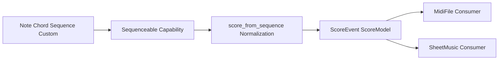

# Sequence-to-MIDI Export API Decision

## Decision title
Sequence-to-MIDI v1 API surface and export architecture.

## Ratified architecture addendum (2026-05-28)
This addendum is the current authoritative decision state and supersedes earlier recommendation text where conflicts exist.

Ratified contracts:
1. `Score` is canonical top-level wrapper around `Sequenceable` values.
2. `Sequence` is the canonical sequencing building block and is `Sequenceable`.
3. `Sequenceable` is a first-class interface implemented in v1 by `Note`, `Chord`, and `Sequence`.
4. `MidiFile` is the canonical MIDI wrapper class around `Score`/`Sequenceable`.

Ratified `MidiFile` API surface:
1. `MidiFile.score_from_file(file_path) -> Score`
2. `MidiFile.load_from_file(file_path) -> MidiFile`
3. `MidiFile.to_file(self, file_path) -> Path`
4. `MidiFile.score_to_file(score, file_path) -> Path`

Ratified notebook behavior:
1. `MidiFile` implements notebook rich display hooks for browser-playable embedded MIDI when optional notebook extras are installed.
2. Core read/write behavior must remain functional without notebook extras.

Compatibility policy:
1. Function-style helpers (`midi_file_from_sequence`, `midi_file_from_notes`, `midi_file_from_chords`) are compatibility delegates to canonical `MidiFile` workflows.
2. Documentation should treat class-based contracts above as canonical for new examples.

## Problem statement
The sequence-to-MIDI work needs a stable public API and a shared internal event model. Without a concrete decision, implementation will drift across naming style, conversion flow, and dependency boundaries, creating avoidable churn in tests, docs, and downstream notation integration.

## Why this matters now
1. The export feature is blocked on API and model clarity.
2. This plan is a dependency for notation and analysis workflows.
3. Early canonical naming and conversion boundaries reduce migration cost before release.
4. Notebook display support is planned and must layer cleanly on top of core export behavior.

## Goals and decision criteria

Goals:
1. Deliver a stable v1 export API that is easy to adopt and evolve.
2. Preserve deterministic conversion behavior across supported input forms.
3. Keep optional notebook integration layered so core export remains unaffected.
4. Minimize long-term naming/model debt while keeping the API surface coherent.

Decision criteria:
1. Convention alignment (33.3%)
2. Extensibility/maintainability (41.8%)
3. Dependency/operational risk (24.9%)

## Constraints and assumptions
1. The library is Python-first and already depends on mido for MIDI read/play features.
2. Naming conventions prefer relation-based APIs for conversions.
3. v1 scope prioritizes correctness, deterministic output, and maintainability over DAW-grade breadth.
4. Export must work without introducing new mandatory external binaries.
5. Notebook rendering support, when present, is optional and cannot change non-notebook behavior.

## Options considered

### Option 1: Keep function-style to-naming API
Use sequence_to_midi_file, note_sequence_to_midi_file, and chord_sequence_to_midi_file as separate top-level entrypoints.

What this means in practice:
1. Each input family gets a dedicated conversion path.
2. Normalization logic is repeated or split across entrypoints.
3. Naming style diverges from relation-based conventions used elsewhere.

API sketch:

```python
def sequence_to_midi_file(sequence, filepath, *, tempo=120, time_signature=(4, 4)):
    ...

def note_sequence_to_midi_file(notes, filepath, *, tempo=120, time_signature=(4, 4)):
    ...

def chord_sequence_to_midi_file(chords, filepath, *, tempo=120, time_signature=(4, 4)):
    ...
```

ASCII flow:

```text
notes ---------> note-specific converter  ----\
chords --------> chord-specific converter ----+--> MIDI writer --> .mid
timeline -----> sequence converter -------/
```

Pros:
1. Low conceptual change from draft naming.
2. Quick initial implementation for one input shape.

Cons:
1. Naming does not match relation-based convention.
2. Higher duplication risk in validation/timing logic.
3. Higher long-term maintenance risk as feature variants grow.

Goal alignment:
1. Partially supports Goal 1 through fast initial delivery, but weakens long-term API clarity.
2. Weak on Goal 2 due to duplicated conversion paths.
3. Neutral on Goal 3; optional notebook layering is feasible but not improved.
4. Weak on Goal 4 because naming and logic debt increase future churn.

Criteria impact:
1. Convention alignment: low (diverges from relation-based naming).
2. Extensibility/maintainability: low (multiple conversion paths tend to drift).
3. Dependency/operational risk: high (no additional mandatory runtime dependencies).

### Option 2: Relation-based canonical API with normalized event model
Use midi_file_from_sequence as canonical entrypoint, with thin wrappers midi_file_from_notes and midi_file_from_chords. Normalize all inputs into a shared timed-event model before writing.

What this means in practice:
1. One conversion pipeline handles validation, timing, and ordering.
2. Wrappers only adapt inputs and delegate.
3. Public API naming stays consistent with relation-based style.

API/model sketch:

```python
from dataclasses import dataclass

@dataclass(frozen=True)
class TimedEvent:
    start_time: float
    duration: float
    pitches: tuple[int, ...]
    velocity: int = 96
    channel: int = 0

def midi_file_from_sequence(sequence, filepath, *, tempo=120, time_signature=(4, 4)):
    events = normalize_to_timed_events(sequence)
    return write_midi_from_events(events, filepath, tempo=tempo, time_signature=time_signature)

def midi_file_from_notes(notes, filepath, **kwargs):
    return midi_file_from_sequence(notes, filepath, **kwargs)

def midi_file_from_chords(chords, filepath, **kwargs):
    return midi_file_from_sequence(chords, filepath, **kwargs)
```

Mermaid flow:


Pros:
1. Aligns with naming conventions.
2. Centralizes conversion logic for easier testing and evolution.
3. Supports deterministic behavior and cleaner notebook/display layering.

Cons:
1. Requires explicit migration guidance for any draft to-style examples.
2. Slightly higher up-front design work than per-path converters.

Goal alignment:
1. Strong on Goal 1 with a stable and consistent public API family.
2. Strong on Goal 2 via centralized normalization and validation.
3. Strong on Goal 3 because notebook behavior can remain a thin optional layer.
4. Strong on Goal 4 by minimizing long-term naming/model debt.

Criteria impact:
1. Convention alignment: high (directly matches relation-based naming guidance).
2. Extensibility/maintainability: high (single canonical pipeline).
3. Dependency/operational risk: high (no new mandatory runtime dependencies).

### Option 3: Custom constructors on MidiFile
Use classmethod constructors such as MidiFile.from_sequence, MidiFile.from_notes, and MidiFile.from_chords as the primary public API, with the same normalized event model internally.

What this means in practice:
1. Users discover conversion through an object-oriented constructor pattern.
2. Input normalization can still be centralized behind constructor delegates.
3. API ownership shifts toward a class-centric surface instead of module-level functions.

API/model sketch:

```python
class MidiFile:
    @classmethod
    def from_sequence(cls, sequence, *, tempo=120, time_signature=(4, 4)) -> "MidiFile":
        events = normalize_to_timed_events(sequence)
        return cls._from_events(events, tempo=tempo, time_signature=time_signature)

    @classmethod
    def from_notes(cls, notes, **kwargs) -> "MidiFile":
        return cls.from_sequence(notes, **kwargs)

    @classmethod
    def from_chords(cls, chords, **kwargs) -> "MidiFile":
        return cls.from_sequence(chords, **kwargs)
```

ASCII flow:

```text
Input --> MidiFile.from_* constructor --> normalize_to_timed_events --> MidiFile instance --> save(path)
```

Pros:
1. Familiar discoverable pattern for users who expect object constructors.
2. Can preserve a single normalization pipeline if constructors delegate correctly.
3. Makes chaining operations on a returned MidiFile object ergonomic.

Cons:
1. Pulls conversion concerns into class API design and may blur module/function boundaries.
2. Less aligned with current relation-based function naming guidance.
3. Increases pressure to stabilize class internals earlier as part of public API.

Goal alignment:
1. Strong on Goal 1 for discoverability, but with added class-surface coupling.
2. Strong on Goal 2 if constructors delegate to one normalization path.
3. Strong on Goal 3 because optional notebook layering still works.
4. Medium on Goal 4 due to earlier stabilization pressure on class internals.

Criteria impact:
1. Convention alignment: medium (object-centric style only partially matches current naming guidance).
2. Extensibility/maintainability: medium (good if delegating, weaker if class API expands).
3. Dependency/operational risk: high (no extra mandatory runtime dependencies).

### Option 4: Shared score IR first, then MIDI API
Pause direct export API implementation and first build a full score intermediate representation shared by MIDI and notation.

What this means in practice:
1. Build a broader abstraction before shipping MIDI export.
2. Delay direct user value from MIDI writing.
3. Potentially reduce future cross-domain duplication.

Model sketch:

```python
@dataclass(frozen=True)
class ScoreEvent:
    beat: float
    duration: float
    pitch_spelling: str
    voice: int

@dataclass(frozen=True)
class ScoreModel:
    tempo: int
    time_signature: tuple[int, int]
    events: tuple[ScoreEvent, ...]
```

Pros:
1. Strong long-term unification potential.
2. May reduce duplicated modeling across MIDI and notation later.

Cons:
1. Oversized for current scope and delivery goals.
2. Introduces schedule risk before v1 export is usable.
3. Harder to validate quickly against immediate feature need.

Goal alignment:
1. Weak on Goal 1 in the short term because v1 API delivery is delayed.
2. Medium on Goal 2 through stronger eventual shared modeling.
3. Medium on Goal 3 because optional layering remains possible but deferred.
4. Medium on Goal 4 with potential long-term debt reduction at high near-term cost.

Criteria impact:
1. Convention alignment: high (fits long-term relation-based model consistency).
2. Extensibility/maintainability: high (shared IR can reduce future duplication).
3. Dependency/operational risk: medium (larger internal surface to maintain and validate).

### Option 5: Do nothing
Defer sequence export and keep current capabilities unchanged.

What this means in practice:
1. No new API or model decisions now.
2. Leaves export workflows blocked.

Pros:
1. No immediate implementation cost.

Cons:
1. Leaves roadmap gap unaddressed.
2. Blocks notebook and notation follow-on work that depends on export.

Goal alignment:
1. Fails Goal 1 by not delivering a v1 export API.
2. Fails Goal 2 by not advancing deterministic export behavior.
3. Fails Goal 3 by leaving optional notebook layering blocked on missing core export.
4. Fails Goal 4 by deferring debt decisions instead of resolving them.

Criteria impact:
1. Convention alignment: low (no API direction selected).
2. Extensibility/maintainability: low (no foundational progress).
3. Dependency/operational risk: high (no new operational dependencies introduced).

### Option 6: Common Sequenceable capability with constructor-first consumers
Define a shared sequence-capability contract so Note, Chord, Sequence, and compatible custom objects can normalize into a canonical timeline model; then allow constructor-style consumers such as MidiFile(...) and SheetMusic(...) to accept that capability.

What this means in practice:
1. Canonical normalization remains centralized, but input acceptance is driven by a shared capability contract.
2. MidiFile and SheetMusic can present ergonomic constructor entrypoints while delegating into the same normalization pipeline.
3. The contract should be structural (Protocol/capability) rather than mandatory inheritance to avoid deep coupling across domain types.

API sketch:

```python
from typing import Protocol

class Sequenceable(Protocol):
    def score_events_for_context(self, context) -> tuple[ScoreEvent, ...]:
        ...

def midi_file_from_sequence(sequenceable: Sequenceable, filepath, *, tempo=120, time_signature=(4, 4)):
    score = score_from_sequence(sequenceable, tempo=tempo, time_signature=time_signature)
    return midi_file_from_score(score, filepath)

class MidiFile:
    def __init__(self, source: str | Path | Sequenceable):
        ...

class SheetMusic:
    def __init__(self, source: Sequenceable):
        ...
```

Mermaid flow:



Pros:
1. Strong cross-domain consistency: one accepted input capability for MIDI and sheet.
2. Ergonomic notebook usage: wrapping an existing sequence in SheetMusic can trigger rendering cleanly.
3. Encourages a single normalization seam and reduces duplicated coercion logic.

Cons:
1. Mandatory inheritance model is high risk: tight coupling and migration burden across existing immutable domain types.
2. Overloading MidiFile constructor with both path-reading and composition-writing concerns can blur object responsibility.
3. If both function-style and constructor-style APIs are canonical at once, docs and user guidance can fragment.

Goal alignment:
1. Strong on Goal 1 if constructor and function surfaces delegate to one canonical pipeline.
2. Strong on Goal 2 because deterministic behavior can stay centralized.
3. Strong on Goal 3 as long as notebook integrations remain optional layering above canonical conversion.
4. Medium-high on Goal 4, with migration risk controlled by choosing Protocol/adapters over forced inheritance.

Criteria impact:
1. Convention alignment: medium-high (fits relation pipeline if functions remain canonical; constructor-only canonical lowers alignment).
2. Extensibility/maintainability: high (shared capability contract improves reuse when structurally typed).
3. Dependency/operational risk: high (no additional mandatory runtime dependencies).

## Tradeoff analysis

Criteria and weights from Goals and decision criteria:
1. Convention alignment (33.3%)
2. Extensibility/maintainability (41.8%)
3. Dependency/operational risk (24.9%)

Weighted comparison (1 low, 5 high):

| Option | Convention | Extensibility | Low Ops Risk | Weighted Result |
|---|---:|---:|---:|---:|
| Option 1: to-naming split paths | 2 | 2 | 4 | 2.50 |
| Option 2: relation-based + normalized model | 5 | 5 | 4 | 4.75 |
| Option 3: MidiFile.from_* constructors | 3 | 4 | 4 | 3.67 |
| Option 4: shared score IR first | 4 | 5 | 3 | 4.17 |
| Option 5: do nothing | 1 | 1 | 5 | 2.00 |
| Option 6: Sequenceable capability + constructors | 4 | 5 | 4 | 4.42 |

Short-term vs long-term:
1. Option 1 has low upfront complexity but accumulates long-term maintenance and naming debt.
2. Option 2 has modest up-front structure cost and the best long-term profile for this scope.
3. Option 3 offers good ergonomics, but introduces class-surface coupling that is not currently preferred.
4. Option 4 scores well on architecture depth, but remains broader than current scoped API goals.
5. Option 5 has no short-term engineering cost but fails product goals.
6. Option 6 is a strong long-term direction when implemented as a structural capability and adapter seam, but it should augment rather than replace canonical function APIs in v1.

## Recommendation
Historical recommendation context (superseded where conflicting with ratified addendum):
Choose Option 2.

Adopt this v1 API baseline:
1. midi_file_from_sequence(...)
2. midi_file_from_notes(...)
3. midi_file_from_chords(...)

Constructor-style note:
1. Keep MidiFile.from_sequence-style constructors as a viable future compatibility layer if user ergonomics data supports adding them.
2. If added later, constructors should delegate to the same canonical function pipeline.

Sequenceable-contract note:
1. A shared Sequenceable capability is compatible with Option 2 and should be treated as an internal/public contract seam, not as mandatory inheritance.
2. Prefer structural typing (Protocol plus adapters) for Note/Chord/Sequence interoperability and custom user types.
3. Keep relation-based function APIs canonical in docs; constructor wrappers can be additive ergonomics.

Adopt a normalized timed-event conversion stage before writing with mido.

Implementation notes:
1. Keep wrapper APIs thin and delegation-only.
2. Keep one canonical validation and ordering path.
3. Keep notebook display integration optional and layered above core writer behavior.

Linked implementation plan: .plans/archive/sequence_to_midi_export_plan.md

## Confidence and risks
Confidence: high.

Key risks:
1. Wrapper APIs may drift from canonical path if not constrained.
2. Timing edge cases (overlaps, short durations, mixed sequence shapes) can still surprise early implementations.

Risk controls:
1. Keep wrapper implementations as strict delegates.
2. Add focused tests for timing conversion and event ordering first.
3. Gate notebook display behavior so missing optional dependencies never break core export.

## Follow-up actions
1. Keep .plans/archive/sequence_to_midi_export_plan.md aligned with this option framing and locked dependency-group naming.
2. Implement Phase 1 API and normalized event model using the recommended relation-based names.
3. Add docs/examples that show canonical APIs and wrapper delegation behavior.
4. Add dependency-isolation tests to confirm core MIDI export works without notebook extras.
