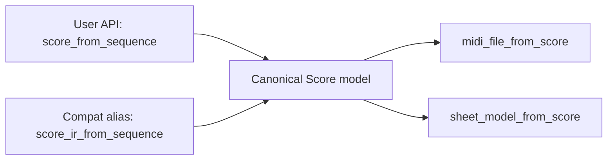

# Shared Score Naming Decision

## Decision title
User-facing naming for the shared score intermediate model (currently discussed as score_ir).

## Ratified architecture addendum (2026-05-28)
This addendum is the current authoritative naming state and supersedes earlier recommendation text where conflicts exist.

Ratified canonical names:
1. `Score`: canonical top-level wrapper around `Sequenceable` values.
2. `Sequence`: canonical composition and sequencing type.
3. `Sequenceable`: canonical capability interface for score conversion.
4. `MidiFile`: canonical MIDI wrapper class around `Score`/`Sequenceable`.
5. `SheetMusic`: canonical sheet-rendering wrapper class around `Score`/`Sequenceable`.

Ratified naming boundaries:
1. `Song`, `Phrase`, and `Timeline` are non-canonical aliases/ideas and not primary API type names in v1.
2. `Playable` and `Renderable` remain conceptual descriptors, not canonical interface names for v1.
3. `score_ir` terms remain compatibility/internal references only during transition, with `Score` as user-facing canonical term.

Ratified wrapper alignment:
1. `MidiFile` and `SheetMusic` are the output-domain wrapper names and should be used in docs/examples.
2. `SheetMusic` is write/render focused in v1; parse/load naming is intentionally not canonical in this phase.

## Problem statement
The term score_ir is precise for architecture discussions, but it is not very intuitive for end users and adds noise to API names. We need naming that is simpler to read and write while preserving clarity for maintainers and compatibility with planned MIDI and sheet workflows.

## Why this matters now
1. The shared-score implementation plan is active and currently proposes score_ir-oriented names.
2. Naming chosen now will shape public API docs, examples, and migration effort.
3. This decision affects both MIDI and sheet planning, so delaying it increases cross-plan churn.

## Goals and decision criteria

Goals:
1. Make shared score APIs intuitive for end users.
2. Keep names short enough for frequent read/write usage in notebooks and scripts.
3. Preserve internal model clarity for maintainers.
4. Enable a clean canonical naming direction with a coherent API surface.

Decision criteria:
1. User intuitiveness and readability (35.3%)
2. API ergonomics and typing burden (23.5%)
3. Conventions alignment with existing naming policy (23.5%)
4. Internal architectural clarity (17.6%)

## Constraints and assumptions
1. Existing relation-based conversion naming is preferred for cross-type APIs.
2. from_* naming is preferred for construction/parsing semantics.
3. No mandatory runtime dependency changes should result from naming decisions.
4. A compatibility window is acceptable if it materially lowers migration friction.
5. The chosen naming should work for both MIDI and sheet adapter paths.

## Options considered

### Option 1: Keep explicit score_ir naming as canonical
Use score_ir.py, ScoreIRModel, and score_ir_from_sequence-style names as public first-class terminology.

What this means:
1. Architectural precision is visible in user APIs.
2. Public names stay tightly coupled to implementation terminology.

API sketch:

```python
from chordelia.score_ir import ScoreIRModel

score_ir = score_ir_from_sequence(sequence)
midi_file_from_score_ir(score_ir, "out.mid")
```

Goal alignment:
1. Weak on Goal 1: IR terminology is less approachable to many users.
2. Weak on Goal 2: names are longer and more cumbersome.
3. Strong on Goal 3: architecture intent is explicit.
4. Medium on Goal 4: no rename churn now, but likely later due usability pressure.

Criteria impact:
1. User intuitiveness and readability: low (IR jargon in every call).
2. API ergonomics and typing burden: low (longer names and more suffix noise).
3. Conventions alignment: medium (from_* possible, but naming intent is implementation-heavy).
4. Internal architectural clarity: high (implementation role is explicit).

### Option 2: Use score as canonical public name; keep score_ir internal/compat alias
Adopt score-oriented names for public APIs and docs (for example score.py, Score, score_from_sequence), while retaining score_ir as an internal or compatibility alias during transition.

What this means:
1. Users interact with simpler score-based terminology.
2. Maintainers can keep IR framing internally where needed.
3. Compatibility aliasing reduces migration friction.

API sketch:

```python
from chordelia.score import Score

score = score_from_sequence(sequence)
midi_file_from_score(score, "out.mid")

# Optional compatibility path during transition
from chordelia import score_ir_from_sequence  # deprecated alias
```

Mermaid flow:



Goal alignment:
1. Strong on Goal 1: score is broadly understandable.
2. Strong on Goal 2: shorter names improve authoring ergonomics.
3. Strong on Goal 3: maintainers can preserve IR framing internally.
4. Strong on Goal 4: compatibility alias enables staged migration.

Criteria impact:
1. User intuitiveness and readability: high (domain-first naming).
2. API ergonomics and typing burden: high (shorter common names).
3. Conventions alignment: high (score_from_sequence and midi_file_from_score align with policy).
4. Internal architectural clarity: high (internal alias/module boundaries can retain IR concept).

### Option 3: Constructor-first canonical naming
Center naming around constructors such as Score.from_sequence and MidiFile.from_score, with minimal module-level factory functions.

What this means:
1. Object-style discovery becomes primary.
2. Type surfaces become more class-centric than relation-function-centric.

API sketch:

```python
score = Score.from_sequence(sequence)
midi = MidiFile.from_score(score)
midi.save("out.mid")
```

Goal alignment:
1. Strong on Goal 1: constructor pattern is familiar to many users.
2. Strong on Goal 2: concise and readable chained usage.
3. Medium on Goal 3: class responsibilities can expand and blur boundaries.
4. Medium on Goal 4: may introduce additional surface-area migration later.

Criteria impact:
1. User intuitiveness and readability: high (discoverable for OOP-oriented users).
2. API ergonomics and typing burden: high (compact usage).
3. Conventions alignment: medium (partially diverges from relation-first pattern preference).
4. Internal architectural clarity: medium (risk of class API bloat).

### Option 4: Out-of-the-box rename to timeline terminology
Replace score_ir with a different metaphor such as timeline (for example timeline_from_sequence, midi_file_from_timeline).

What this means:
1. Terminology emphasizes time-ordered events over notation semantics.
2. Naming may fit MIDI better than sheet semantics.

API sketch:

```python
timeline = timeline_from_sequence(sequence)
midi_file_from_timeline(timeline, "out.mid")
```

Goal alignment:
1. Medium on Goal 1: timeline is simple but less musically specific.
2. Medium on Goal 2: short names, but meaning may be ambiguous across domains.
3. Medium on Goal 3: model intent is clear for sequencing, weaker for notation.
4. Low on Goal 4: broad renaming churn and possible conceptual mismatch.

Criteria impact:
1. User intuitiveness and readability: medium (intuitive for sequencing, less for notation users).
2. API ergonomics and typing burden: high (short names).
3. Conventions alignment: medium (relation naming fits, domain term is weaker for sheet use).
4. Internal architectural clarity: medium (clear temporal framing, weaker cross-domain semantics).

### Option 5: Do nothing
Defer naming decision and keep current placeholders until later implementation phases.

What this means:
1. No immediate naming stabilization.
2. Plans and docs continue using provisional terms.

Goal alignment:
1. Fails Goal 1: users keep seeing implementation-oriented terms.
2. Fails Goal 2: no simplification is delivered.
3. Medium on Goal 3: internal teams can continue, but with ambiguity.
4. Fails Goal 4: deferral increases eventual migration churn.

Criteria impact:
1. User intuitiveness and readability: low (no improvement).
2. API ergonomics and typing burden: low (no simplification).
3. Conventions alignment: low (canonical naming remains unresolved).
4. Internal architectural clarity: medium (status quo remains, but unresolved).

## Tradeoff analysis

Facts:
1. Existing naming guidance favors relation-based cross-type APIs and from_* construction semantics.
2. Shared score work touches both MIDI and sheet planning, making naming a cross-plan concern.

Assumptions:
1. score terminology is more user-friendly than score_ir for most users.
2. A temporary compatibility alias is acceptable to minimize migration disruption.

Unknowns:
1. Whether constructor-first APIs should become canonical later.
2. How much existing example content will need updates once implementation starts.

Weighted comparison (1 low, 5 high):

| Option | Intuitive | Ergonomic | Conventions | Internal Clarity | Weighted Result |
|---|---:|---:|---:|---:|---:|
| Option 1: keep score_ir canonical | 2 | 2 | 3 | 5 | 2.76 |
| Option 2: score canonical + score_ir alias | 5 | 5 | 5 | 5 | 5.00 |
| Option 3: constructor-first | 4 | 5 | 3 | 3 | 3.82 |
| Option 4: timeline terminology | 3 | 5 | 3 | 3 | 3.47 |
| Option 5: do nothing | 1 | 1 | 1 | 3 | 1.35 |

Short-term vs long-term:
1. Option 1 is easiest short-term but likely causes long-term usability debt.
2. Option 2 requires a small transition plan now and provides the best long-term balance.
3. Option 3 is ergonomic but may fragment naming style if function-style APIs stay canonical.
4. Option 4 is concise but weaker as a shared term across MIDI and notation domains.
5. Option 5 avoids immediate work but raises future migration and documentation churn.

## Recommendation
Historical recommendation context (superseded where conflicting with ratified addendum):
Choose Option 2.

Canonical naming direction:
1. Prefer score as the user-facing term.
2. Use score_from_sequence and midi_file_from_score as canonical relation-based function names.
3. Use Score as the primary public model name.
4. Keep score_ir naming as internal or compatibility alias only during a bounded migration window.

Compatibility guidance:
1. Introduce deprecated alias exports for score_ir-prefixed names where needed.
2. Update examples and docs to canonical score names immediately once implementation starts.

Linked plan: .plans/archive/shared_score_ir_implementation_plan.md

## Confidence and risks
Confidence: high.

Key risks:
1. Alias period could linger and create dual-naming confusion.
2. Constructor-style requests may continue and pressure API expansion.

Risk controls:
1. Set an explicit alias retirement target during implementation planning.
2. Keep one canonical naming surface in docs/tests from day one.
3. Revisit constructor-canonical question only after Score IR stabilization metrics are available.

## Follow-up actions
1. Update .plans/archive/shared_score_ir_implementation_plan.md to reference this naming decision explicitly.
2. Add implementation tasks for alias strategy and retirement timeline.
3. Ensure future MIDI and sheet plan edits use canonical score naming.
4. Add migration notes to user-facing docs when Score APIs land.
