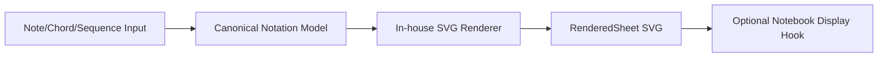
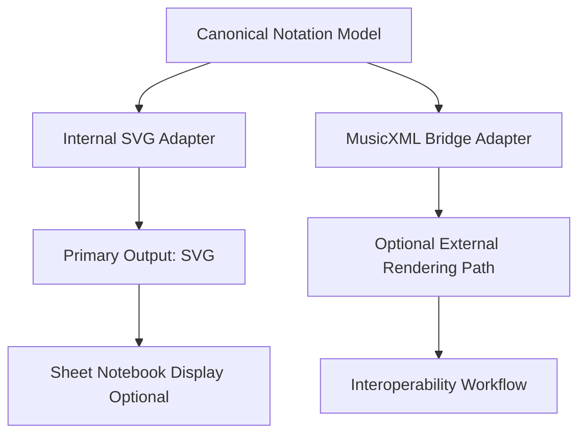

# Sheet-Music Rendering Strategy Decision

## Decision title
Sheet-music v1 production strategy and backend direction.

## Ratified architecture addendum (2026-05-28)
This addendum is the current authoritative sheet API state and supersedes earlier recommendation text where conflicts exist.

Ratified wrapper contracts:
1. `SheetMusic` is the canonical sheet-rendering wrapper class.
2. `SheetMusic` accepts `Score | Sequenceable` sources and normalizes through canonical score conversion.
3. `SheetMusic` is write/render focused in v1 and does not define parse/load file APIs in this phase.

Ratified `SheetMusic` API surface:
1. `SheetMusic.to_file(self, file_path, *, format="svg") -> Path`
2. `SheetMusic.score_to_file(score, file_path, *, format="svg") -> Path`

Ratified notebook behavior:
1. `SheetMusic` implements notebook rich display hooks for inline rendering when optional sheet notebook extras are installed.
2. Core rendering must remain usable without notebook extras.

Ratified alignment with MIDI and score:
1. `Score` remains canonical shared normalization boundary.
2. `MidiFile` and `SheetMusic` are parallel wrapper classes consuming shared score semantics.
3. `Sequenceable` remains the common capability seam for mixed musical inputs.

## Problem statement
The sheet-music plan needs a concrete backend strategy. Without a clear decision, implementation risks oscillating between third-party tools and internal rendering, causing unclear boundaries, unstable dependency policy, and hard-to-review tradeoffs.

## Why this matters now
1. Backend direction defines data model boundaries, test approach, and packaging strategy.
2. The plan now includes optional notebook rendering, which requires explicit dependency separation from MIDI notebook support.
3. A clear production direction is needed before implementation phases can be executed confidently.

## Goals and decision criteria

Goals:
1. Ship a usable v1 sheet output path within scoped notation coverage.
2. Preserve deterministic, testable rendering behavior for regression checks.
3. Keep core usage independent from notebook and cross-domain optional dependencies.
4. Maintain an architecture that can extend toward interoperability without lock-in.

Decision criteria:
1. v1 delivery speed (20%)
2. Output quality ceiling (20%)
3. Dependency footprint/portability (20%)
4. Deterministic testability (20%)
5. Long-term maintainability (20%)

## Constraints and assumptions
1. Chordelia is Python-first and should avoid mandatory heavyweight runtime dependencies for core flows.
2. v1 scope is intentionally limited (treble clef, simple durations, basic chords/rests).
3. Deterministic output is required for visual snapshot/regression testing.
4. Interoperability with external notation ecosystems remains valuable.
5. Dependency groups are locked at the plan level: sheet, sheet-notebook, midi, midi-notebook.

## Options considered

### Option 1: Third-party-first production path
Use a third-party notation engine as the primary v1 rendering backend; internal renderer is deferred.

What this means in practice:
1. Chordelia converts canonical notation data into third-party input format.
2. Final rendering quality is strongly influenced by external tools.
3. Operational burden moves to packaging, platform support, and runtime integration.

Candidate tracks:
1. music21 + MusicXML export + external renderer.
2. LilyPond pipeline (text notation to engraved output).
3. MuseScore CLI via MusicXML.
4. Verovio via MEI/MusicXML to SVG.
5. Browser-first engines (VexFlow or abcjs) via JS bridge.

ASCII flow:

```text
Chordelia model --> MusicXML/MEI adapter --> Third-party renderer --> SVG/PNG/PDF
                               \--> notebook wrapper (optional)
```

Pros:
1. Faster access to higher engraving quality for broader notation sets.
2. Less initial internal engraving implementation.

Cons:
1. External dependency burden (binaries, versions, CI compatibility).
2. Harder deterministic output guarantees across environments.
3. Higher operational/support cost for users.

Goal alignment:
1. Strong on Goal 1 with fast access to usable output features.
2. Weak on Goal 2 because deterministic rendering varies by external toolchain.
3. Weak on Goal 3 due to heavier runtime and packaging dependency burden.
4. Medium on Goal 4 through interoperability, but with vendor/tool coupling risk.

Criteria impact:
1. v1 delivery speed: high (mature external engines accelerate early output).
2. Output quality ceiling: high (external engravers usually provide broad quality potential).
3. Dependency footprint/portability: low (binary/runtime variance across environments).
4. Deterministic testability: low (cross-environment output drift risk).
5. Long-term maintainability: medium (less internal engraving code, more integration maintenance).

### Option 2: In-house SVG-first production path
Build and ship only a native Chordelia SVG renderer for v1 scope.

What this means in practice:
1. All core rendering logic stays inside Chordelia code.
2. v1 feature coverage is intentionally narrow and explicit.
3. Deterministic snapshots are easier to maintain.

API sketch:

```python
def sheet_from_sequence(sequence, *, backend="svg") -> "RenderedSheet":
    model = normalize_to_notation_model(sequence)
    return render_svg_sheet(model)
```

Mermaid flow:



Pros:
1. Full control over output shape and deterministic behavior.
2. No mandatory external binary dependency.
3. Cleaner fit for optional notebook extras policy.

Cons:
1. Slower path to broad engraving coverage.
2. Ongoing maintenance burden stays in-repo.

Goal alignment:
1. Medium on Goal 1 because scoped v1 is deliverable but broader output takes longer.
2. Strong on Goal 2 via deterministic in-house rendering behavior.
3. Strong on Goal 3 with minimal mandatory external dependencies.
4. Medium on Goal 4 because interoperability requires additional bridge work later.

Criteria impact:
1. v1 delivery speed: medium (focused implementation effort still required).
2. Output quality ceiling: medium (good for scoped v1, limited for advanced engraving).
3. Dependency footprint/portability: high (core path remains lightweight and portable).
4. Deterministic testability: high (owned renderer enables stable snapshots).
5. Long-term maintainability: medium (single-path ownership but ongoing feature expansion cost).

### Option 3: Hybrid strategy (recommended)
Use in-house SVG as the production v1 path for scoped coverage, and support a secondary optional MusicXML bridge for interoperability.

What this means in practice:
1. Core behavior is deterministic and dependency-light.
2. Advanced workflows can opt into bridge tooling.
3. Canonical notation model remains renderer-agnostic.

Architecture sketch:



Pros:
1. Best balance of control, portability, and interoperability.
2. Preserves optional dependency policy for notebook and bridge paths.
3. Enables phased growth without lock-in.

Cons:
1. Requires clear adapter contracts and ownership boundaries.
2. Two paths must be periodically validated to avoid drift.

Goal alignment:
1. Strong on Goal 1 with a practical v1 path plus optional extension path.
2. Strong on Goal 2 by keeping deterministic behavior in the primary in-house path.
3. Strong on Goal 3 through optional, non-mandatory bridge dependencies.
4. Strong on Goal 4 by preserving interoperability without locking core behavior to external engines.

Criteria impact:
1. v1 delivery speed: high (ship scoped internal path while deferring optional bridge depth).
2. Output quality ceiling: high (core output now, bridge supports advanced workflows later).
3. Dependency footprint/portability: high (core lightweight, bridge remains optional).
4. Deterministic testability: high (primary deterministic renderer stays under project control).
5. Long-term maintainability: high (adapter boundaries isolate complexity and support phased growth).

### Option 4: Export-only, no direct rendering
Defer direct visual rendering and export notation source (for example MusicXML/ABC) for external tools only.

What this means in practice:
1. Chordelia acts as a notation source generator.
2. Rendering quality and UX are delegated entirely to external tools.

Pros:
1. Lower near-term implementation cost.

Cons:
1. Does not satisfy direct visual output goals.
2. Weak notebook story without additional external setup.

Goal alignment:
1. Medium on Goal 1 for export deliverables, weak for direct visual rendering expectations.
2. Medium on Goal 2 because deterministic export is feasible, but visual determinism is externalized.
3. Medium on Goal 3 with moderate core dependency isolation.
4. Medium on Goal 4 by supporting interoperability but leaving product experience incomplete.

Criteria impact:
1. v1 delivery speed: high (export-only scope is narrower than rendering).
2. Output quality ceiling: low (quality depends entirely on external renderers).
3. Dependency footprint/portability: high (core avoids renderer dependencies).
4. Deterministic testability: medium (export can be deterministic; rendered output is not controlled).
5. Long-term maintainability: medium (simpler core, but unresolved rendering gap persists).

### Option 5: Do nothing
Postpone all sheet-music rendering work.

Pros:
1. No near-term engineering cost.

Cons:
1. Major capability gap remains.
2. Blocks planned notation workflows.

Goal alignment:
1. Fails Goal 1 by not shipping a sheet output path.
2. Fails Goal 2 by not establishing deterministic rendering behavior.
3. Partially supports Goal 3 only by avoiding new dependencies.
4. Fails Goal 4 by deferring architecture progress.

Criteria impact:
1. v1 delivery speed: low (no delivery).
2. Output quality ceiling: low (no rendering capability).
3. Dependency footprint/portability: high (no new dependencies introduced).
4. Deterministic testability: high (no rendering variability because no renderer exists).
5. Long-term maintainability: low (capability debt and roadmap blockage increase over time).

## Tradeoff analysis

Criteria and weights from Goals and decision criteria:
1. v1 delivery speed (20%)
2. Output quality ceiling (20%)
3. Dependency footprint/portability (20%)
4. Deterministic testability (20%)
5. Long-term maintainability (20%)

Weighted comparison (1 low, 5 high):

| Option | Speed | Quality Ceiling | Low Dependency Risk | Determinism | Maintainability | Weighted Result |
|---|---:|---:|---:|---:|---:|---:|
| Option 1: third-party-first | 4 | 5 | 2 | 2 | 3 | 3.20 |
| Option 2: in-house SVG-first | 3 | 3 | 5 | 5 | 3 | 3.80 |
| Option 3: hybrid | 4 | 4 | 4 | 4 | 4 | 4.00 |
| Option 4: export-only | 4 | 2 | 4 | 3 | 3 | 3.20 |
| Option 5: do nothing | 1 | 1 | 5 | 5 | 1 | 2.60 |

Dependency implications by option:
1. Option 1 increases probability of mandatory operational complexity.
2. Option 2 best protects core optional dependency boundaries, but has lower short-term quality ceiling.
3. Option 3 preserves core dependency simplicity while leaving advanced paths optional.
4. Option 4 avoids renderer dependencies but misses product intent.

## Recommendation
Historical recommendation context (superseded where conflicting with ratified addendum):
Choose Option 3.

Production direction:
1. Primary v1: in-house SVG renderer for scoped notation coverage.
2. Secondary path: optional MusicXML bridge adapter for interoperability.
3. Keep canonical notation model renderer-agnostic and adapter-based.

Notebook/dependency policy alignment:
1. Core sheet path maps to sheet group.
2. Notebook rendering for sheet maps to sheet-notebook group.
3. No dependency from sheet-notebook to midi-notebook.
4. MIDI notebook capability remains independently optional.

Sequenceable-input alignment:
1. Sheet entrypoints should accept the same sequence-capability contract used by MIDI normalization (for example Sequence, Note, Chord, and compatible custom objects via adapters/Protocol semantics).
2. Constructor ergonomics such as SheetMusic(sequenceable) are additive and should delegate into the canonical score/notation normalization pipeline.
3. Avoid mandatory inheritance across musical domain classes; prefer structural capability plus adapters to reduce coupling and migration churn.

Linked implementation plan: .plans/sheet_music_rendering_plan.md

## Confidence and risks
Confidence: medium-high.

Key risks:
1. In-house renderer scope creep toward full engraving.
2. Optional bridge path drift without periodic contract validation.
3. Optional notebook dependencies accidentally leaking into core path.

Risk controls:
1. Enforce strict v1 scope and phase gates in the plan.
2. Keep adapter contracts explicit and test both paths at boundaries.
3. Add dependency-isolation tests across sheet/sheet-notebook and midi/midi-notebook combinations.

## Follow-up actions
1. Keep .plans/sheet_music_rendering_plan.md synchronized with this option framing and locked dependency-group names.
2. Convert implementation phases into decision-backed execution milestones with explicit adapter contracts.
3. Add comparison checkpoints for in-house vs bridge path quality, cost, and portability.
4. Add docs/examples showing notebook and non-notebook flows with independent optional extras.
